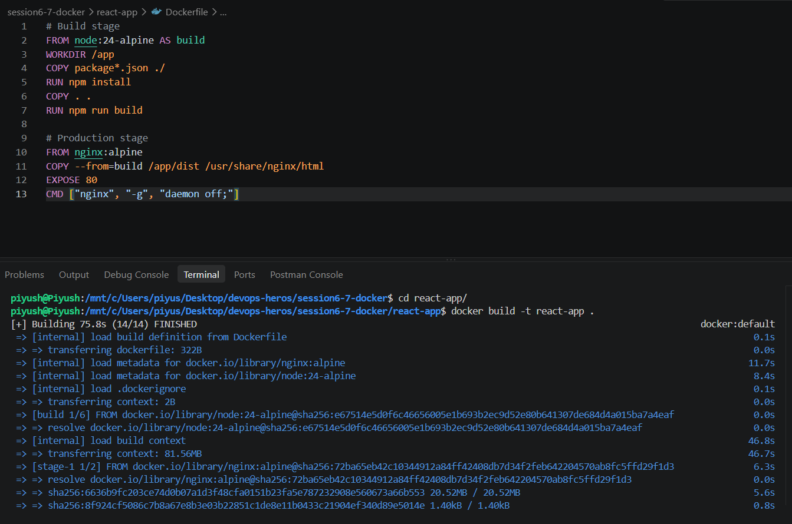
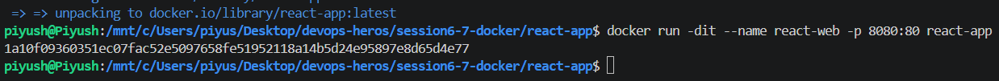
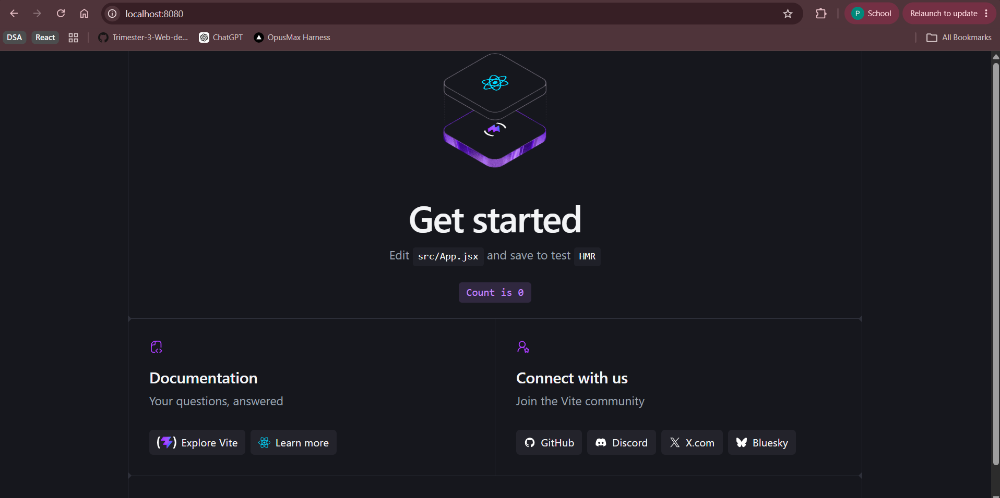
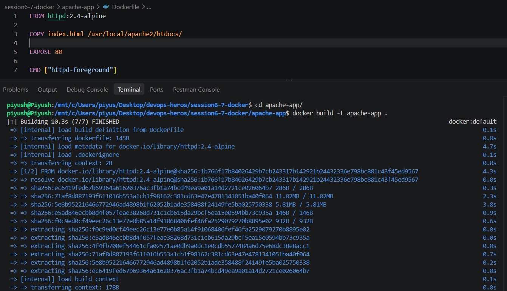
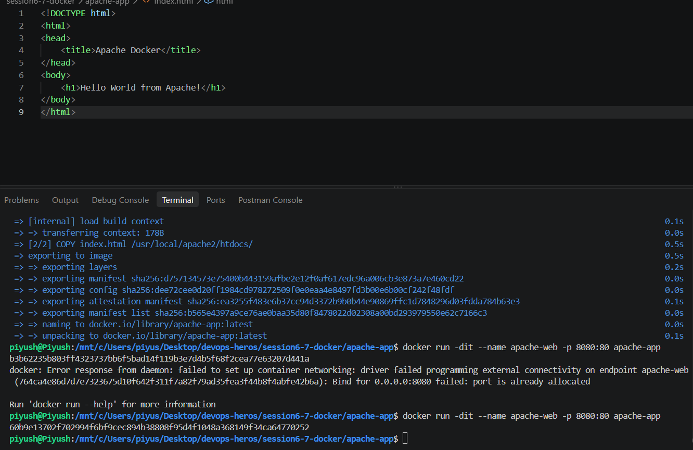
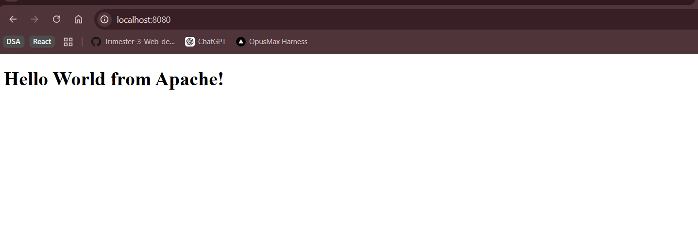

## Name - Piyush Kumar Mahato
## Roll no- 10233

## Nginx-app

## Node-app

## Python-app
there was an issue running so i commented that part out to build the image and made an empty requirements.txt

## Java-app

## React-app

## Apache-app

