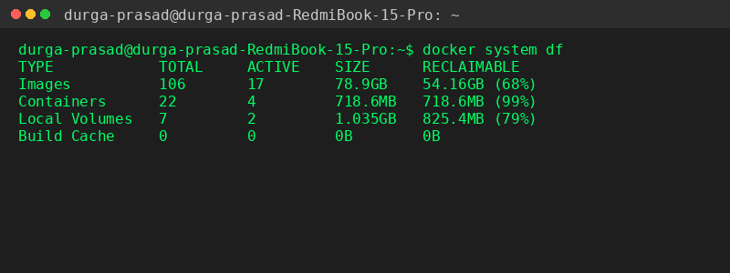

# Docker Fundamentals Homework

**Name:** Durga Prasad  
**Enrollment Number:** 10012  

---

## Deployed Applications

1. [Node.js App (nodejs-app)](./nodejs-app) — Port 3000
2. [Python App (python-app)](./python-app) — Port 5001
3. [Java App (java-app)](./java-app) — Port 8082
4. [Apache Web (Apache-app)](./Apache-app) — Port 8083
5. [React App (React-app)](./React-app) — Port 8084
6. [Nginx Web (nginx-app)](./nginx-app) — Port 8085

---

## Multi-Stage Docker Build
- [Multi-Stage Build Report & Port 8080 Evidence](./multi-stage-dockerfile/multi_stage_homework.md)

---

## 📸 Execution Screenshots

### Docker Container Exec Verification

### Docker System Disk Usage Verification

