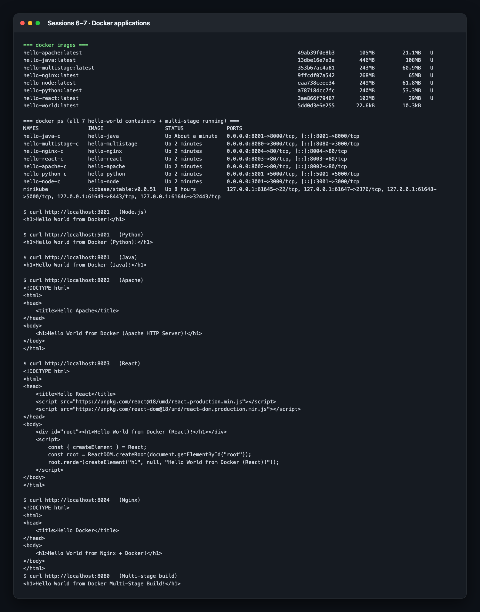

# Sessions 6-7 - Docker

**Name:** Anshal Kumar
**Enrollment number:** 83

I built and ran all six web applications locally. The Docker image list, running-container output, and `curl` checks are saved in [`verification/`](verification/).

## Hello World applications

| Application | Folder | Port I used | Response I verified |
|---|---|---:|---|
| Node.js | [`nodejs-app/`](nodejs-app/) | 3001 | `Hello World from Docker!` |
| Python | [`python-app/`](python-app/) | 5001 | `Hello World from Docker (Python)!` |
| Java | [`java-app/`](java-app/) | 8001 | `Hello World from Docker (Java)!` |
| Apache | [`Apache-app/`](Apache-app/) | 8002 | `Hello World from Docker (Apache HTTP Server)!` |
| React | [`React-app/`](React-app/) | 8003 | `Hello World from Docker (React)!` |
| Nginx | [`nginx-app/`](nginx-app/) | 8004 | `Hello World from Nginx + Docker!` |

I followed the same build-and-test pattern for each application. For example:

```bash
docker build -t hello-node ./nodejs-app
docker run -d --name hello-node-c -p 3001:3000 hello-node
curl http://localhost:3001
```

The combined results are in [`curl-verification.txt`](verification/curl-verification.txt).

A few implementation choices I made:

- The Java app uses the HTTP server included in the JDK, so it does not need an extra web framework. I compiled it in a JDK image and ran it from the smaller JRE image.
- Apache and Nginx serve simple static HTML pages.
- The React page is served by Nginx.
- I changed the Python example from a script that immediately exited into a small HTTP server so it could be tested like the other web apps.

## Multi-stage build

The multi-stage example is in [`multi-stage-dockerfile/`](multi-stage-dockerfile/). The first stage installs and prepares the application; the second stage contains only what is needed to run it.

```bash
docker build -t hello-multistage ./multi-stage-dockerfile
docker run -d --name hello-multistage-c -p 8080:3000 hello-multistage
curl http://localhost:8080
```

My response was:

```html
<h1>Hello World from Docker Multi-Stage Build!</h1>
```

`docker ps` confirmed the required host port:

```text
hello-multistage-c  hello-multistage  Up 2 minutes  0.0.0.0:8080->3000/tcp
```

The container listens on port 3000, while Docker publishes it on port 8080 on the host. Full output: [`docker-ps-output.txt`](verification/docker-ps-output.txt).

## Three application types

The Node.js, Python, and Java containers satisfy the final deployment task. I ran them together on separate ports and verified each response rather than only building the images.

## Proof of the Docker runs

This screenshot shows the images and running containers, followed by the HTTP response from every application and the multi-stage build.


