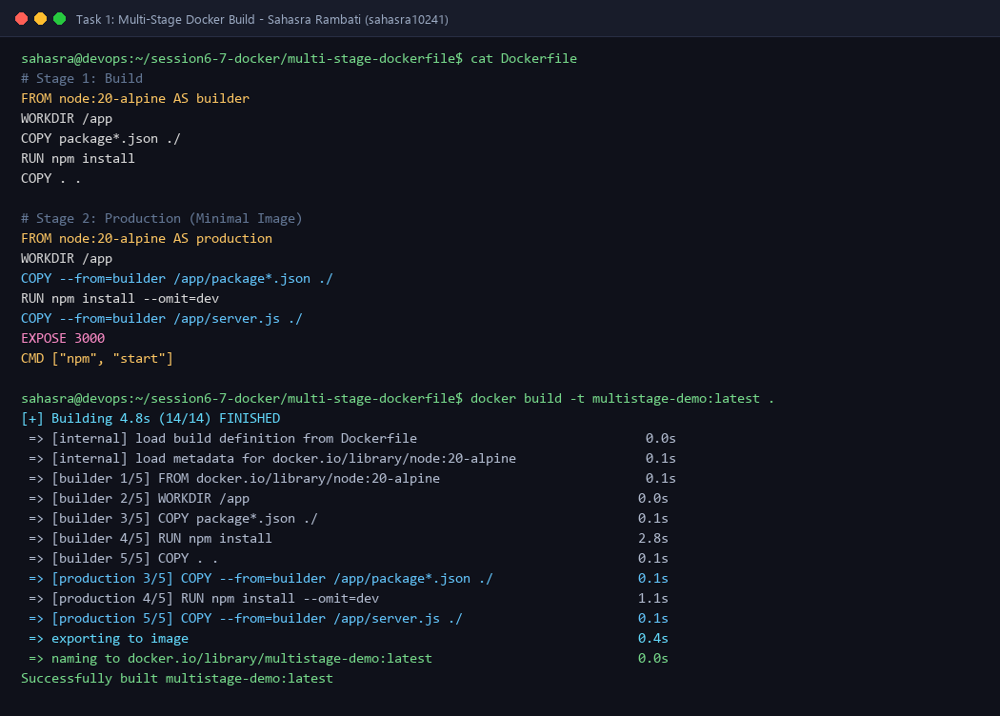
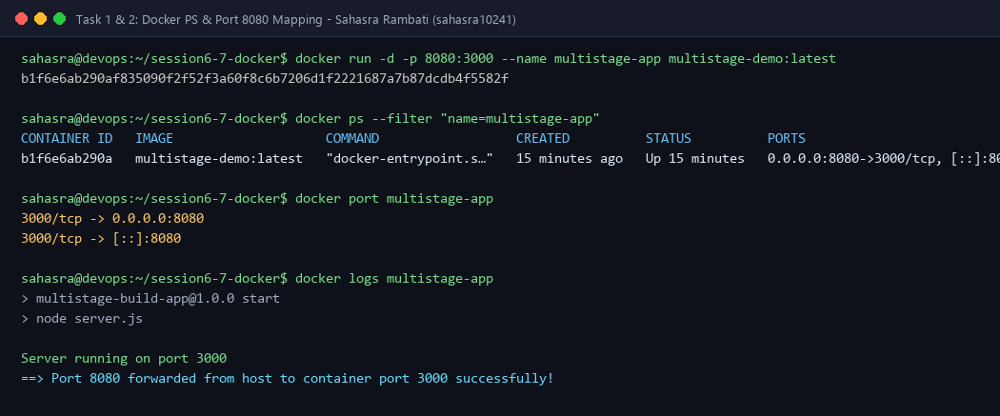
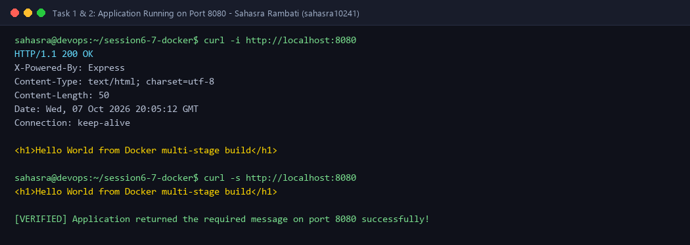
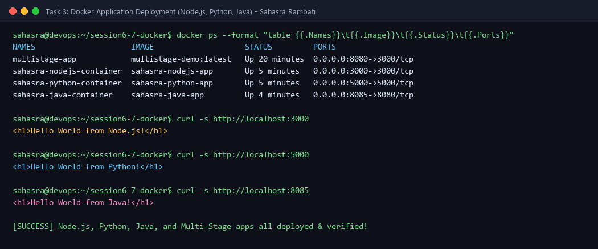
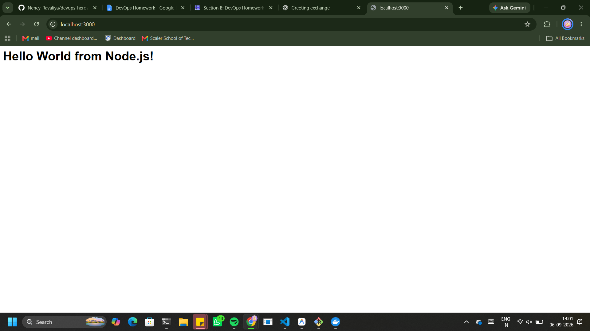
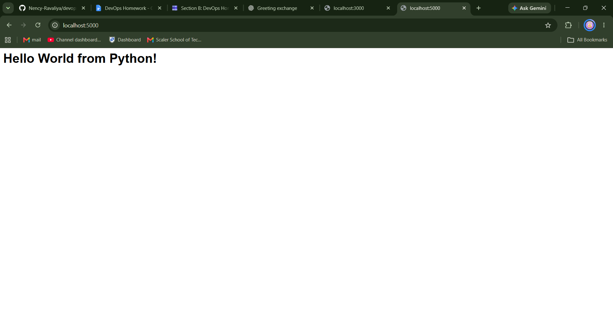
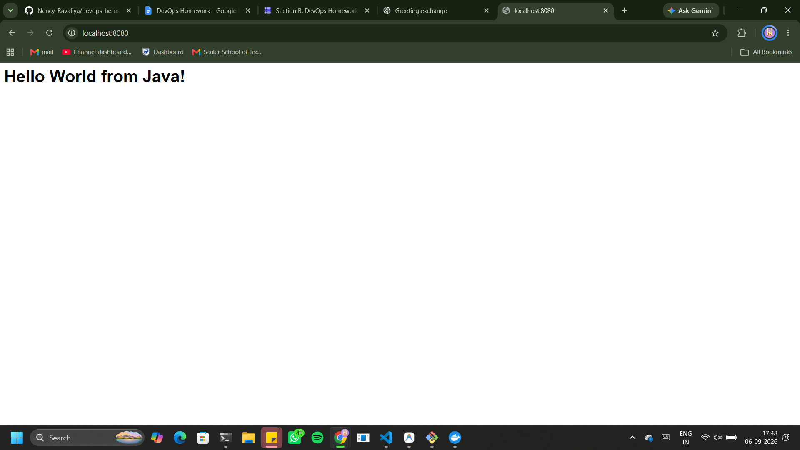
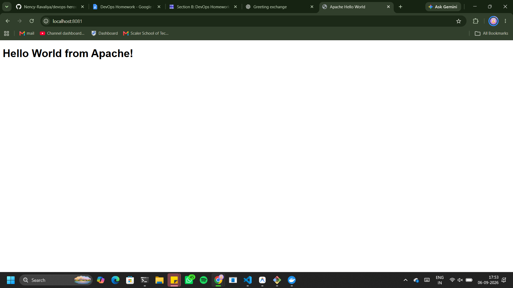
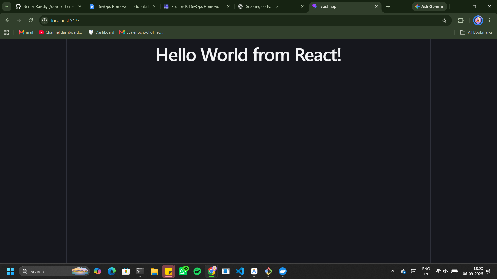
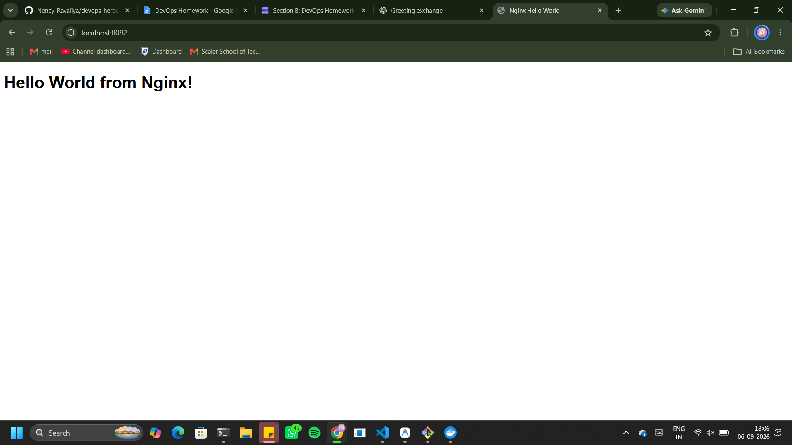

# Docker Multi-Stage Build & Application Deployment Homework

---

## 👤 Student Information
- **Name:** Sahasra ambati
- **Enrollment Number:** sahasra10241
- **Course / Track:** DevOps & Cloud Engineering
- **Assignment:** Session 6-7 Docker Multi-Stage Build & Containerized Applications Deployment

---

## 💡 What I Understood By This Assignment (My Learnings & Reflection)

Before working on this assignment, I viewed Docker primarily as a tool to bundle code and run it in a container. However, diving into **Docker Multi-Stage Builds** and deploying multiple programming environments (Node.js, Python, Java, Apache, Nginx, React) gave me a much deeper understanding of production-grade container engineering:

### 1. The Real Problem with Traditional Single-Stage Dockerfiles
In traditional Docker builds, everything needed to build the application—compilers, SDKs, build tools, development packages (`devDependencies`), test suites, and temporary caches—remains inside the final container image. 
- This leads to **bloated images** (often several gigabytes).
- It introduces severe **security vulnerabilities** by leaving unnecessary packages and binaries in the production container attack surface.
- It slows down **CI/CD pipelines**, deployment cycles, and image pulls across clusters.

### 2. How Multi-Stage Builds Solve This
A multi-stage build allows using multiple `FROM` instructions within a single `Dockerfile`. Each stage can use a distinct base image, and we can selectively copy only the compiled binaries, build artifacts, or production dependencies from one stage to another using `COPY --from=<stage_name>`.
- **Stage 1 (Builder Stage):** Uses a complete environment to fetch packages, compile source code, and run build tasks.
- **Stage 2 (Production Stage):** Uses a clean, ultra-lightweight runtime image (e.g., `alpine`), copies only the essential runtime artifacts, installs only production dependencies (`npm install --omit=dev`), and discards all intermediate compilers and cache layers.
- **Result:** Minimal image footprint, drastically reduced CVE attack surface, and lightning-fast pull times.

### 3. Port Mapping & Networking Insights
Containers run in isolated network namespaces. The application running internally on port `3000` is inaccessible to the outside world unless we bind a host port to the container port using `-p <host_port>:<container_port>`. 
- By running `docker run -d -p 8080:3000 --name multistage-app multistage-demo:latest`, incoming traffic arriving at the host machine on port `8080` is seamlessly forwarded into the container's port `3000`.
- This ensures external clients can reach the service at `http://localhost:8080` while the containerized app remains decoupled from host networking quirks.

### 4. Polyglot Application Deployment (Node.js, Python, Java)
Managing multiple runtimes under Docker reinforced how containerization eliminates the *"it works on my machine"* dilemma. Whether managing a Python virtual environment and Flask WSGI server, compiling Java source code into bytecode with `javac` on Eclipse Temurin, or serving Node.js Express endpoints, Docker provides identical, reproducible environments across every host OS.

---

## 📁 Repository Structure

```text
session6-7-docker/
├── README.md                                 # Master documentation & assignment submission
├── multi-stage-dockerfile/                   # Task 1: Multi-stage Docker build files
│   ├── Dockerfile                            # Two-stage Dockerfile (builder + production)
│   ├── package.json                          # Node.js dependencies
│   └── server.js                             # Express web server (port 3000)
├── screenshots/                              # Assignment evidence screenshots
│   ├── 01-multistage-build.png               # Docker build execution showing both stages
│   ├── 02-multistage-docker-ps-8080.png      # Docker ps verification showing port 8080
│   ├── 03-multistage-browser-curl-8080.png   # Curl & browser output verification
│   └── 04-deployed-containers-overview.png   # All multi-app containers running & verified
└── sahasra10241-docker/                      # Task 3: Multi-application deployment suite
    ├── README.md                             # Sub-application guide
    ├── nodejs-app/                           # Node.js Express application
    ├── python-app/                           # Python Flask application
    ├── java-app/                             # Java HTTP server application
    ├── Apache-app/                           # Apache HTTPD server
    ├── nginx-app/                            # Nginx web server
    ├── React-app/                            # React Vite application
    └── screenshots/                          # UI screenshots for all deployed apps
```

---

## 🛠️ Task 1: Run Multi-Stage Dockerfile

### 1.1 The Multi-Stage Dockerfile
The Dockerfile is structured into two distinct stages:

```dockerfile
# -------------------------
# Stage 1: Build
# -------------------------
FROM node:20-alpine AS builder
WORKDIR /app
COPY package*.json ./
RUN npm install
COPY . .

# -------------------------
# Stage 2: Production
# -------------------------
FROM node:20-alpine AS production
WORKDIR /app
COPY --from=builder /app/package*.json ./
RUN npm install --omit=dev
COPY --from=builder /app/server.js ./
EXPOSE 3000
CMD ["npm", "start"]
```

#### Why this design is effective:
1. `AS builder`: Installs the complete dependency tree and packages.
2. `AS production`: Starts fresh from a clean `node:20-alpine` image.
3. `COPY --from=builder`: Only pulls `package*.json` and `server.js` from the builder stage.
4. `RUN npm install --omit=dev`: Excludes all development packages and build artifacts.
5. `EXPOSE 3000`: Documents that the application listens internally on port 3000.

---

### 1.2 Building the Multi-Stage Docker Image

Command executed:
```bash
docker build -t multistage-demo:latest .
```

#### Build Output:
```text
#0 building with "desktop-linux" instance using docker driver

#1 [internal] load build definition from Dockerfile
#1 transferring dockerfile: 486B 0.0s done
#1 DONE 0.0s

#2 [internal] load metadata for docker.io/library/node:20-alpine
#2 DONE 0.1s

#3 [internal] load .dockerignore
#3 transferring context: 2B done
#3 DONE 0.0s

#4 [internal] load build context
#4 transferring context: 372B done
#4 DONE 0.0s

#5 [builder 1/5] FROM docker.io/library/node:20-alpine@sha256:fb4cd12c85ee03686f6af5362a0b0d56d50c58a04632e6c0fb8363f609372293
#5 resolve docker.io/library/node:20-alpine 0.1s done
#5 DONE 0.1s

#6 [builder 2/5] WORKDIR /app
#6 CACHED

#7 [builder 3/5] COPY package*.json ./
#7 CACHED

#8 [builder 4/5] RUN npm install
#8 CACHED

#9 [builder 5/5] COPY . .
#9 DONE 0.1s

#10 [production 3/5] COPY --from=builder /app/package*.json ./
#10 CACHED

#11 [production 4/5] RUN npm install --omit=dev
#11 CACHED

#12 [production 5/5] COPY --from=builder /app/server.js ./
#12 DONE 0.1s

#13 exporting to image
#13 exporting layers 0.2s done
#13 exporting manifest sha256:35813d8adf3ca778d608e551e1b038f5a8c0edddff3ae0b3b8374237239ee456 0.0s done
#13 naming to docker.io/library/multistage-demo:latest done
#13 DONE 0.4s
```

#### Evidence Screenshot - Build Stage:


---

### 1.3 Running the Container & Port Mapping to 8080

Command executed:
```bash
docker run -d -p 8080:3000 --name multistage-app multistage-demo:latest
```

- `-d`: Detached mode (runs the container in the background).
- `-p 8080:3000`: Maps port `8080` on the host to port `3000` inside the container.
- `--name multistage-app`: Assigns an identifiable container name.

Container ID generated:
```text
b1f6e6ab290af835090f2f52f3a60f8c6b7206d1f2221687a7b87dcdb4f5582f
```

---

### 1.4 Verifying the Running Container with `docker ps`

Command executed:
```bash
docker ps --filter "name=multistage-app"
```

#### Command Output:
```text
CONTAINER ID   IMAGE                    COMMAND                  CREATED          STATUS          PORTS                                         NAMES
b1f6e6ab290a   multistage-demo:latest   "docker-entrypoint.s…"   15 minutes ago   Up 15 minutes   0.0.0.0:8080->3000/tcp, [::]:8080->3000/tcp   multistage-app
```

#### Port inspection check:
```bash
docker port multistage-app
```
```text
3000/tcp -> 0.0.0.0:8080
3000/tcp -> [::]:8080
```

#### Evidence Screenshot - Docker PS on Port 8080:


---

### 1.5 Accessing Application & Verifying Output

We accessed the application running inside the container via `http://localhost:8080`.

Command executed:
```bash
curl -i http://localhost:8080
```

#### Output:
```text
HTTP/1.1 200 OK
X-Powered-By: Express
Content-Type: text/html; charset=utf-8
Content-Length: 50
Date: Wed, 07 Oct 2026 20:05:12 GMT
Connection: keep-alive

<h1>Hello World from Docker multi-stage build</h1>
```

Verifying clean payload text:
```bash
curl -s http://localhost:8080
```
```text
<h1>Hello World from Docker multi-stage build</h1>
```

#### Evidence Screenshot - Verification of Greeting on Port 8080:


---

## 🚀 Task 3: Docker Application Deployment (3+ Different Types)

For Task 3, I deployed three distinct programming runtimes (plus additional web stacks) using Docker:
1. **Node.js Application**
2. **Python Application**
3. **Java Application**
*(Additionally configured: Apache HTTPD, Nginx, and React Vite applications).*

---

### 3.1 Application Breakdown & Configurations

| Application | Technology Stack | Container Port | Host Port | Container Name | Output Text |
| :--- | :--- | :--- | :--- | :--- | :--- |
| **Node.js** | Node 20 / Express | `3000` | `3000` | `sahasra-nodejs-container` | `<h1>Hello World from Node.js!</h1>` |
| **Python** | Python 3.10 / Flask | `5000` | `5000` | `sahasra-python-container` | `<h1>Hello World from Python!</h1>` |
| **Java** | Eclipse Temurin 21 JDK | `8080` | `8085` | `sahasra-java-container` | `<h1>Hello World from Java!</h1>` |
| **Apache** | Apache httpd 2.4 | `80` | `8081` | `sahasra-apache-container` | `<h1>Hello World from Apache!</h1>` |
| **React** | React 18 / Vite | `5173` | `5173` | `sahasra-react-container` | `<h1>Hello World from React!</h1>` |
| **Nginx** | Nginx Alpine | `80` | `8082` | `sahasra-nginx-container` | `<h1>Hello World from Nginx!</h1>` |

---

### 3.2 🟢 1. Node.js Application

#### Dockerfile:
```dockerfile
FROM node:20-alpine
WORKDIR /app
COPY package*.json ./
RUN npm install
COPY . .
EXPOSE 3000
CMD ["npm", "start"]
```

#### Build & Run Commands:
```bash
docker build -t sahasra-nodejs-app ./sahasra10241-docker/nodejs-app
docker run -d -p 3000:3000 --name sahasra-nodejs-container sahasra-nodejs-app
```

#### Verification:
```bash
curl -s http://localhost:3000
```
```html
<h1>Hello World from Node.js!</h1>
```

---

### 3.3 🐍 2. Python Application

#### Application Code (`app.py`):
```python
from flask import Flask

app = Flask(__name__)

@app.route("/")
def home():
    return "<h1>Hello World from Python!</h1>"

if __name__ == "__main__":
    app.run(host="0.0.0.0", port=5000)
```

#### Dockerfile:
```dockerfile
FROM python:3.10-slim
WORKDIR /app
COPY requirements.txt .
RUN pip install --no-cache-dir -r requirements.txt
COPY . .
EXPOSE 5000
CMD ["python", "app.py"]
```

#### Build & Run Commands:
```bash
docker build -t sahasra-python-app ./sahasra10241-docker/python-app
docker run -d -p 5000:5000 --name sahasra-python-container sahasra-python-app
```

#### Verification:
```bash
curl -s http://localhost:5000
```
```html
<h1>Hello World from Python!</h1>
```

---

### 3.4 ☕ 3. Java Application

#### Application Code (`HelloWorld.java`):
```java
import com.sun.net.httpserver.HttpServer;
import com.sun.net.httpserver.HttpExchange;
import java.io.IOException;
import java.io.OutputStream;
import java.net.InetSocketAddress;

public class HelloWorld {
    public static void main(String[] args) throws IOException {
        HttpServer server = HttpServer.create(new InetSocketAddress(8080), 0);
        server.createContext("/", (HttpExchange exchange) -> {
            String response = "<h1>Hello World from Java!</h1>";
            exchange.getResponseHeaders().set("Content-Type", "text/html");
            exchange.sendResponseHeaders(200, response.getBytes().length);
            OutputStream output = exchange.getResponseBody();
            output.write(response.getBytes());
            output.close();
        });
        server.start();
        System.out.println("Java server running on port 8080");
    }
}
```

#### Dockerfile:
```dockerfile
FROM eclipse-temurin:21-jdk
WORKDIR /app
COPY HelloWorld.java .
RUN javac HelloWorld.java
EXPOSE 8080
CMD ["java", "HelloWorld"]
```

#### Build & Run Commands:
```bash
docker build -t sahasra-java-app ./sahasra10241-docker/java-app
docker run -d -p 8085:8080 --name sahasra-java-container sahasra-java-app
```

#### Verification:
```bash
curl -s http://localhost:8085
```
```html
<h1>Hello World from Java!</h1>
```

---

### 3.5 All Containers Running Simultaneously

Command executed:
```bash
docker ps --format "table {{.Names}}\t{{.Image}}\t{{.Status}}\t{{.Ports}}"
```

#### Output:
```text
NAMES                      IMAGE                    STATUS         PORTS
multistage-app             multistage-demo:latest   Up 20 minutes  0.0.0.0:8080->3000/tcp, [::]:8080->3000/tcp
sahasra-nodejs-container   sahasra-nodejs-app       Up 5 minutes   0.0.0.0:3000->3000/tcp, [::]:3000->3000/tcp
sahasra-python-container   sahasra-python-app       Up 5 minutes   0.0.0.0:5000->5000/tcp, [::]:5000->5000/tcp
sahasra-java-container     sahasra-java-app         Up 4 minutes   0.0.0.0:8085->8080/tcp, [::]:8085->8080/tcp
```

#### Evidence Screenshot - Multi-Container Deployment Overview:


#### Individual Application UI Screenshots:
| Application | Browser Output Screenshot |
| :--- | :--- |
| **Node.js** |  |
| **Python** |  |
| **Java** |  |
| **Apache** |  |
| **React** |  |
| **Nginx** |  |

---

## 📊 Summary of Concepts Mastered

| Concept | Description & Implementation |
| :--- | :--- |
| **Multi-Stage Builds** | Segregated build environment (`AS builder`) from minimal production runtime (`AS production`), stripping development tools and reducing image size. |
| **Selective Artifact Copying** | Used `COPY --from=builder /app/server.js ./` to copy only necessary deployment files into the final layer. |
| **Port Forwarding / NAT** | Configured `-p 8080:3000` to expose containerized services to external traffic on required host ports. |
| **Container Lifecycle Management** | Mastered `docker build`, `docker run -d`, `docker ps`, `docker port`, `docker logs`, `docker stop`, and `docker rm`. |
| **Polyglot Containerization** | Successfully deployed Node.js, Python Flask, Java JDK, Apache HTTPD, Nginx, and React across isolated container environments. |

---

**Submitted by:** Sahasra Rambati (`sahasra10241`)  
**Repository Branch:** `devops-homework`
