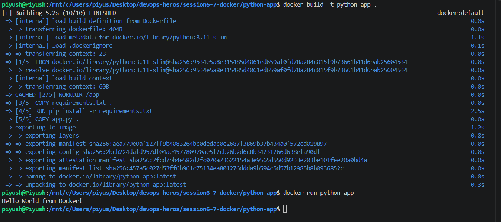
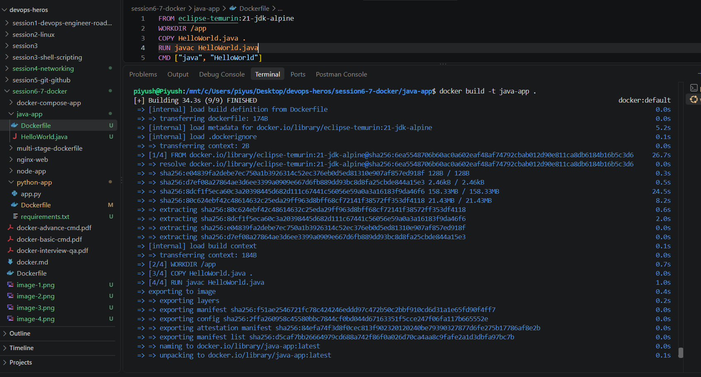
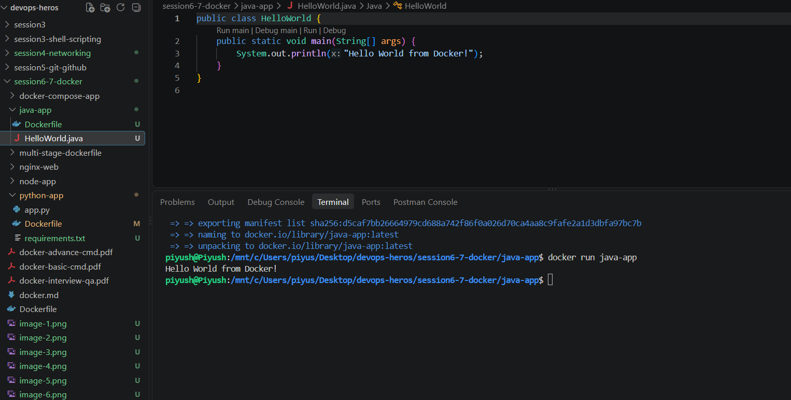

## Name - Piyush Kumar Mahato
## Roll no- 10233

## Task 1

I had an nginx container on port 8080 so i did it on port 3000 itself.

## Task 2
### Node-app

### Python app
there was an issue running so i commented that part out to build the image and made an empty requirements.txt

### Java app

