# Task: Hello World Applications

Create simple **Hello World** web applications using Docker for:

* Node.js application (preferably React)
* Python application
* Java application
* Apache web server
* React application
* Nginx application

## Requirements

For each application:

* Create a separate folder:

  * `nodejs-app`
  * `python-app`
  * `java-app`
  * `Apache-app`
  * `React-app`
  * `nginx-app`

* Add the application code.

* Create a `Dockerfile`.

* Build the Docker image.

* Run the application using Docker.

* Verify that **Hello World** is displayed on a webpage.

# Solution Screenshots: 

## Apache App
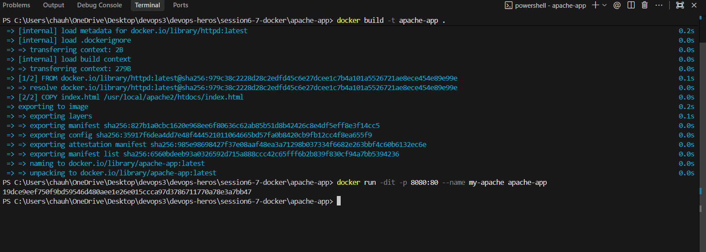
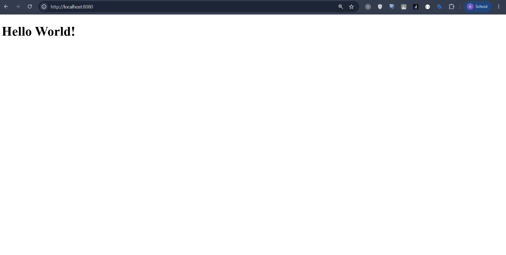

## Nginx App
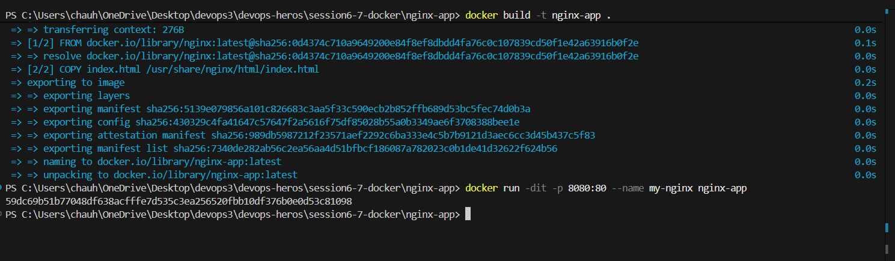
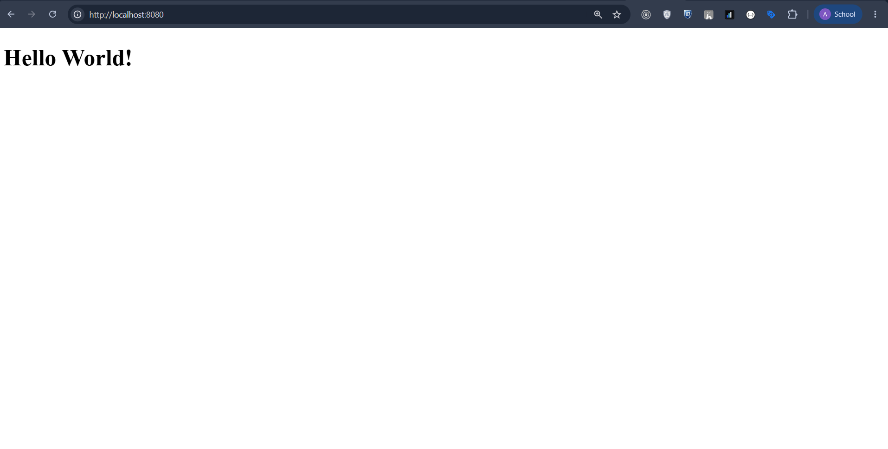

## React App
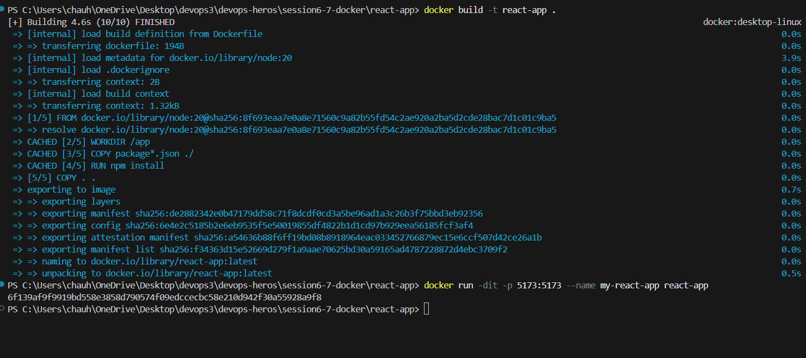
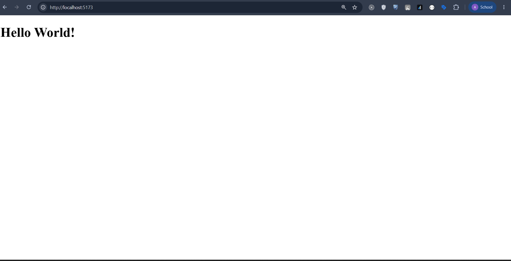

## Python App
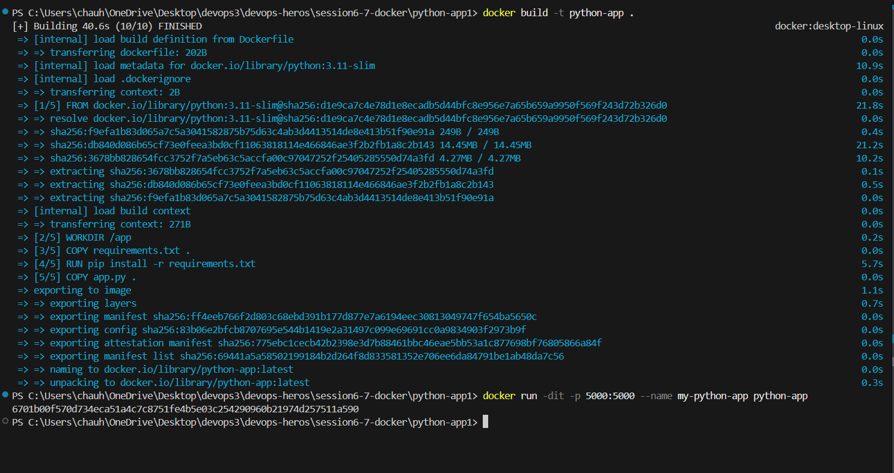
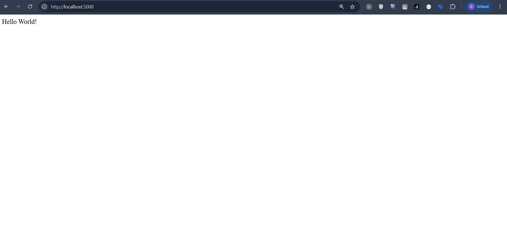

## Java App
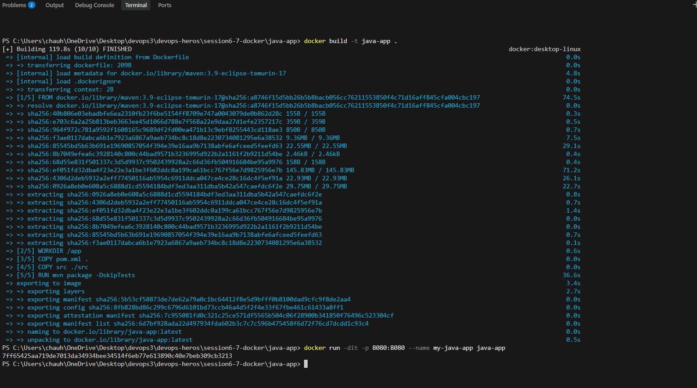

## Nodejs App
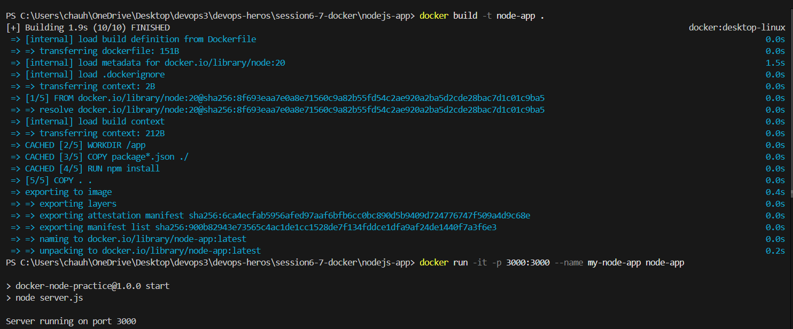
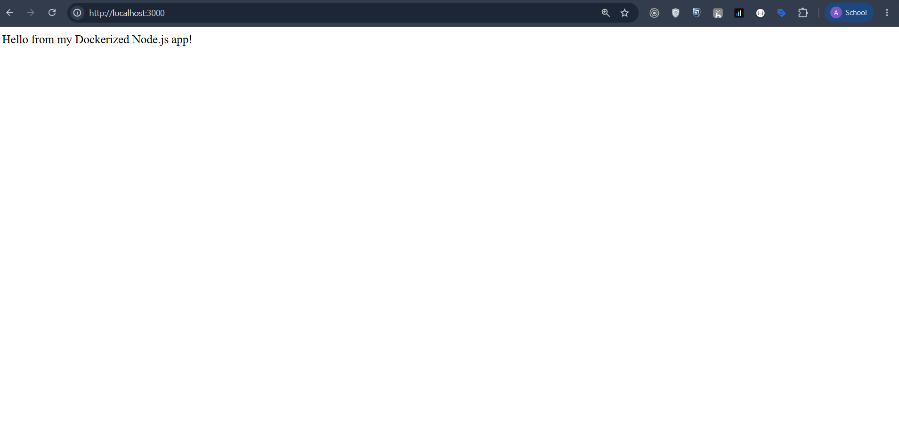