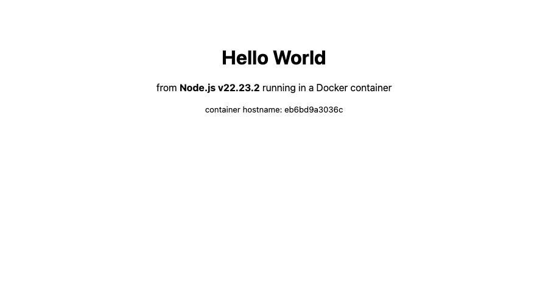
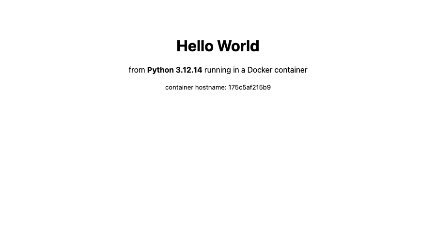
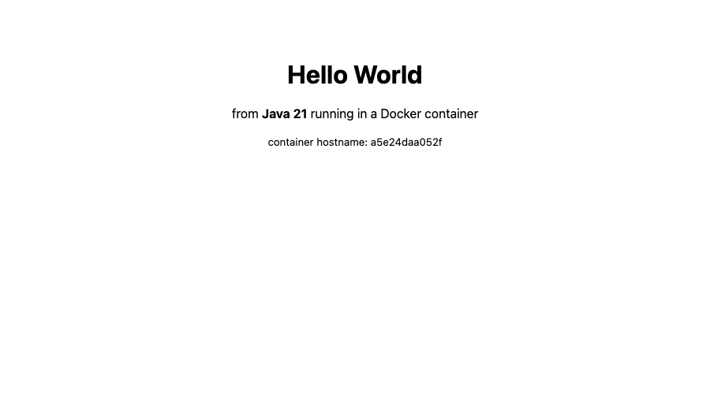
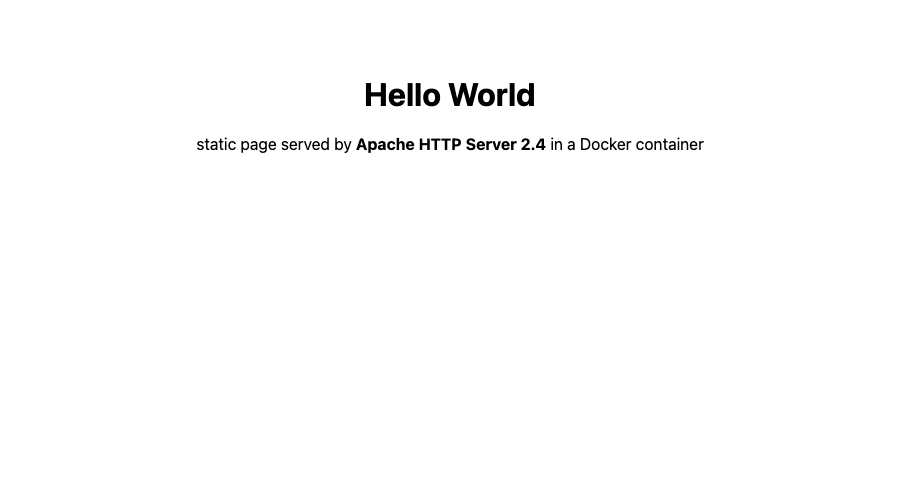
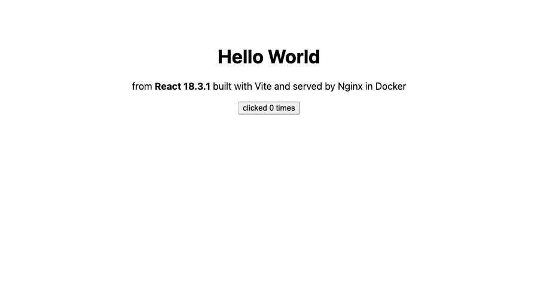
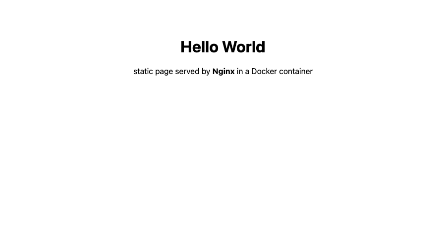

# Session 6 – Docker Fundamentals: six Hello World web apps

Each folder is a self-contained app with its own `Dockerfile`. I deliberately picked a different flavour for each so I could compare image sizes and Dockerfile patterns.

| Folder | Stack | How "Hello World" is produced | Image | Size | Host port |
|---|---|---|---|---|---|
| `nodejs-app` | Node.js 22, standard `http` module (no npm deps) | tiny HTTP server, `USER node` | `node:22-alpine` | 228 MB | 3000 |
| `python-app` | Python 3.12, standard `http.server` (no pip deps) | `BaseHTTPRequestHandler` | `python:3.12-alpine` | 88 MB | 5000 |
| `java-app` | Java 21, JDK built-in `com.sun.net.httpserver` | **multi-stage**: compile with JDK, run on JRE | `eclipse-temurin:21-jdk-alpine` → `21-jre-alpine` | 286 MB | 8080 |
| `Apache-app` | Apache HTTP Server 2.4 | static `index.html` copied into `htdocs` | `httpd:2.4-alpine` | 105 MB | 8081 → 80 |
| `React-app` | React 18 + Vite | **multi-stage**: `npm run build`, static bundle served by Nginx | `node:22-alpine` → `nginx:1.27-alpine` | 76 MB | 8082 → 80 |
| `nginx-app` | Nginx 1.27 | static `index.html` + custom `default.conf` with a `/health` route | `nginx:1.27-alpine` | 76 MB | 8083 → 80 |

Sizes are from `docker images` on arm64 ([evidence/ps-images.txt](evidence/ps-images.txt)).

## Build and run

Everything in one go:

```bash
./run-all.sh          # builds 6 images, starts 6 containers, curls each one
./run-all.sh down     # removes the containers
```

Or by hand, for example the Java app:

```bash
cd java-app
docker build -t hello-java-app .
docker run -d --name hello-java-app -p 8080:8080 hello-java-app
curl http://localhost:8080
```

## Verification

`docker ps` after `run-all.sh` ([evidence/ps-images.txt](evidence/ps-images.txt)):

```text
NAMES              IMAGE              STATUS         PORTS
hello-nginx-app    hello-nginx-app    Up 4 seconds   0.0.0.0:8083->80/tcp
hello-react-app    hello-react-app    Up 4 seconds   0.0.0.0:8082->80/tcp
hello-apache-app   hello-apache-app   Up 4 seconds   0.0.0.0:8081->80/tcp
hello-java-app     hello-java-app     Up 4 seconds   0.0.0.0:8080->8080/tcp
hello-python-app   hello-python-app   Up 4 seconds   0.0.0.0:5000->5000/tcp
hello-nodejs-app   hello-nodejs-app   Up 4 seconds   0.0.0.0:3000->3000/tcp
```

`curl` on every port returned `<h1>Hello World</h1>` ([evidence/curl-checks.txt](evidence/curl-checks.txt)); the React page returns only `<div id="root">` over curl because React renders in the browser, so it is verified with the screenshot instead. Response headers confirm which server answered (`Server: Apache/2.4.68 (Unix)`, `Server: nginx/1.27.5`).

Browser screenshots (in [`../screenshots/`](../screenshots)):

| Node.js :3000 | Python :5000 | Java :8080 |
|---|---|---|
|  |  |  |

| Apache :8081 | React :8082 | Nginx :8083 |
|---|---|---|
|  |  |  |

## Dockerfile notes (what I learned)

* **Alpine base images** cut the size a lot (Python 88 MB vs ~1 GB for `python:3.12`).
* **Layer order matters**: copy `package.json` / requirements before the source so dependency layers are cached when only code changes (React-app does this).
* **Multi-stage builds** keep compilers and `node_modules` out of the final image: the React image is 76 MB even though the build stage pulls hundreds of MB of npm packages; the Java image runs on a JRE with no `javac`.
* `EXPOSE` is documentation, `-p host:container` is what actually publishes the port.
* Run as a non-root user where the image provides one (`USER node`).
* `.dockerignore` keeps `node_modules`/`dist` out of the build context.
* Web servers inside containers must bind `0.0.0.0`, not `127.0.0.1`, or the port mapping will connect to nothing.
