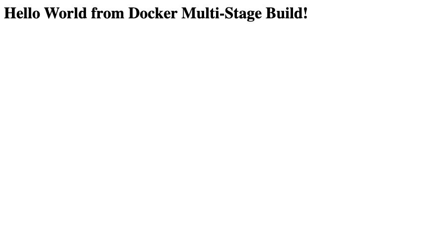

# Session 7 – Docker multi-stage build homework

**Name:** Kushal Talati  
**Enrollment No:** 24BCS10123

## Task 1 – run the course multi-stage Dockerfile

Source: [`../../multi-stage-dockerfile/`](../../multi-stage-dockerfile) in this repo (Express app, two stages: `builder` runs `npm install`, `production` copies `package*.json` + `server.js` and installs only production deps). I used it unmodified. Full output: [evidence/task1-multistage-run.txt](evidence/task1-multistage-run.txt).

```bash
cd session6-7-docker
docker build -t ms-hello:latest multi-stage-dockerfile
docker run -d --name ms-hello -p 8080:3000 ms-hello:latest   # app listens on 3000 inside, published on 8080
curl http://localhost:8080
```

### Application running

```text
$ curl -s http://localhost:8080
<h1>Hello World from Docker Multi-Stage Build!</h1>

$ curl -sI http://localhost:8080 | head -4
HTTP/1.1 200 OK
X-Powered-By: Express
Content-Type: text/html; charset=utf-8
```

Browser at `http://localhost:8080`:



### `docker ps` showing the container on port 8080

```text
$ docker ps --filter name=ms-hello
CONTAINER ID   IMAGE             STATUS         PORTS                                         NAMES
a1a055bc3000   ms-hello:latest   Up 3 seconds   0.0.0.0:8080->3000/tcp, [::]:8080->3000/tcp   ms-hello

$ docker port ms-hello
3000/tcp -> 0.0.0.0:8080
```

### What the multi-stage build bought us

I also built only the first stage with `--target builder` to compare:

```text
REPOSITORY:TAG          SIZE
ms-hello:latest         243MB
ms-hello:builder-only   249MB
```

Inside the final image there is only `server.js`, `package*.json` and a 4.3 MB `node_modules` with 65 production packages (`docker exec ms-hello du -sh /app/node_modules`). The difference is small here because this app has no dev dependencies and no compile step; for the React app in `hello-world-apps/` the same technique takes the image from a ~250 MB Node build environment to a 76 MB Nginx image, and the Java app ships a JRE instead of a JDK.

## Task 2 – documentation

This file. Evidence files:

| File | Contents |
|---|---|
| [evidence/task1-multistage-run.txt](evidence/task1-multistage-run.txt) | build log, image sizes, `docker ps`, `docker port`, `curl`, container filesystem |
| [evidence/browser-localhost-8080.png](evidence/browser-localhost-8080.png) | browser showing the app on port 8080 |
| [evidence/task3-three-apps-compose.txt](evidence/task3-three-apps-compose.txt) | Task 3 deployment |

## Task 3 – deploy three different application types

Instead of starting each container by hand, I described the Node.js, Python and Java apps from `hello-world-apps/` in one [`docker-compose.yml`](docker-compose.yml) (each `build:` points at the app folder, so the Dockerfiles are not duplicated) and deployed them together. Full output: [evidence/task3-three-apps-compose.txt](evidence/task3-three-apps-compose.txt).

```bash
cd multi-stage-build
docker compose up -d --build
docker compose ps
docker compose down
```

```text
$ docker compose ps
NAME           IMAGE              STATUS                    PORTS
stack-java     hello-java-app     Up 15 seconds (healthy)   0.0.0.0:8180->8080/tcp
stack-node     hello-nodejs-app   Up 15 seconds             0.0.0.0:3100->3000/tcp
stack-python   hello-python-app   Up 15 seconds             0.0.0.0:5100->5000/tcp

localhost:3100 -> <h1>Hello World</h1> from Node.js v22.23.2
localhost:5100 -> <h1>Hello World</h1> from Python 3.12.14
localhost:8180 -> <h1>Hello World</h1> from Java 21
```

The Java service has a `healthcheck`, which is why Compose reports `(healthy)`. Compose also created a private network `multi-stage-build_default`, so the three containers can reach each other by service name (`node-hello`, `python-hello`, `java-hello`) – that is the topic of session 8.
