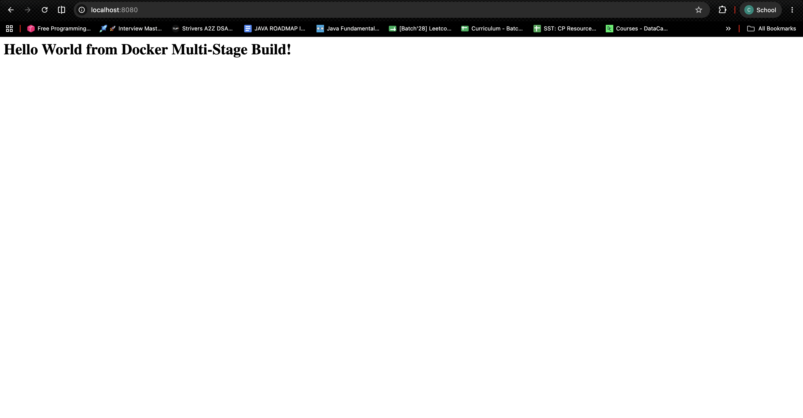
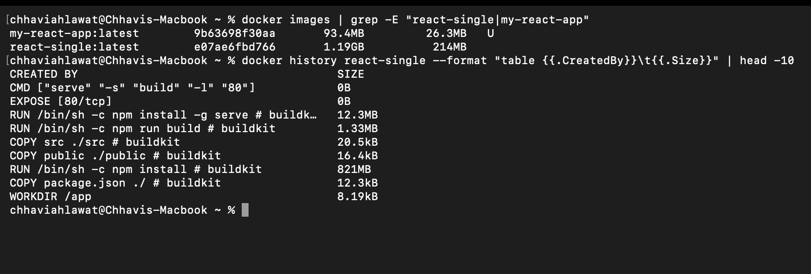
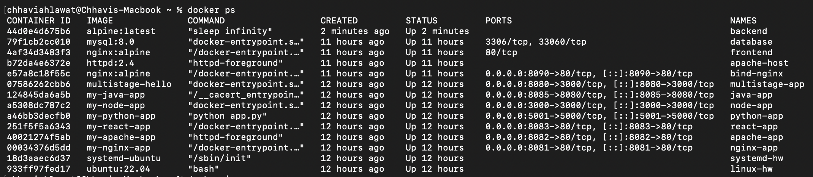

# Session 7 — Docker Images & Multi-Stage Builds (Homework)

**Name:** Chhavi Ahlawat
**Enrollment Number:** 24BCS10201
**Email:** chhavi.24bcs10201@sst.scaler.com

---

## Homework Tasks

**Task 1** — Clone the repo with the multi-stage Dockerfile, build the image, run a container,
access the app, verify it shows *"Hello World from Docker multi-stage build"*, verify with
`docker ps`, and confirm it's running on **port 8080**. ✅

**Task 2** — Create an `.md` file with name, enrollment number, and screenshots/output of the
app running and of `docker ps` showing port 8080. ✅ *(this file)*

**Task 3** — Deploy at least 3 different types of applications using Docker (Node.js, Python,
Java). ✅ — **6 applications** deployed, documented in
[`../README.md`](../README.md).

---

# Task 1 — Build and Run the Multi-Stage Dockerfile

## The application

### `server.js`

```javascript
const express = require("express");

const app = express();
const PORT = 3000;

app.get("/", (req, res) => {
  res.send("<h1>Hello World from Docker Multi-Stage Build!</h1>");
});

app.listen(PORT, () => {
  console.log(`Server running on port ${PORT}`);
});
```

### `package.json`

```json
{
  "name": "docker-hello-world",
  "version": "1.0.0",
  "main": "server.js",
  "scripts": {
    "start": "node server.js"
  },
  "dependencies": {
    "express": "^5.1.0"
  }
}
```

## The multi-stage `Dockerfile`

```dockerfile
# -------------------------
# Stage 1: Build
# -------------------------
FROM node:24-alpine AS builder
WORKDIR /app
COPY package*.json ./
RUN npm install
COPY . .

# -------------------------
# Stage 2: Production
# -------------------------
FROM node:24-alpine AS production
WORKDIR /app
COPY --from=builder /app/package*.json ./
RUN npm install --omit=dev
COPY --from=builder /app/server.js ./
EXPOSE 3000
CMD ["npm", "start"]
```

**Reading it:**

| Line | What it does |
|---|---|
| `FROM node:24-alpine AS builder` | Start stage 1 and **name it** `builder` so stage 2 can refer to it |
| `RUN npm install` | Install **all** dependencies, including devDependencies |
| `COPY . .` | Bring in the source |
| `FROM node:24-alpine AS production` | ⭐ A **second `FROM`** — this starts a brand-new, empty image. Everything from stage 1 is discarded unless explicitly copied |
| `RUN npm install --omit=dev` | Install **production dependencies only** — no test frameworks, linters or build tools |
| `COPY --from=builder /app/server.js ./` | ⭐ Reach back into stage 1 and take **only** this file |
| `CMD ["npm", "start"]` | What runs when the container starts |

**`COPY --from=builder` is the whole feature.** Without it, a second `FROM` would just throw
the first stage away. With it, you can build in a fat image and ship in a thin one.

---

## Build the image

```bash
docker build -t multistage-hello ./multi-stage-dockerfile
```

```
#13 exporting attestation manifest sha256:bbd0be5fc50e76066f288fefb281d17ce510bdd424cf9c387fee1a71716a6fb1 done
#13 exporting manifest list sha256:433656771dcee7c251862e1082319404c7c54207b117816c2838eeea76ac54ff done
#13 naming to docker.io/library/multistage-hello:latest done
#13 unpacking to docker.io/library/multistage-hello:latest done
#13 DONE 0.5s
```

## Run a container on **port 8080**

```bash
docker run -d -p 8080:3000 --name multistage-app multistage-hello
```

The app listens on **3000** inside the container; `-p 8080:3000` publishes it on the host as
**8080**, exactly as the homework requires.

---

# ✅ Task 1 Verification

## 1. `docker ps` — running on port 8080

```bash
docker ps
```

```
CONTAINER ID   IMAGE              COMMAND                  CREATED         STATUS         PORTS                                         NAMES
07586262cbb6   multistage-hello   "docker-entrypoint.s…"   6 seconds ago   Up 6 seconds   0.0.0.0:8080->3000/tcp, [::]:8080->3000/tcp   multistage-app
```

**`0.0.0.0:8080->3000/tcp`** — confirmed: **host port 8080 → container port 3000**, container
status **Up**. ✅

## 2. The application output

```bash
curl http://localhost:8080
```

```
<h1>Hello World from Docker Multi-Stage Build!</h1>
```

```bash
curl -s -o /dev/null -w '%{http_code}' http://localhost:8080
```

```
200
```

✅ **Verified: the application displays "Hello World from Docker Multi-Stage Build" and
returns HTTP 200 on port 8080.**

### Screenshot — the application in the browser



The address bar shows **localhost:8080** and the page shows **"Hello World from Docker Multi-Stage Build!"** — both Task 1 requirements in one shot.

🌐 **Open in a browser:** http://localhost:8080

## 3. Container logs

```bash
docker logs multistage-app
```

```
> docker-hello-world@1.0.0 start
> node server.js

Server running on port 3000
```

---

# What is a Multi-Stage Build?

A **multi-stage build** is a single Dockerfile with **more than one `FROM`**. Each `FROM`
starts a new stage with a clean filesystem. The final stage becomes your image; every earlier
stage is discarded except for whatever you explicitly `COPY --from`.

## The problem it solves

Building software and running software need **completely different things**:

| Phase | Needs |
|---|---|
| **Build** | Compilers, package managers, dev dependencies, source code, test frameworks |
| **Run** | The compiled output + a runtime. That's it. |

Without multi-stage builds, all the build tooling ends up in your production image — bigger
downloads, slower deploys, and a much larger attack surface for no benefit.

## The measured proof

I built the **same two applications** both ways:

| Application | Single-stage | Multi-stage | Saving |
|---|---|---|---|
| **React app** | **1.19 GB** | **93.4 MB** | **92.2% smaller (13×)** |
| **Node/Express app** | 249 MB | 243 MB | 2.4% smaller |

```bash
docker images
```

```
REPOSITORY          TAG       IMAGE ID       SIZE
react-single        latest    e07ae6fbd766   1.19GB      <-- single-stage React
multistage-single   latest    a211eec58596   249MB       <-- single-stage Node
multistage-hello    latest    433656771dce   243MB       <-- multi-stage Node
my-react-app        latest    9b63698f30aa   93.4MB      <-- multi-stage React ⭐
```

### 📸 Screenshot — the measurement



### Why React saves 92% but Node only saves 2%

**This was the most useful thing I learned here — the saving isn't automatic.**

For **React**, the build output is *static files*. The final stage doesn't need Node at all,
so it can start from `nginx:alpine` and drop the entire Node toolchain:

```bash
docker history react-single --format "table {{.CreatedBy}}\t{{.Size}}"
```

```
CREATED BY                                      SIZE
CMD ["serve" "-s" "build" "-l" "80"]            0B
EXPOSE [80/tcp]                                 0B
RUN /bin/sh -c npm install -g serve             12.3MB
RUN /bin/sh -c npm run build # buildkit         1.33MB   <-- what we actually need
COPY src ./src # buildkit                       20.5kB
COPY public ./public # buildkit                 16.4kB
RUN /bin/sh -c npm install # buildkit           821MB    <-- ⚠️ node_modules
COPY package.json ./ # buildkit                 12.3kB
WORKDIR /app                                    8.19kB
```

**821 MB of `node_modules` to produce 1.33 MB of output.** The multi-stage version copies the
1.33 MB and leaves the 821 MB behind.

For the **Express app**, the final image still needs **Node.js to run** — it's a server, not
static files. Both stages use `node:24-alpine`, so the only saving is `--omit=dev` skipping
dev dependencies. Small app, few dev dependencies, small saving.

> **The lesson:** multi-stage builds pay off most when the **build toolchain differs from the
> runtime** — React/Angular/Vue → Nginx, Go/Rust → `scratch`, Java JDK → JRE, C++ → the bare
> binary. For an interpreted app that needs its interpreter at run time anyway, the win is
> mostly just dropping dev dependencies.

## Real-world savings

| Language | Single-stage | Multi-stage | Final base |
|---|---|---|---|
| **Go** | ~800 MB | **~10 MB** | `scratch` (nothing but the binary) |
| **React/Vue/Angular** | ~1.2 GB | **~90 MB** | `nginx:alpine` |
| **Java** | ~700 MB | **~200 MB** | `eclipse-temurin:21-jre` |
| **Rust** | ~1.5 GB | **~15 MB** | `scratch` / `distroless` |
| **Python** | ~1 GB | **~150 MB** | `python:3.11-slim` |

Go is the extreme case: it compiles to a single static binary that needs **no operating
system at all**, so the final stage can be `FROM scratch` — a completely empty image.

## Why size matters beyond disk space

1. **Deployment speed** — pulling 93 MB instead of 1.19 GB on every deploy across a fleet.
2. **Security** — every package is a potential CVE. `npm`, `git`, `curl` and a compiler in
   your production image are all tools an attacker could use after a breach. **Removing them
   is a real defence**, not just tidiness.
3. **Cost** — registry storage and egress bandwidth are billed.
4. **Cold starts** — on Kubernetes or serverless, image pull time is startup time.

---

# Task 3 — Docker Application Deployment

The homework asks for **at least 3** application types. I deployed **6**, plus the multi-stage
app — full details, Dockerfiles and verified output in **[`../README.md`](../README.md)**.

```bash
docker ps
```

```
NAMES            IMAGE              STATUS         PORTS
multistage-app   multistage-hello   Up 9 minutes   0.0.0.0:8080->3000/tcp
java-app         my-java-app        Up 9 minutes   0.0.0.0:8085->8080/tcp
node-app         my-node-app        Up 9 minutes   0.0.0.0:3000->3000/tcp
python-app       my-python-app      Up 9 minutes   0.0.0.0:5001->5000/tcp
react-app        my-react-app       Up 9 minutes   0.0.0.0:8083->80/tcp
apache-app       my-apache-app      Up 9 minutes   0.0.0.0:8082->80/tcp
nginx-app        my-nginx-app       Up 9 minutes   0.0.0.0:8081->80/tcp
```

| # | Application | Type | Port | Output | Status |
|---|---|---|---|---|---|
| 1 | **Node.js** | Runtime | 3000 | `<h1>Hello from Node.js + Docker!</h1>` | ✅ |
| 2 | **Python** | Runtime (Flask) | 5001 | `<h1>Hello from Python Flask + Docker!</h1>` | ✅ |
| 3 | **Java** | Runtime (JDK) | 8085 | `<h1>Hello from Java + Docker!</h1>` | ✅ |
| 4 | **Nginx** | Web server | 8081 | `<h1>Hello World from Nginx + Docker!</h1>` | ✅ |
| 5 | **Apache** | Web server | 8082 | `<h1>Hello World from Apache + Docker!</h1>` | ✅ |
| 6 | **React** | SPA (multi-stage) | 8083 | `Hello World from React + Docker!` | ✅ |
| 7 | **Express** | Multi-stage | 8080 | `<h1>Hello World from Docker Multi-Stage Build!</h1>` | ✅ |

All seven verified returning **HTTP 200**.

### 📸 Screenshot — `docker ps`



---

# Docker Image Concepts

## Layers

A Docker image is a **stack of read-only layers**. Each Dockerfile instruction adds one.

```bash
docker history <image>
```

Layers are **shared** between images: if five of your images use `nginx:alpine`, those base
layers are stored **once** on disk. This is why `docker images` sizes look like they add up
to more than your actual disk usage, and why the *second* image built on a familiar base
pulls almost instantly.

## Layer caching

Docker reuses a cached layer when its instruction and inputs are unchanged. **But once one
layer is invalidated, every layer below it rebuilds too.**

❌ **Bad** — any code change reinstalls all dependencies:
```dockerfile
COPY . .
RUN npm install
```

✅ **Good** — dependencies only reinstall when `package.json` changes:
```dockerfile
COPY package*.json ./
RUN npm install
COPY . .
```

**Order instructions from least-likely-to-change to most-likely-to-change.**

## Image size — the ranking from my own builds

```
my-react-app        93.4MB     multi-stage → nginx:alpine ⭐
my-apache-app        205MB     httpd:2.4
my-python-app        239MB     python:3.11-slim
multistage-hello     243MB     multi-stage → node:24-alpine
my-nginx-app         256MB     nginx:latest (Debian-based)
my-node-app          313MB     node:20-slim
my-java-app          744MB     eclipse-temurin:21-jdk (full JDK)
react-single        1.19GB     single-stage React ❌
```

**How to shrink an image, in order of impact:**

1. **Use a multi-stage build** — the biggest win by far when build ≠ runtime tooling
2. **Pick a smaller base** — `alpine` or `-slim` instead of the full image
3. **Ship the runtime, not the SDK** — JRE not JDK, `--omit=dev` not full `npm install`
4. **Combine `RUN` steps and clean up in the same layer:**
   ```dockerfile
   RUN apt-get update && apt-get install -y curl \
       && rm -rf /var/lib/apt/lists/*
   ```
   ⚠️ The cleanup **must** be in the same `RUN`. A separate `RUN rm -rf ...` doesn't help —
   the files still exist in the earlier layer, and layers are immutable. The image only gets
   bigger.
5. **Use a `.dockerignore`** — keep `node_modules`, `.git` and build output out of the build
   context entirely:
   ```
   node_modules
   build
   .git
   ```

## Useful image commands

```bash
docker images                        # list images with sizes
docker images -a                     # include intermediate layers
docker history <image>               # layers and their individual sizes ⭐
docker inspect <image>               # full metadata as JSON
docker build -t name .               # build
docker build --no-cache -t name .    # build ignoring the cache
docker build --target builder -t x . # build ONLY up to a named stage ⭐
docker rmi <image>                   # remove
docker image prune                   # remove dangling images
docker image prune -a                # remove all unused images
docker system df                     # how much disk is Docker using?
docker tag local user/repo:v1        # tag for a registry
docker push user/repo:v1             # push to Docker Hub
```

**`--target` is genuinely useful:** `docker build --target builder -t debug .` builds *only*
the first stage, giving you an image that still contains the compiler and source — perfect
for debugging a build that fails.

---

# Key Takeaways

1. **A second `FROM` starts a brand-new image.** Everything from the previous stage is
   discarded unless you explicitly `COPY --from=<stage>` it. That discard *is* the feature.

2. **The saving depends on whether the runtime needs the build tools.** React went from
   1.19 GB → 93.4 MB (92%); the Express app only went 249 MB → 243 MB (2%). Same technique,
   very different results — because React's output is static files while Express still needs
   Node at run time.

3. **`docker history` shows exactly where the bytes are.** `RUN npm install` was a **821 MB**
   layer producing **1.33 MB** of usable output. You can't optimise what you haven't measured.

4. **Smaller images are more secure, not just faster.** A production image with no compiler,
   no package manager and no shell gives an attacker far less to work with after a breach.

5. **Layer ordering is free performance.** Putting `COPY package.json` + `RUN npm install`
   above `COPY . .` turns a 2-minute rebuild into a 2-second one, and costs nothing.

6. **Name your stages** (`AS builder`). Positional references (`COPY --from=0`) work but break
   silently the moment someone inserts a stage.

---

## Reference Links

- Multi-stage builds — https://docs.docker.com/build/building/multi-stage/
- Dockerfile best practices — https://docs.docker.com/develop/develop-images/dockerfile_best-practices/
- Docker overview — https://docs.docker.com/get-started/docker-overview/
