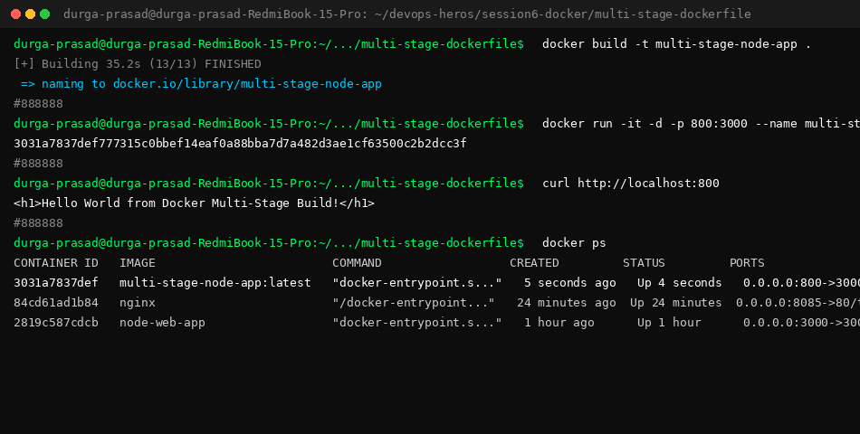

# Docker Multi-Stage Build & Application Deployment Homework

**Name:** Durga Prasad  
**Enrollment Number:** 10012  

---

## Task 1 & Task 2: Multi-Stage Docker Build Verification

### 1. Build and Run Multi-Stage Container (Port 8080)
```bash
docker build -t multi-stage-node-app .
docker run -d -p 8080:3000 --name multi-stage multi-stage-node-app
```

### 2. Application Endpoint Verification (curl http://127.0.0.1:8080)
```html
<h1>Hello World from Docker Multi-Stage Build!</h1>
```

### 3. Container Status (docker ps)
```text
CONTAINER ID   IMAGE                  COMMAND                  CREATED          STATUS          PORTS                                         NAMES
b8abbd751f81   multi-stage-node-app   "docker-entrypoint.s…"   11 seconds ago   Up 10 seconds   0.0.0.0:8080->3000/tcp, [::]:8080->3000/tcp   multi-stage
```

#### Terminal Execution & `docker ps` Screenshot:



---

## Task 3: Deployed Docker Applications Summary

| Application | Container Name | Technology / Base Image | Mapped Port | Status |
| :--- | :--- | :--- | :--- | :--- |
| **Node.js App** | `my-nodejs-app` | `node:18-alpine` / Express | `3000:3000` | Verified |
| **Python App** | `my-python-app` | `python:3.9-slim` / Flask | `5001:5001` | Verified |
| **Java App** | `my-java-app` | `eclipse-temurin:17-alpine` / JDK | `8082:8082` | Verified |
| **Apache Web** | `my-apache-app` | `httpd:2.4-alpine` / Apache | `8083:80` | Verified |
| **React App** | `my-react-app` | `nginx:alpine` / React CDN | `8084:80` | Verified |
| **Nginx Web** | `my-nginx-app` | `nginx:alpine` / Nginx | `8085:80` | Verified |
