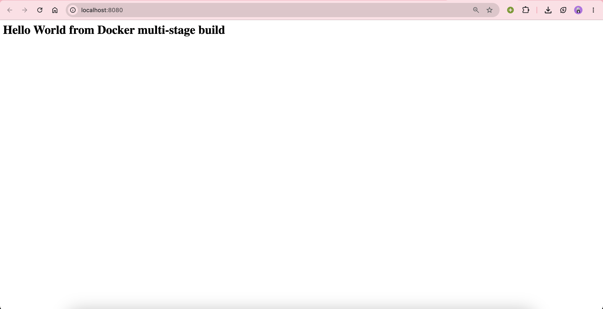
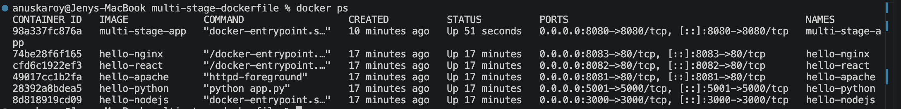

# Docker Multi-Stage Build — Homework Submission

**Name:** Anuska Roy
**Enrollment Number:** 10021

Environment: Docker Engine 29.7.2, macOS (Apple Silicon, linux/arm64)

---

## Task 1 — Run the Multi-Stage Dockerfile

Source: [`session6-7-docker/multi-stage-dockerfile`](multi-stage-dockerfile)

### The Dockerfile

```dockerfile
# -------------------------
# Stage 1: Build
# -------------------------
FROM node:24-alpine AS builder
WORKDIR /app
COPY package*.json ./
RUN npm install
COPY . .

# -------------------------
# Stage 2: Production
# -------------------------
FROM node:24-alpine AS production
WORKDIR /app
COPY --from=builder /app/package*.json ./
RUN npm install --omit=dev
COPY --from=builder /app/server.js ./
EXPOSE 8080
CMD ["npm", "start"]
```

Stage 1 (`builder`) installs all dependencies including dev dependencies.
Stage 2 (`production`) starts from a clean base and copies in only
`package*.json` and `server.js`, then installs production dependencies with
`--omit=dev`. The build tooling and dev dependencies never reach the final image.

### Steps performed

```bash
cd session6-7-docker/multi-stage-dockerfile

# 1. Build the image from the multi-stage Dockerfile
docker build -t multi-stage-app .

# 2. Run a container, publishing container port 8080 on host port 8080
docker run -d --name multi-stage-app -p 8080:8080 multi-stage-app

# 3. Access the application
curl http://localhost:8080
```

### Application output — `curl http://localhost:8080`

```
HTTP/1.1 200 OK
X-Powered-By: Express
Content-Type: text/html; charset=utf-8
Content-Length: 50
ETag: W/"32-/f6Dub7FU3KvL133TUZVmIWqIxw"
Date: Wed, 02 Sep 2026 18:33:28 GMT
Connection: keep-alive
Keep-Alive: timeout=5

<h1>Hello World from Docker multi-stage build</h1>
```

The application displays **Hello World from Docker multi-stage build**, as required.



### Container logs — confirms port 8080

```
> docker-hello-world@1.0.0 start
> node server.js

Server running on port 8080
```

---

## Task 1 (cont.) — Verify with `docker ps`

```
CONTAINER ID   IMAGE             COMMAND                  CREATED          STATUS          PORTS                                         NAMES
98a337fc876a   multi-stage-app   "docker-entrypoint.s…"   11 seconds ago   Up 10 seconds   0.0.0.0:8080->8080/tcp, [::]:8080->8080/tcp   multi-stage-app
```

The `PORTS` column shows `0.0.0.0:8080->8080/tcp`, confirming the application
is running on **port 8080**.



---

## Task 3 — Deploy 3+ Different Types of Applications

Six applications were containerised and deployed, each in its own folder with
its own Dockerfile. This exceeds the required minimum of three.

| Folder        | Stack                                             | Container port | Host port |
|---------------|---------------------------------------------------|----------------|-----------|
| `nodejs-app`  | Node.js 20 + Express                              | 3000           | 3000      |
| `python-app`  | Python 3.11 + Flask                               | 5000           | 5001      |
| `java-app`    | Java 17 (JDK HttpServer), multi-stage Maven build | 8080           | 8080      |
| `Apache-app`  | Apache HTTP Server 2.4                            | 80             | 8081      |
| `React-app`   | React 18 + Vite, multi-stage build, Nginx runtime | 80             | 8082      |
| `nginx-app`   | Nginx 1.27                                        | 80             | 8083      |

### Build and run commands

```bash
# nodejs-app
cd nodejs-app && docker build -t hello-nodejs . && docker run -d --name hello-nodejs -p 3000:3000 hello-nodejs

# python-app
cd python-app && docker build -t hello-python . && docker run -d --name hello-python -p 5001:5000 hello-python

# java-app
cd java-app && docker build -t hello-java . && docker run -d --name hello-java -p 8080:8080 hello-java

# Apache-app
cd Apache-app && docker build -t hello-apache . && docker run -d --name hello-apache -p 8081:80 hello-apache

# React-app
cd React-app && docker build -t hello-react . && docker run -d --name hello-react -p 8082:80 hello-react

# nginx-app
cd nginx-app && docker build -t hello-nginx . && docker run -d --name hello-nginx -p 8083:80 hello-nginx
```

### Running containers (`docker ps`)

```
CONTAINER ID   IMAGE             COMMAND                  STATUS          PORTS                                         NAMES
74be28f6f165   hello-nginx       "/docker-entrypoint.…"   Up 6 minutes    0.0.0.0:8083->80/tcp, [::]:8083->80/tcp       hello-nginx
cfd6c1922ef3   hello-react       "/docker-entrypoint.…"   Up 6 minutes    0.0.0.0:8082->80/tcp, [::]:8082->80/tcp       hello-react
49017cc1b2fa   hello-apache      "httpd-foreground"       Up 6 minutes    0.0.0.0:8081->80/tcp, [::]:8081->80/tcp       hello-apache
28392a8bdea5   hello-python      "python app.py"          Up 6 minutes    0.0.0.0:5001->5000/tcp, [::]:5001->5000/tcp   hello-python
8d818919cd09   hello-nodejs      "docker-entrypoint.s…"   Up 6 minutes    0.0.0.0:3000->3000/tcp, [::]:3000->3000/tcp   hello-nodejs
```

The `docker ps` screenshot under Task 1 above shows these containers running
alongside `multi-stage-app`.

### HTTP verification

```
Node.js   http://localhost:3000  -> HTTP 200  Hello World: OK
Python    http://localhost:5001  -> HTTP 200  Hello World: OK
Java      http://localhost:8080  -> HTTP 200  Hello World: OK
Apache    http://localhost:8081  -> HTTP 200  Hello World: OK
React     http://localhost:8082  -> HTTP 200  Hello World: OK
Nginx     http://localhost:8083  -> HTTP 200  Hello World: OK
```

All six were verified serving **Hello World**. Java was later stopped to free
host port 8080 for the Task 1 multi-stage container, which is why `hello-java`
does not appear in the `docker ps` screenshot above.

---

## Notes

- **Port 8080 conflict.** Both `java-app` and the Task 1 multi-stage app use
  host port 8080. They cannot run at the same time — stop one before starting
  the other (`docker stop hello-java`), or remap one to a different host port.
- **Python on host port 5001.** macOS binds port 5000 to the AirPlay Receiver,
  which returns HTTP 403 and would mask the Flask app. Inside the container the
  app still listens on 5000.
- **Multi-stage builds** are used by `multi-stage-dockerfile`, `java-app`, and
  `React-app`, so build tooling (npm, Maven, Vite) is not shipped in the final
  runtime images.
- **Java base image.** `eclipse-temurin:17-jre-alpine` is published amd64-only
  and failed on Apple Silicon with `no match for platform in manifest`. The
  runtime stage uses the multi-arch `eclipse-temurin:17-jre` instead.
