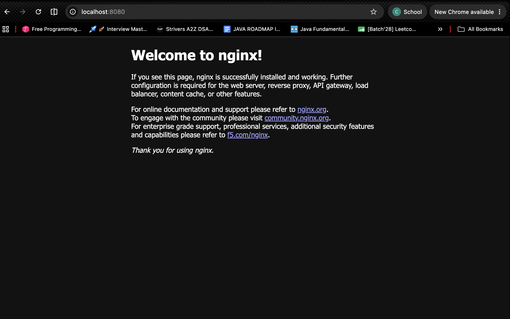
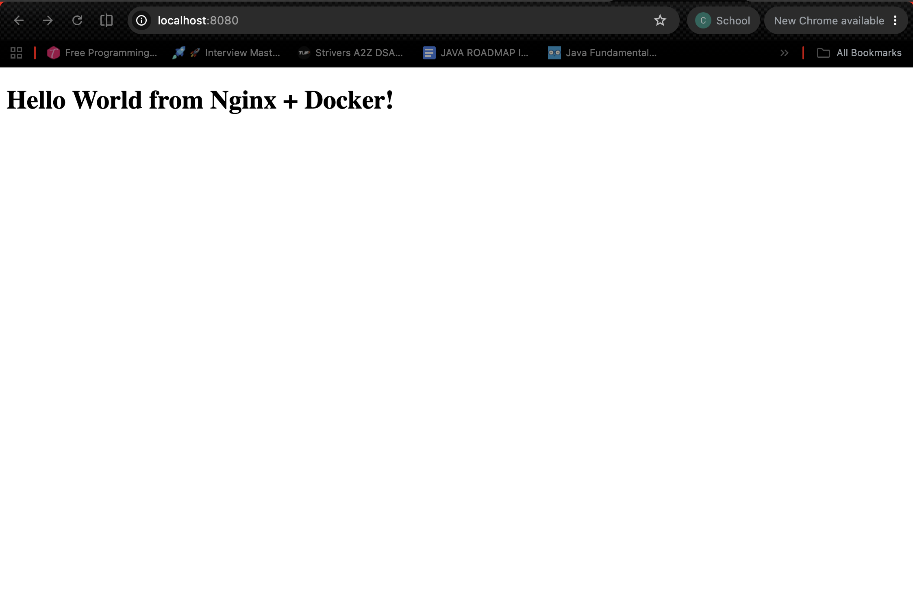
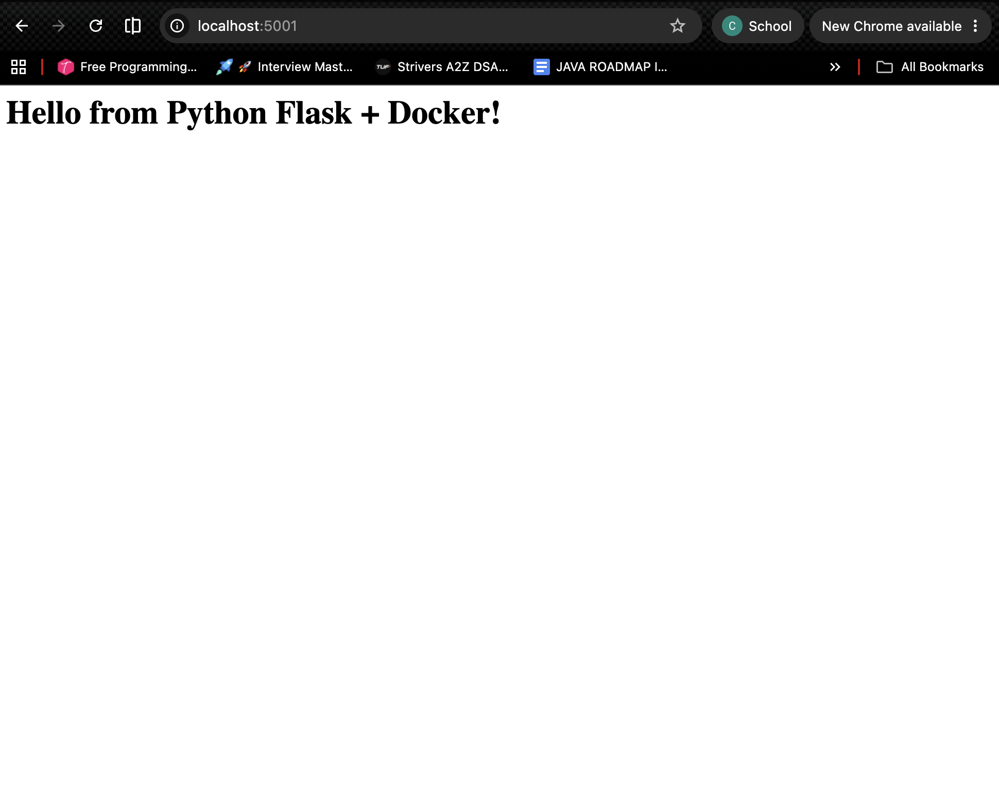
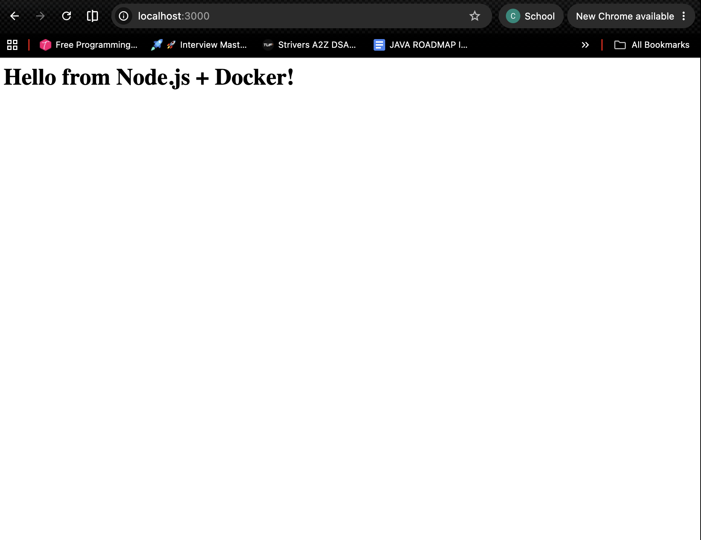
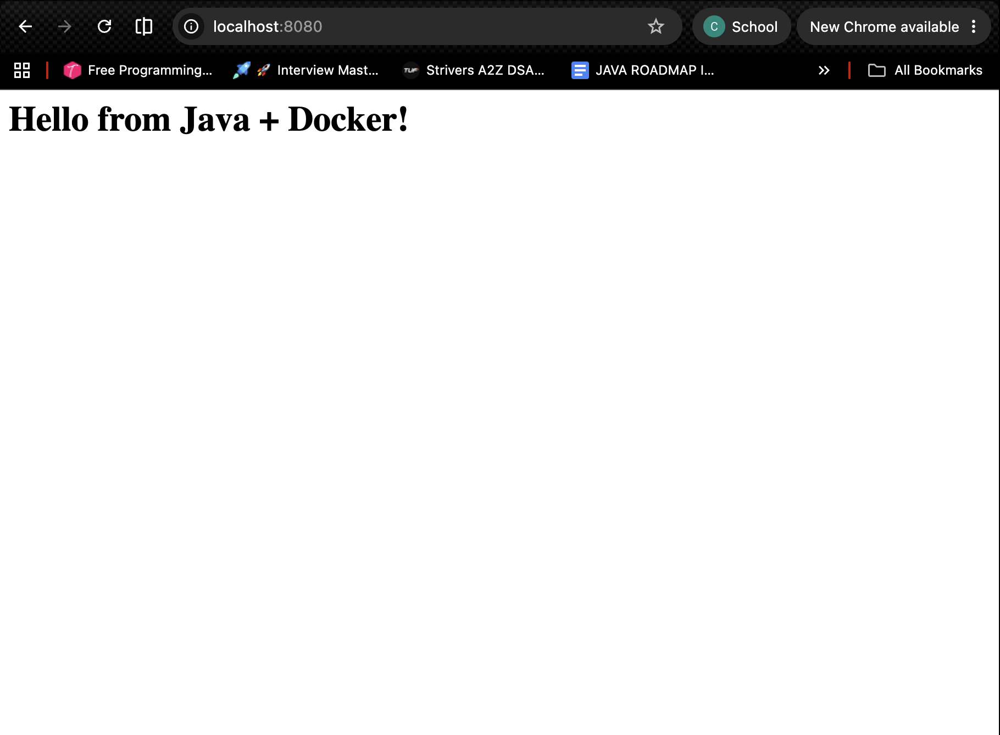

# My Docker Learning Journey

## 1. Basic Nginx Container

### Commands Used:
```bash
# Pull nginx image
docker pull nginx

# Run nginx container
docker run -d -p 8080:80 --name my-nginx nginx

# Check running containers
docker ps
```

### What I Learned:
- `-d` runs container in detached (background) mode
- `-p 8080:80` maps host port 8080 to container port 80
- `--name my-nginx` gives the container a friendly name

### Screenshot:



---

## 2. Custom Nginx with Custom HTML

### Dockerfile Used (nginx-web/Dockerfile):
```dockerfile
FROM nginx:latest
COPY index.html /usr/share/nginx/html/index.html
EXPOSE 80
```

### Commands Used:
```bash
# Stop and remove basic nginx
docker stop my-nginx
docker rm my-nginx

# Build custom image
cd session6-docker/nginx-web
docker build -t my-custom-nginx .

# Run custom nginx
docker run -d -p 8080:80 --name custom-nginx my-custom-nginx
```

### What I Learned:
- `FROM nginx:latest` - Use nginx as base image
- `COPY` - Copy local files into the container
- `docker build -t name .` - Build image with a tag name (`.` = current directory)

### Screenshot:


## 3. Python Flask App

### Files Created:
- `app.py` - Flask web server
- `requirements.txt` - Python dependencies
- `Dockerfile` - Build instructions

### Dockerfile Used (python-app/Dockerfile):
```dockerfile
FROM python:3.11-slim
WORKDIR /app
COPY requirements.txt .
RUN pip install -r requirements.txt
COPY app.py .
EXPOSE 5000
CMD ["python", "app.py"]
```

### Commands Used:
```bash
cd session6-docker/python-app
docker build -t my-python-app .
docker run -d -p 5001:5000 --name python-app my-python-app
```

### What I Learned:
- `WORKDIR /app` - Set working directory inside container
- `RUN pip install` - Install dependencies during build
- `CMD` - Command to run when container starts
- Port mapping can use different host:container ports (5001:5000)

### Screenshot:


## 4. Node.js App

### Files Created:
- `app.js` - Node HTTP server
- `package.json` - Node dependencies
- `Dockerfile` - Build instructions

### Dockerfile Used (node-app/Dockerfile):
```dockerfile
FROM node:20-slim
WORKDIR /app
COPY package.json .
RUN npm install
COPY app.js .
EXPOSE 3000
CMD ["npm", "start"]
```

### Commands Used:
```bash
cd session6-docker/node-app
docker build -t my-node-app .
docker run -d -p 3000:3000 --name node-app my-node-app
```

### What I Learned:
- Node uses `npm install` to install dependencies
- `package.json` defines the project and scripts
- `CMD ["npm", "start"]` runs the start script from package.json

### Screenshot:


## 5. Java App

### Files Created:
- `HelloDocker.java` - Java HTTP server
- `Dockerfile` - Build instructions

### Dockerfile Used (java-app/Dockerfile):
```dockerfile
FROM eclipse-temurin:21-jdk
WORKDIR /app
COPY HelloDocker.java .
RUN javac HelloDocker.java
EXPOSE 8080
CMD ["java", "HelloDocker"]
```

### Commands Used:
```bash
docker stop custom-nginx
cd session6-docker/java-app
docker build -t my-java-app .
docker run -d -p 8080:8080 --name java-app my-java-app
```

### What I Learned:
- `eclipse-temurin:21-jdk` is a popular Java Docker image
- `RUN javac` compiles Java code during image build
- `CMD ["java", "HelloDocker"]` runs the compiled class

### Screenshot:


---

## Summary: Useful Docker Commands

```bash
# List running containers
docker ps

# List all containers (including stopped)
docker ps -a

# Stop a container
docker stop <container-name>

# Remove a container
docker rm <container-name>

# List images
docker images

# Remove an image
docker rmi <image-name>

# View container logs
docker logs <container-name>
```
