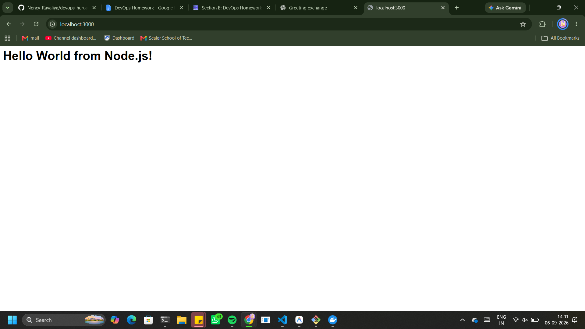
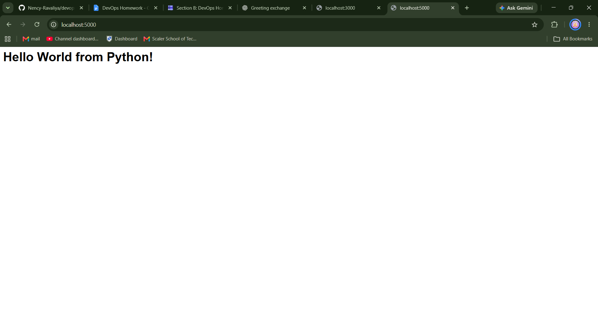
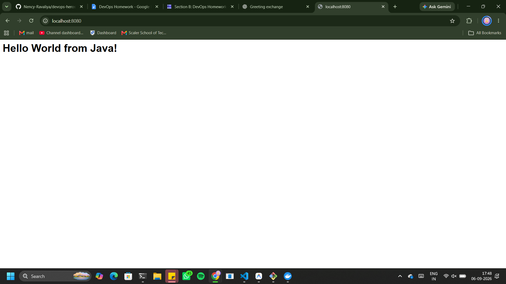
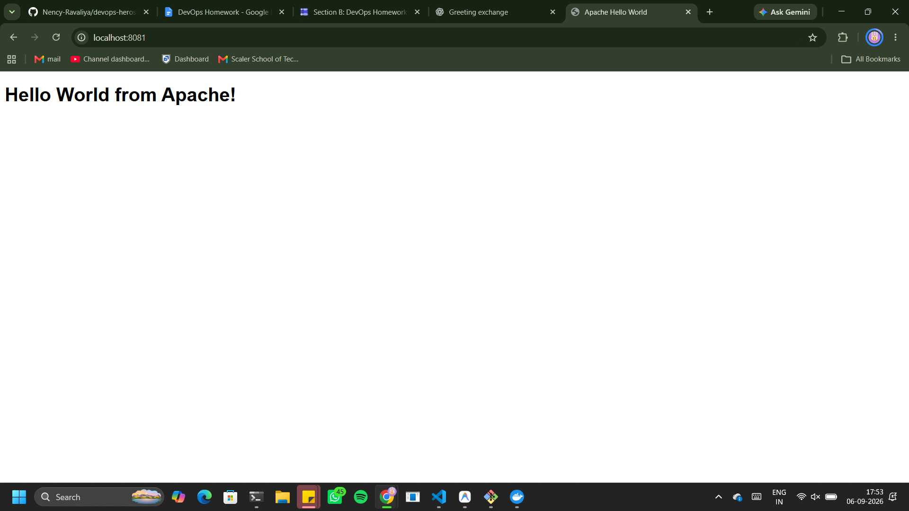
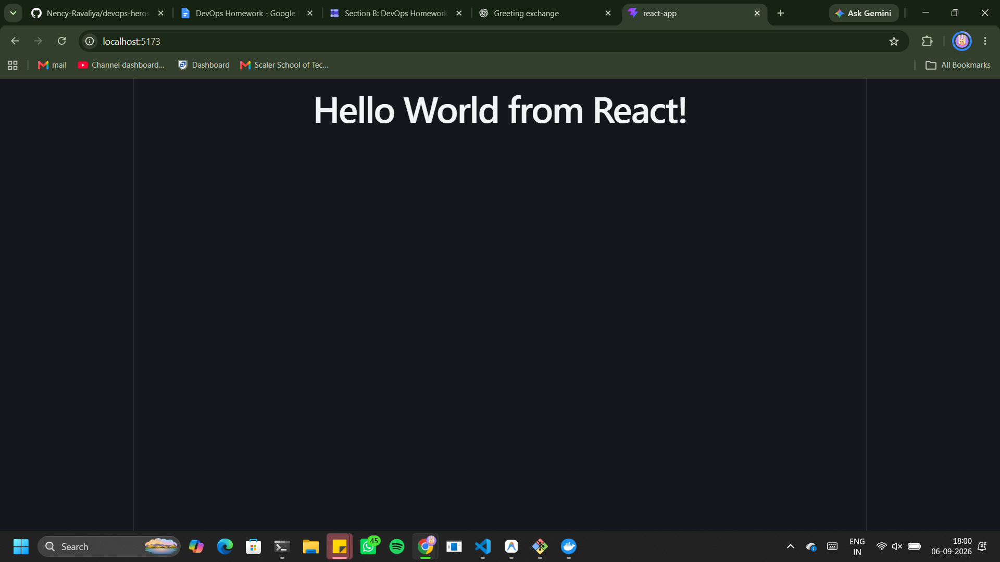
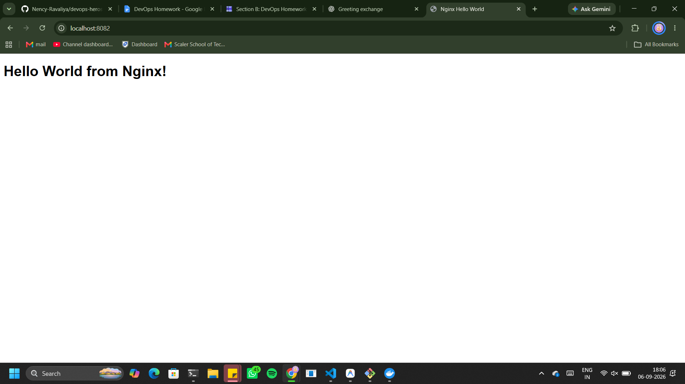

# Docker Hello World Applications

## 👩‍💻 Submitted by Sahasra

This project contains six simple **Hello World applications** containerized using Docker.

Each application has its own folder, application code, and Dockerfile.

---

# 📁 Project Structure

```text
sahasra10241-docker/
│
├── README.md
├── nodejs-app/
├── python-app/
├── java-app/
├── Apache-app/
├── React-app/
└── nginx-app/
```

---

# 🟢 1. Node.js Application

A simple Node.js web application displaying:

```text
Hello World from Node.js!
```

### Build

```bash
docker build -t sahasra-nodejs-app .
```

### Run

```bash
docker run -d -p 3000:3000 --name sahasra-nodejs-container sahasra-nodejs-app
```

### Open

```text
http://localhost:3000
```

---

### Output



# 🐍 2. Python Application

A Flask web application displaying:

```text
Hello World from Python!
```

### Build

```bash
docker build -t sahasra-python-app .
```

### Run

```bash
docker run -d -p 5000:5000 --name sahasra-python-container sahasra-python-app
```

### Open

```text
http://localhost:5000
```

---

### Output




# ☕ 3. Java Application

A simple Java web server displaying:

```text
Hello World from Java!
```

### Build

```bash
docker build -t sahasra-java-app .
```

### Run

```bash
docker run -d -p 8080:8080 --name sahasra-java-container sahasra-java-app
```

### Open

```text
http://localhost:8080
```

---


### Output




# 🌐 4. Apache Application

Apache web server displaying:

```text
Hello World from Apache!
```

### Build

```bash
docker build -t sahasra-apache-app .
```

### Run

```bash
docker run -d -p 8081:80 --name sahasra-apache-container sahasra-apache-app
```

### Open

```text
http://localhost:8081
```

---

### Output




# ⚛️ 5. React Application

A React application displaying:

```text
Hello World from React!
```

### Build

```bash
docker build -t sahasra-react-app .
```

### Run

```bash
docker run -d -p 5173:5173 --name sahasra-react-container sahasra-react-app
```

### Open

```text
http://localhost:5173
```

---

### Output




# 🚀 6. Nginx Application

Nginx web server displaying:

```text
Hello World from Nginx!
```

### Build

```bash
docker build -t sahasra-nginx-app .
```

### Run

```bash
docker run -d -p 8082:80 --name sahasra-nginx-container sahasra-nginx-app
```

### Open

```text
http://localhost:8082
```

---

### Output




# 🐳 Docker Concepts Practiced

- Dockerfile
- Docker Images
- Docker Containers
- Docker Build
- Docker Run
- Port Mapping
- Base Images
- Containerized Web Applications

---

## 🎉 Result

All six applications were successfully containerized using Docker and verified through the browser.