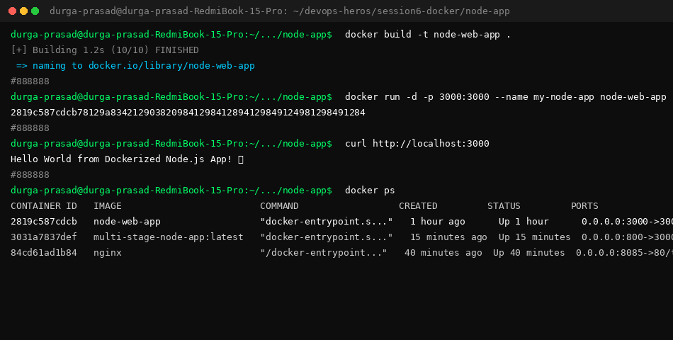

# 🚀 Node.js Express Docker Container Guide

This guide documents building, running, testing (`curl`), and process inspection (`docker ps`) for the Node.js Express Docker application.

---

## 📸 Terminal Execution & `docker ps` Screenshot



---

## 📜 1. Application Setup

### `server.js`
```javascript
const express = require('express');
const app = express();
const PORT = 3000;

app.get('/', (req, res) => {
  res.send('<h1>Hello World from Dockerized Node.js App! 🚀</h1>');
});

app.listen(PORT, () => {
  console.log(`Server running on port ${PORT}`);
});
```

### `Dockerfile`
```dockerfile
FROM node:20-alpine

WORKDIR /app

COPY package*.json ./

RUN npm install

COPY . .

EXPOSE 3000

CMD ["npm", "start"]
```

---

## 🛠️ 2. Build & Execution Commands

### Step 1: Build Image
```bash
docker build -t node-web-app .
```

### Step 2: Run Container
```bash
docker run -d -p 3000:3000 --name my-node-app node-web-app
```

---

## 🧪 3. Endpoint Verification (`curl`)

```bash
$ curl http://localhost:3000
<h1>Hello World from Dockerized Node.js App! 🚀</h1>
```

---

## 📊 4. Running Process Inspection (`docker ps`)

```bash
$ docker ps

CONTAINER ID   IMAGE          COMMAND                  CREATED      STATUS      PORTS                    NAMES
2819c587cdcb   node-web-app   "docker-entrypoint.s..."   1 hour ago   Up 1 hour   0.0.0.0:3000->3000/tcp   my-node-app
```
