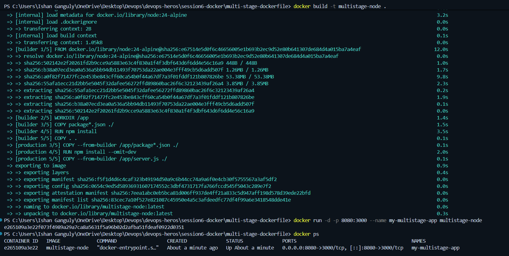
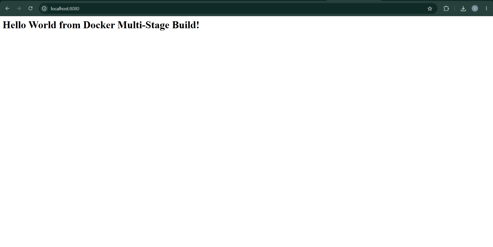

# Docker Multi-Stage Build & Application Deployment

## Task 1: Run Multi-Stage Dockerfile

* Clone the repository containing the multi-stage Dockerfile.
* Build the Docker image using the multi-stage Dockerfile.
* Run a container from the image.
* Access the application running inside the container.
* Verify that the application displays:
  **Hello World from Docker multi-stage build**
* Verify the running container using `docker ps`.
* Confirm that the application is running on port `8080`.

## Task 2: Documentation

Create an `.md` file containing:

* Your name
* Your enrollment number
* Screenshot or output showing the application running successfully.
* Screenshot or output of `docker ps` showing the running container on port `8080`.

## Task 3: Docker Application Deployment

Deploy at least **3 different types of applications** using Docker, such as:

* Node.js
* Python
* Java

# Solution:

Name: Ishan Ganguly
Enrollment Number: 10330

## Screenshots:

