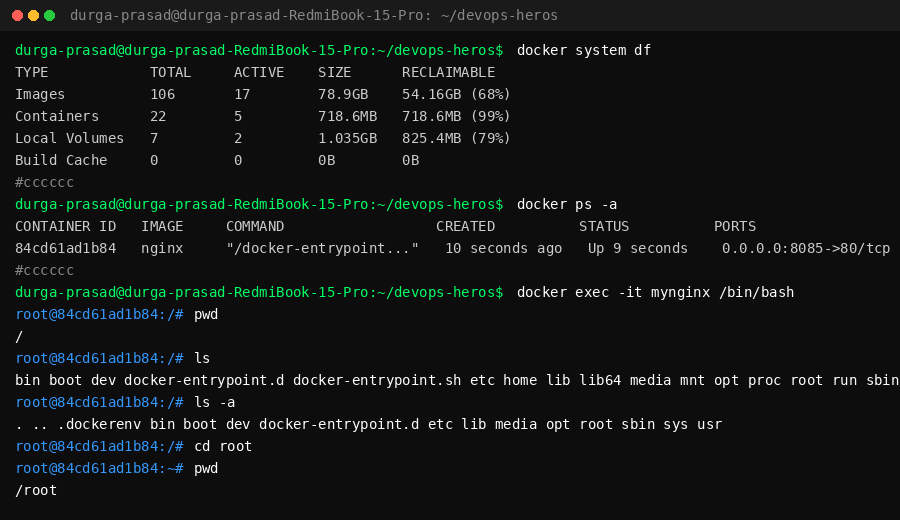

# Session 7: Docker Container Inspection & Exec Commands

## Screenshots



---

## Command Logs & Output

### 1. Docker System Space Check
```bash
$ docker system df
TYPE            TOTAL     ACTIVE    SIZE      RECLAIMABLE
Images          106       17        78.9GB    54.16GB (68%)
Containers      22        5         718.6MB   718.6MB (99%)
Local Volumes   7         2         1.035GB   825.4MB (79%)
Build Cache     0         0         0B        0B
```

### 2. Container Status Check
```bash
$ docker ps -a
CONTAINER ID   IMAGE     COMMAND                  CREATED          STATUS          PORTS                  NAMES
84cd61ad1b84   nginx     "/docker-entrypoint..."   10 seconds ago   Up 9 seconds    0.0.0.0:8085->80/tcp   mynginx
```

### 3. Interactive Container Exec Shell
```bash
$ docker exec -it mynginx /bin/bash

root@84cd61ad1b84:/# pwd
/

root@84cd61ad1b84:/# ls
bin boot dev docker-entrypoint.d docker-entrypoint.sh etc home lib lib64 media mnt opt proc root run sbin srv sys tmp usr var

root@84cd61ad1b84:/# ls -a
. .. .dockerenv bin boot dev docker-entrypoint.d etc lib media opt root sbin sys usr

root@84cd61ad1b84:/# cd root

root@84cd61ad1b84:~# pwd
/root
```
