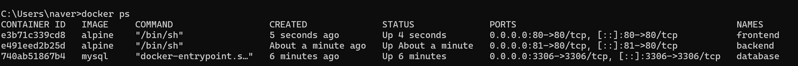
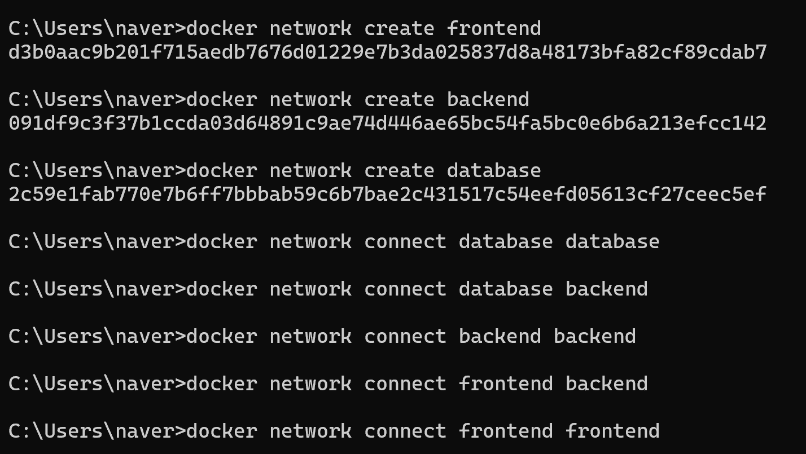
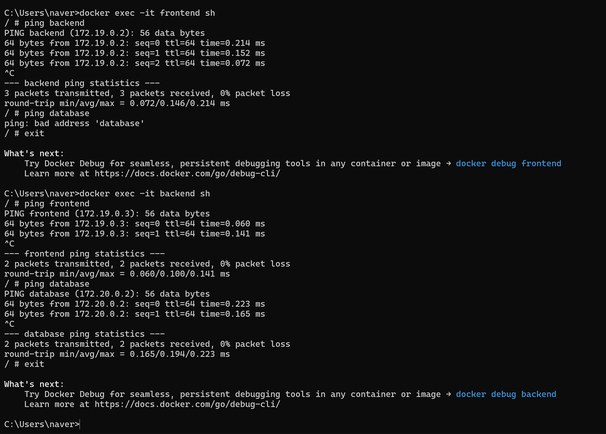
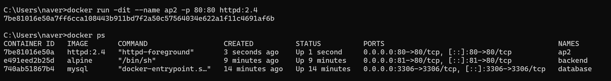
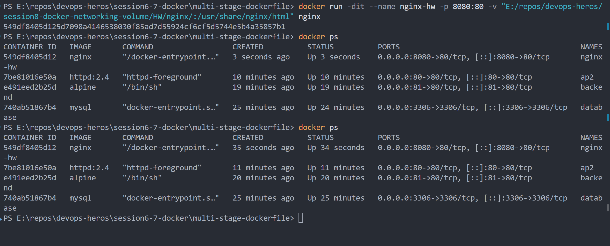

# Docker Networking & Volume Homework Tasks

## Task 1: Docker Container Networking

### Create 3 containers:

- Frontend
- Backend
- Database
  
Use Nginx or Alpine images for the frontend and backend.
Use the MySQL image for the database.
Create 3 different Docker networks.
Add the backend container to 2 networks.
Check connectivity between the containers.

## Task 2: Host Network

- Pull the Apache2 image from Docker Hub.
- Create an Apache2 container using the host network.
- Access the Apache website directly on port 80.

## Task 3: Bind Mount

- Create a folder on your local machine.
- Create an index.html file with Hello students as the content.
- Bind mount the folder to an Nginx container.
- Access the Nginx website and verify the content.
- Modify the index.html file.
- Verify that the changes are reflected without restarting the container.

## Task 4: Overlay Network

- Research Docker overlay networks.
- Understand their use cases.
- Understand how overlay networks work across multiple Docker hosts.

Docker **overlay networks** are used to connect containers running on **different Docker hosts**.
Unlike bridge networks, overlay networks work across multiple machines.
They are mainly used with **Docker Swarm** for communication between services.
Docker creates a virtual network that spans all participating hosts.
Containers can communicate using **service/container names** instead of IP addresses.
Overlay networks use **VXLAN** to transport container traffic between hosts.
For example, a frontend container on Host 1 can communicate with a backend on Host 2.
This is useful for **distributed and microservice-based applications**.
