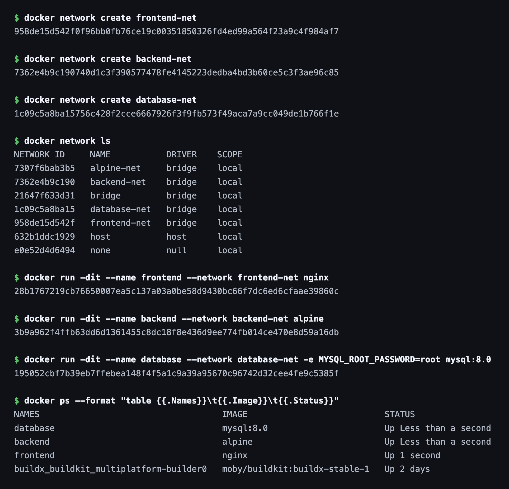
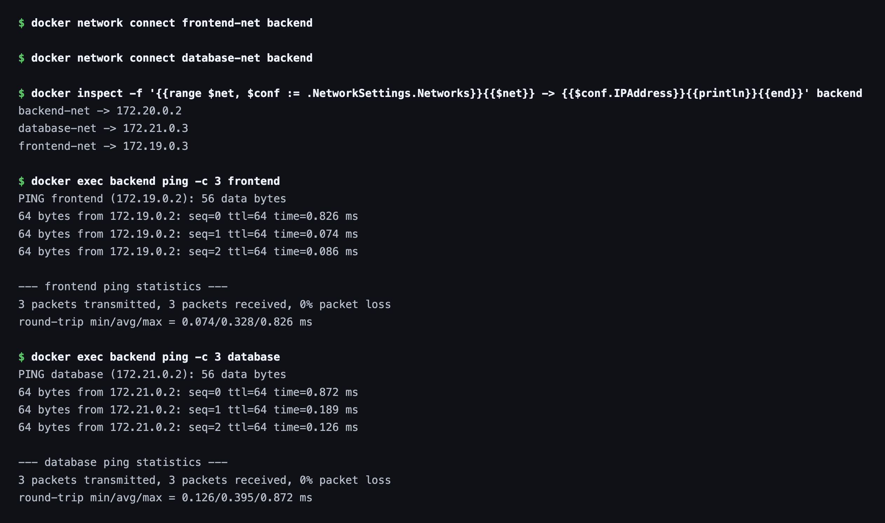
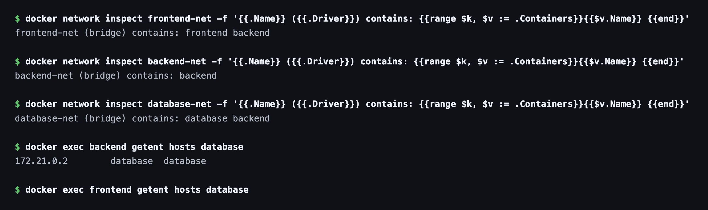

# Session 8 — Docker Networking & Volumes

Hands-on exercises covering Docker bridge networks, multi-network containers,
host networking, bind mounts and overlay networks.

**Environment:** Docker 28.5.2 (Docker Desktop, WSL2 backend) on Windows 11

Resources: https://docs.docker.com/engine/network/drivers/

---

## Task 1 — Container Networking

Three containers on three user-defined bridge networks, with the backend
deliberately attached to **two** networks so it can act as a bridge between the
frontend and the database.

### Create the networks

```bash
docker network create frontend-net
docker network create backend-net
docker network create database-net
```



### Create the containers

```bash
docker run -dit --name frontend --network frontend-net alpine sh
docker run -dit --name backend  --network frontend-net alpine sh
docker network connect database-net backend        # 2nd network
docker run -d  --name database --network database-net \
  -e MYSQL_ROOT_PASSWORD=root mysql:8.0
```

`docker network connect` is what attaches an already-running container to an
additional network — a container can only be given one `--network` at creation.

### Resulting topology

| Container | Networks | IP addresses |
|---|---|---|
| frontend | frontend-net | 172.21.0.2 |
| **backend** | **frontend-net + database-net** | **172.21.0.3, 172.23.0.2** |
| database | database-net | 172.23.0.3 |

The backend holds **two IPs**, one per network — this is what multi-homing looks like:

```
$ docker inspect backend --format '...NetworkSettings.Networks...'
database-net=172.23.0.2 frontend-net=172.21.0.3
```



### Connectivity results

`ping` is not in the base `alpine` image, so it was installed first:

```bash
docker exec backend sh -c "apk add --no-cache iputils"
docker exec backend ping -c 2 database
```

| From | To | Result |
|---|---|---|
| backend | frontend | ✅ 0% packet loss |
| frontend | backend | ✅ 0% packet loss |
| backend | database | ✅ 0% packet loss |
| **frontend** | **database** | ❌ `ping: database: Try again` |

```
# backend -> database  (share database-net)
2 packets transmitted, 2 received, 0% packet loss, time 1001ms

# frontend -> database (share no network)
ping: database: Try again
```



### What this demonstrates

The frontend → database failure is **the point of the exercise, not a bug.**

* Docker runs an embedded DNS server at `127.0.0.11` that resolves container
  names — but **only between containers that share at least one network.**
* `frontend` and `database` have no network in common, so the name never
  resolves and the packet is never even sent.
* `backend` sits on both networks, so it can reach both sides.

This is the standard three-tier security pattern: the frontend is forced to go
*through* the backend to reach data, and cannot talk to the database directly.

---

## Task 2 — Host Network

```bash
docker pull httpd
docker run -d --name apache-host --network host httpd
```

> **Note:** `apache2` is not an official Docker Hub image — the official Apache
> HTTP Server image is **`httpd`**.

With `--network host` the container shares the host's network namespace
directly: no NAT, no virtual bridge, and **no port mapping** — note the empty
PORTS column:

```
NAMES           IMAGE     PORTS
apache-host     httpd
apache-mapped   httpd     0.0.0.0:8081->80/tcp
```

### ⚠️ Host networking on Windows

`--network host` is a **Linux-only** feature. On Docker Desktop for Windows the
container joins the *WSL2 Linux VM's* network stack — not the Windows host's —
so `http://localhost:80` in a Windows browser does **not** reach it.

To show a working Apache page, a port-mapped container was run alongside:

```bash
docker run -d --name apache-mapped -p 8081:80 httpd
curl http://localhost:8081
```

```html
<html><body>It works!</body></html>
```


On a native Linux host, `--network host` would serve on port 80 with no `-p` flag.

---

## Task 3 — Bind Mount

A host folder mounted straight into the container, so edits on the host appear
instantly inside it.

```bash
mkdir bindmount
echo 'Hello students' > bindmount/index.html

docker run -d --name nginx-bind -p 8082:80 \
  -v "/c/Users/.../session8-docker-networking-volume/bindmount:/usr/share/nginx/html" \
  nginx
```

### Before

```bash
curl http://localhost:8082
# <h1>Hello students</h1>
```


### After editing the file on the host

```bash
echo '<h1>Hello students - UPDATED without restart!</h1>' > bindmount/index.html
curl http://localhost:8082
# <h1>Hello students - UPDATED without restart!</h1>
```


### No restart was performed

The container uptime kept counting straight through the edit, proving it was
never restarted or recreated:

```
nginx-bind: Up 35 seconds
```


### Bind mount vs named volume

| | Bind mount | Named volume |
|---|---|---|
| Location | Any host path you choose | Docker-managed (`/var/lib/docker/volumes`) |
| Host access | Direct — edit with any editor | Needs a container to reach it |
| Best for | Local development, live editing | Databases, production data |

Because the mount is a live view of the host directory rather than a copy, nginx
reads the new bytes off disk on the very next request — no rebuild, no restart.

---

## Task 4 — Overlay Network (Research)

An overlay network spans **multiple Docker hosts**, letting containers on
different physical machines talk as if on one LAN. It requires Swarm mode.

```bash
docker swarm init
docker network create -d overlay --attachable my-overlay
```

```
Name:       my-overlay
Driver:     overlay
Scope:      swarm        <-- bridge networks are "local"
Attachable: true
Subnet:     10.0.1.0/24
```


### How it works

1. **VXLAN encapsulation** — each container frame is wrapped in a UDP packet
   (port **4789**) and tunnelled across the physical network, then unwrapped on
   the destination host. Containers see a flat L2 network; the physical
   infrastructure only sees ordinary UDP.
2. **Control plane** — Swarm managers distribute network state (which container
   lives on which node, and its IP) to every node via an encrypted gossip protocol.
3. **Service discovery** — a container name resolves to the right IP regardless
   of which physical host it runs on.
4. **Encryption** — `--opt encrypted` adds IPsec on the data plane.

### bridge vs overlay

| | bridge | overlay |
|---|---|---|
| Scope | Single host (`local`) | Multiple hosts (`swarm`) |
| Transport | Linux virtual bridge | VXLAN tunnel over UDP 4789 |
| Requires Swarm | No | Yes |
| Use case | Containers on one machine | Distributed / clustered services |

**Use cases:** Swarm & Kubernetes clusters, multi-host microservices,
high-availability services spread across machines, and blue-green deployments
where traffic shifts between hosts.

> Demonstrated single-node here (one machine available). A true overlay needs
> 2+ hosts joined to the same swarm; the mechanism is identical, only the node
> count differs.

---


## Cleanup

```bash
docker rm -f frontend backend database apache-host apache-mapped nginx-bind
docker network rm frontend-net backend-net database-net my-overlay
docker swarm leave --force
```
