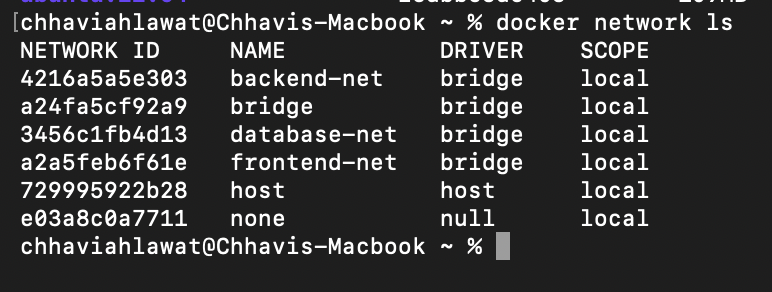
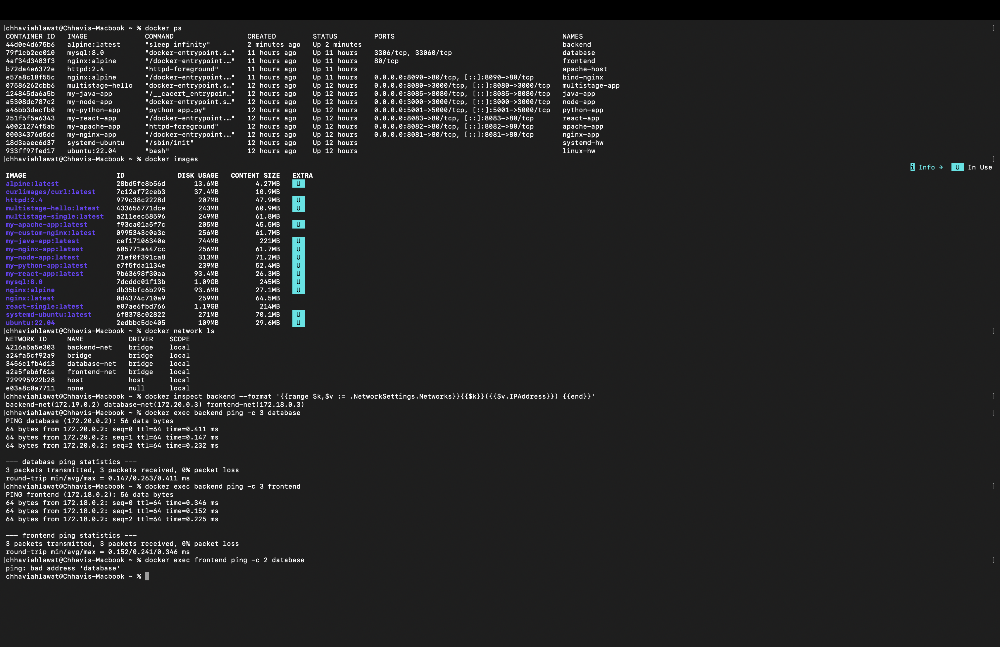
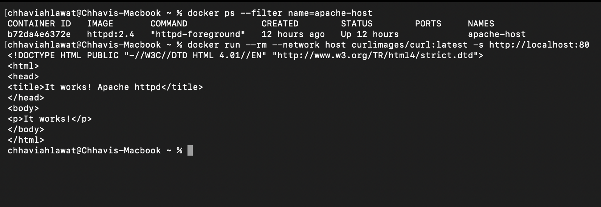
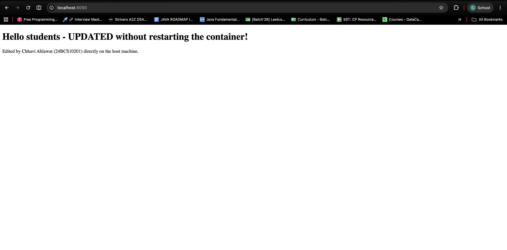

# Session 8 — Docker Networking & Volumes (Homework)

**Name:** Chhavi Ahlawat
**Enrollment Number:** 24BCS10201
**Email:** chhavi.24bcs10201@sst.scaler.com

---

## Homework Tasks

| Task | Description | Status |
|---|---|---|
| **1** | Container networking — 3 containers (frontend/backend/database), 3 networks, backend on 2+ networks, check connectivity | ✅ |
| **2** | Host network — pull Apache2, run it with `--network host`, access it on port 80 | ✅ |
| **3** | Bind mount — create a folder + `index.html` with "Hello students", bind mount into Nginx, modify and verify live | ✅ |
| **4** | Overlay network — research, use cases, how it works across multiple Docker hosts | ✅ |

All output below is **real terminal output**.

---

# Task 1 — Docker Container Networking

## The setup

```
                   ┌──────────────────────────────┐
   frontend-net    │                              │
   172.18.0.0/16   │  frontend (nginx:alpine)     │  172.18.0.2
                   │  backend  (alpine)     ──────┼─ 172.18.0.3
                   └──────────────────────────────┘
                   ┌──────────────────────────────┐
   backend-net     │  backend  (alpine)           │  172.19.0.2
   172.19.0.0/16   └──────────────────────────────┘
                   ┌──────────────────────────────┐
   database-net    │  backend  (alpine)     ──────┼─ 172.20.0.3
   172.20.0.0/16   │  database (mysql:8.0)        │  172.20.0.2
                   └──────────────────────────────┘

   frontend ←→ backend   ✅  (share frontend-net)
   backend  ←→ database  ✅  (share database-net)
   frontend ←→ database  ❌  (share NO network — isolated by design)
```

**The backend is the only container on all three networks** — it's the middle tier, so it must
talk to both the frontend and the database. The frontend and database never share a network,
so the database can never be reached directly from the public-facing tier.

---

## 1. Create 3 Docker networks

```bash
docker network create frontend-net
docker network create backend-net
docker network create database-net
```

```
a2a5feb6f61e16f2ff630b6e8c8c5447d85ed5010a8d2cb62cb2961bc5340cc5
4216a5a5e3030357254f5f6176dc61d51b3d216874a9ffdf350e01388ed696eb
3456c1fb4d1371c6672b0e009d5c62d8932ccd2b05377a9656f7c84c0065ea3e
```

```bash
docker network ls
```

```
NETWORK ID     NAME           DRIVER    SCOPE
4216a5a5e303   backend-net    bridge    local
a24fa5cf92a9   bridge         bridge    local
3456c1fb4d13   database-net   bridge    local
a2a5feb6f61e   frontend-net   bridge    local
729995922b28   host           host      local
e03a8c0a7711   none           null      local
```

### 📸 Screenshot — `docker network ls`



The three at the bottom (`bridge`, `host`, `none`) are Docker's **built-in** networks — they
always exist and can't be removed. The three I created (`backend-net`, `database-net`,
`frontend-net`) use the **`bridge` driver**, which is the default for user-defined networks.

Note the `DRIVER` column: my three and the built-in `bridge` are all `bridge`, `host` uses
the `host` driver, and `none` uses the `null` driver.

## 2. Create the three containers

```bash
docker run -d --name frontend --network frontend-net nginx:alpine
docker run -d --name backend  --network backend-net  alpine:latest sleep 3600
docker run -d --name database --network database-net -e MYSQL_ROOT_PASSWORD=root mysql:8.0
```

```
4af34d3483f390a20834f4aed3ca95e53bdb096276951e74149f0b26dbd2259c
69724b4855718b004ead863a705634f40d3a63a12e2a9ecbc629c1de74d3ab48
79f1cb2cc0104cd04311864944d17c72f98f3c034d39fc09b174235b564eb435
```

> `sleep 3600` keeps the Alpine container alive. A container lives only as long as its main
> process — plain `alpine` would run its default shell, find no input, and exit instantly.

## 3. ⭐ Add the backend to **2 more** networks

A container can only be given **one** network at `docker run` time. Additional networks are
attached afterwards with `docker network connect`:

```bash
docker network connect frontend-net backend
docker network connect database-net backend
```

```
OK - backend is now on backend-net AND frontend-net
OK - backend can now reach the database too
```

## 4. Verify which networks each container is on

```bash
docker inspect <container> --format '{{range $k,$v := .NetworkSettings.Networks}}{{$k}}({{$v.IPAddress}}) {{end}}'
```

```
frontend : frontend-net(172.18.0.2)
backend  : backend-net(172.19.0.2) database-net(172.20.0.3) frontend-net(172.18.0.3)
database : database-net(172.20.0.2)
```

**The backend has three different IP addresses — one per network.** That's the key idea: a
container gets a separate virtual network interface for every network it joins, exactly like
a physical server with three NICs.

```bash
docker ps
```

```
NAMES            IMAGE              STATUS
database         mysql:8.0          Up
backend          alpine:latest      Up
frontend         nginx:alpine       Up
```

---

## 5. ✅ Connectivity tests

### backend → frontend (they **share** `frontend-net`)

```bash
docker exec backend ping -c 3 frontend
```

```
PING frontend (172.18.0.2): 56 data bytes
64 bytes from 172.18.0.2: seq=0 ttl=64 time=0.979 ms
64 bytes from 172.18.0.2: seq=1 ttl=64 time=0.706 ms
64 bytes from 172.18.0.2: seq=2 ttl=64 time=0.360 ms

--- frontend ping statistics ---
3 packets transmitted, 3 packets received, 0% packet loss
round-trip min/avg/max = 0.360/0.681/0.979 ms
```

✅ **Works.** Note it resolved the name **`frontend`** to `172.18.0.2` — I never typed an IP.

### backend → database (they **share** `database-net`)

```bash
docker exec backend ping -c 3 database
```

```
PING database (172.20.0.2): 56 data bytes
64 bytes from 172.20.0.2: seq=0 ttl=64 time=0.722 ms
64 bytes from 172.20.0.2: seq=1 ttl=64 time=0.206 ms
64 bytes from 172.20.0.2: seq=2 ttl=64 time=0.287 ms

--- database ping statistics ---
3 packets transmitted, 3 packets received, 0% packet loss
round-trip min/avg/max = 0.206/0.405/0.722 ms
```

✅ **Works.**

### ⭐ frontend → database (they share **NO** network)

```bash
docker exec frontend ping -c 2 database
```

```
ping: bad address 'database'
```

❌ **Fails — and this is the whole point of the exercise.**

Look at *how* it failed: **`bad address`**, not "host unreachable" or a timeout. The name
`database` **doesn't even resolve** from the frontend's perspective. Docker's embedded DNS
only returns records for containers on a **shared** network. From the frontend, the database
container doesn't exist at all.

**That's real isolation, enforced by default.** This is exactly how you'd protect a production
database: the internet-facing tier physically cannot address it, so a compromised frontend
can't reach it even if the attacker knows its name.

### frontend → backend (they **do** share `frontend-net`)

```bash
docker exec frontend ping -c 2 backend
```

```
PING backend (172.18.0.3): 56 data bytes
64 bytes from 172.18.0.3: seq=0 ttl=64 time=0.190 ms
64 bytes from 172.18.0.3: seq=1 ttl=64 time=1.398 ms

--- backend ping statistics ---
2 packets transmitted, 2 packets received, 0% packet loss
```

✅ **Works** — and notice the backend answers on `172.18.0.3`, its `frontend-net` address, not
one of its other two IPs. Each container reaches it on the network they have in common.

### Beyond ping — the actual services are reachable

```bash
docker exec backend wget -qO- http://frontend
```

```html
<!DOCTYPE html>
<html>
<head>
<title>Welcome to nginx!</title>
```

```bash
docker exec backend nc -zv database 3306
```

```
database (172.20.0.2:3306) open
```

✅ MySQL's port **3306** is open and reachable from the backend by name. Ping proves Layer 3
reachability; this proves the **service** is actually usable.

### 📸 Screenshot — the full connectivity test



One session capturing the whole exercise. Reading it bottom-up — the last four commands are
the ones that matter:

```
$ docker inspect backend --format '{{range $k,$v := .NetworkSettings.Networks}}...'
backend-net(172.19.0.2) database-net(172.20.0.3) frontend-net(172.18.0.3)   ← 3 networks, 3 IPs

$ docker exec backend ping -c 3 database     → 0% packet loss  ✅
$ docker exec backend ping -c 3 frontend     → 0% packet loss  ✅
$ docker exec frontend ping -c 2 database    → ping: bad address 'database'  ❌
```

The final line is the one to look at. **`bad address`** — not a timeout, not "unreachable".
The name never resolved, because Docker's embedded DNS returns nothing for a container you
share no network with. The `docker network ls` output above it shows all three networks
(`backend-net`, `database-net`, `frontend-net`) alongside the three built-in ones.

---

## 6. `docker network inspect`

```bash
docker network inspect frontend-net --format '{{json .Containers}}' | python3 -m json.tool
```

```json
{
    "4af34d3483f39...": {
        "Name": "frontend",
        "MacAddress": "fa:29:76:86:9a:01",
        "IPv4Address": "172.18.0.2/16"
    },
    "69724b485571...": {
        "Name": "backend",
        "MacAddress": "76:98:5d:4d:2f:c4",
        "IPv4Address": "172.18.0.3/16"
    }
}
```

Only `frontend` and `backend` are on this network — the database is absent, confirming the
isolation from the other direction.

### Each network gets its own subnet

```
frontend-net : 172.18.0.0/16  gateway 172.18.0.1
backend-net  : 172.19.0.0/16  gateway 172.19.0.1
database-net : 172.20.0.0/16  gateway 172.20.0.1
```

Docker allocates a **non-overlapping private subnet** per network (all inside RFC 1918
space), and creates a Linux bridge interface acting as the gateway for each one.

## 7. ⭐ Why DNS works: user-defined networks

```bash
docker exec backend cat /etc/resolv.conf
```

```
nameserver 127.0.0.11
options ndots:0
```

```bash
docker exec backend nslookup frontend
```

```
Server:		127.0.0.11
Address:	127.0.0.11:53

Non-authoritative answer:
Name:	frontend
Address: 172.18.0.2
```

**`127.0.0.11` is Docker's embedded DNS server**, injected into every container on a
user-defined network. It resolves container names to their IPs on shared networks.

🔑 **This is the single most important reason to always create your own network:**

| | Default `bridge` network | **User-defined network** |
|---|---|---|
| DNS by container name | ❌ Not available | ✅ **Works automatically** |
| Reach other containers | Only by IP address | **By name** |
| Isolation | All containers can see each other | Only containers on the same network |
| Attach/detach while running | ❌ | ✅ `docker network connect/disconnect` |
| Legacy `--link` needed | Yes (deprecated) | No |

Container IPs change on every restart, so hardcoding them is hopeless. **Always
`docker network create` your own network** — then `mysql://database:3306` just works, forever.

---

# Task 2 — Host Network

## 1. Pull the Apache image from Docker Hub

```bash
docker pull httpd:2.4
```

```
2.4: Pulling from library/httpd
Digest: sha256:979c38c2228d28c2edfd45c6e27dcee1c7b4a101a5526721ae8ece454e89e99e
Status: Downloaded newer image for httpd:2.4
docker.io/library/httpd:2.4
```

## 2. Run Apache with the host network

```bash
docker run -d --name apache-host --network host httpd:2.4
```

```
b72da4e6372e71ff8342b25c7c860335880f9c33a7a19251856ae71f1a6386d4
```

**Note there is no `-p` flag.** With `--network host` there's nothing to publish — the
container is already using the host's network stack directly.

## 3. `docker ps` — the PORTS column is **empty**

```bash
docker ps --filter name=apache-host
```

```
CONTAINER ID   IMAGE       COMMAND              CREATED         STATUS         PORTS     NAMES
b72da4e6372e   httpd:2.4   "httpd-foreground"   6 seconds ago   Up 4 seconds             apache-host
```

⭐ **The empty `PORTS` column is the proof that host networking is active.** A bridge
container would show `0.0.0.0:80->80/tcp`. There's no mapping here because there's no
translation happening — Apache is bound directly to the host's port 80.

## 4. ✅ Access Apache on port 80

```bash
docker run --rm --network host curlimages/curl:latest -s http://localhost:80
```

```html
<!DOCTYPE HTML PUBLIC "-//W3C//DTD HTML 4.01//EN" "http://www.w3.org/TR/html4/strict.dtd">
<html>
<head>
<title>It works! Apache httpd</title>
</head>
<body>
<p>It works!</p>
</body>
</html>
```

✅ **Apache is serving on port 80 with no port mapping at all.**

### 📸 Screenshot — host networking verified



Both halves of the proof in one shot: `docker ps --filter name=apache-host` shows the
container **Up** with a **completely empty `PORTS` column** (no mapping — because none is
needed), and the `curl` beneath it returns Apache's `It works!` page from **port 80**.

```bash
docker logs apache-host
```

```
AH00558: httpd: Could not reliably determine the server's fully qualified domain name, using 192.168.65.3. Set the 'ServerName' directive globally to suppress this message
[Mon Aug 31 18:59:54 2026] [mpm_event:notice] [pid 1:tid 1] AH00489: Apache/2.4.68 (Unix) configured -- resuming normal operations
[Mon Aug 31 18:59:54 2026] [core:notice] [pid 1:tid 1] AH00094: Command line: 'httpd -D FOREGROUND'
```

Apache reports the host's IP `192.168.65.3` as its own — it really is using the host's
network identity.

## 5. Host vs bridge, side by side

### A `--network host` container sees the **host's** interfaces

```bash
docker run --rm --network host alpine ip addr show
```

```
1: lo:    <LOOPBACK,UP,LOWER_UP> mtu 65536
    inet 127.0.0.1/8 scope host lo
2: bond0: <BROADCAST,MULTICAST> mtu 1500 state DOWN
3: dummy0:<BROADCAST,NOARP> mtu 1500 state DOWN
4: eth0:  <BROADCAST,MULTICAST,UP,LOWER_UP> mtu 65535 state UP
    inet 192.168.65.3/24 brd 192.168.65.255 scope global eth0
5: teql0: <NOARP> mtu 1500 state DOWN
```

Real host interfaces — `bond0`, `dummy0`, `teql0` — and the host's own IP.

### A **bridge** container gets its own isolated stack

```bash
docker run --rm alpine ip addr show
```

```
1: lo:    <LOOPBACK,UP,LOWER_UP> mtu 65536
    inet 127.0.0.1/8 scope host lo
2: tunl0@NONE: ...
3: gre0@NONE:  ...
```

A completely separate network namespace with its own private IP.

> **A note about Docker Desktop on macOS/Windows:** Docker runs in a lightweight Linux VM, so
> `--network host` shares the **VM's** network namespace, not macOS's. That's why the test
> above was run from another `--network host` container — from macOS's own `localhost`, port
> 80 isn't reachable unless *Settings → Resources → Network → Enable host networking* is
> turned on. **On native Linux, `curl http://localhost:80` from the terminal works directly.**

## 6. Bridge vs Host vs None

| | **bridge** (default) | **host** | **none** |
|---|---|---|---|
| Network namespace | Its own, isolated | **Shares the host's** | Its own, empty |
| Container IP | Private (`172.17.x.x`) | The host's IP | Only `lo` |
| Port mapping (`-p`) | **Required** | Not used — ports bind directly | N/A |
| Performance | Small NAT overhead | **Native — no NAT** | N/A |
| Port conflicts | No — many containers can use port 80 internally | **Yes — only one process per host port** | N/A |
| Isolation | ✅ Good | ❌ **None** | ✅ Total |
| Linux only? | No | **Yes** (limited on Docker Desktop) | No |

**When to actually use `--network host`:**

✅ **Good reasons**
- **High-throughput networking** where NAT overhead matters (load balancers, proxies)
- Services needing **many ports** — mapping 50 ports with `-p` is unmanageable
- Protocols needing the **real** client IP, since NAT rewrites it
- Software that **discovers ports dynamically** and can't be mapped ahead of time
- Monitoring agents that must see all host interfaces (Prometheus node-exporter, etc.)

❌ **Bad reasons**
- "It's easier than writing `-p`" — you're trading away isolation for a few keystrokes
- Any multi-tenant or untrusted workload
- Anything you plan to run more than one copy of — the second one will fail with
  `address already in use`

**Default to `bridge`.** Reach for `host` only when you have one of the reasons above.

---

# Task 3 — Bind Mount

## 1. Create a folder and `index.html` on the local machine

```bash
mkdir bind-mount-demo
cat > bind-mount-demo/index.html
```

```bash
pwd
```

```
/Users/chhaviahlawat/Downloads/devops-heros-main/session8-docker-networking-volume
```

```bash
ls -l bind-mount-demo
```

```
total 8
-rw-r--r--@ 1 chhaviahlawat  staff  118 Sep  1 00:29 index.html
```

```bash
cat bind-mount-demo/index.html
```

```html
<!DOCTYPE html>
<html>
<head><title>Bind Mount Demo</title></head>
<body>
    <h1>Hello students</h1>
</body>
</html>
```

## 2. Bind mount the folder into an Nginx container

```bash
docker run -d --name bind-nginx -p 8090:80 \
  -v "$(pwd)/bind-mount-demo":/usr/share/nginx/html \
  nginx:alpine
```

```
e57a8c18f55c03cc59e12a89c6ebafb53193e9bd055beb920f1e03eff9abc5ac
```

**The `-v` syntax:** `-v <host-path>:<container-path>`

- `$(pwd)/bind-mount-demo` — the folder on my machine
- `/usr/share/nginx/html` — Nginx's document root inside the container
- The host folder **replaces** whatever was at that path in the image (the default welcome page)

⚠️ **The host path must be absolute.** `-v ./folder:/path` is interpreted as a *named volume*
called `.` — which is why `$(pwd)/` is there.

## 3. ✅ Access the Nginx website

```bash
curl http://localhost:8090
```

```html
<!DOCTYPE html>
<html>
<head><title>Bind Mount Demo</title></head>
<body>
    <h1>Hello students</h1>
</body>
</html>
```

✅ **"Hello students" is being served — from a file that was never copied into the image.**

🌐 **Open in a browser:** http://localhost:8090

## 4. ⭐ Modify `index.html` — **without restarting the container**

```bash
cat > bind-mount-demo/index.html <<'EOF'
<!DOCTYPE html>
<html>
<head><title>Bind Mount Demo</title></head>
<body>
    <h1>Hello students - UPDATED without restarting the container!</h1>
    <p>Edited by Chhavi Ahlawat (24BCS10201) directly on the host machine.</p>
</body>
</html>
EOF
```

**No `docker restart`. No `docker build`. Nothing.** Just editing the file on my machine.

### The container was not restarted — proof:

```bash
docker ps --filter name=bind-nginx
```

```
CONTAINER ID   IMAGE          COMMAND                  CREATED          STATUS          PORTS
e57a8c18f55c   nginx:alpine   "/docker-entrypoint.…"   21 seconds ago   Up 15 seconds   0.0.0.0:8090->80/tcp
```

**`Up 15 seconds`** — continuous uptime with no restart.

### 5. ✅ Reload the page — the change is already live

```bash
curl http://localhost:8090
```

```html
<!DOCTYPE html>
<html>
<head><title>Bind Mount Demo</title></head>
<body>
    <h1>Hello students - UPDATED without restarting the container!</h1>
    <p>Edited by Chhavi Ahlawat (24BCS10201) directly on the host machine.</p>
</body>
</html>
```

✅ **Verified: the change appears immediately, with no container restart.**

### Screenshot — the updated page in the browser



The browser at **localhost:8090** shows the edited text, served by a container that was never rebuilt or restarted.

### 6. Confirmed from inside the container too

```bash
docker exec bind-nginx cat /usr/share/nginx/html/index.html
```

```html
<h1>Hello students - UPDATED without restarting the container!</h1>
<p>Edited by Chhavi Ahlawat (24BCS10201) directly on the host machine.</p>
```

The container is genuinely reading the same file on disk — **there is no copy**. The host
directory is mounted straight into the container's filesystem, so both see the same bytes.

### 7. `docker inspect` — see the mount

```bash
docker inspect bind-nginx --format '{{json .Mounts}}' | python3 -m json.tool
```

```json
[
    {
        "Type": "bind",
        "Source": "/Users/chhaviahlawat/Downloads/devops-heros-main/session8-docker-networking-volume/bind-mount-demo",
        "Destination": "/usr/share/nginx/html",
        "Mode": "",
        "RW": true,
        "Propagation": "rprivate"
    }
]
```

- **`"Type": "bind"`** — a bind mount, not a named volume
- **`"RW": true`** — read-write. Add `:ro` (`-v host:container:ro`) to mount read-only, which
  is good practice for config files a container should never modify.

---

# Volumes — the other way to persist data

The homework covers bind mounts; here's the named-volume counterpart, since the two are
constantly confused.

## Named volume demo

```bash
docker volume create mydata
docker volume ls
```

```
mydata
DRIVER    VOLUME NAME
local     mydata
```

### Write data through one container

```bash
docker run --rm -v mydata:/data alpine sh -c 'echo "Saved by Chhavi Ahlawat - 24BCS10201" > /data/notes.txt; cat /data/notes.txt'
```

```
Saved by Chhavi Ahlawat - 24BCS10201
```

`--rm` means that container was **destroyed** the moment it finished.

### Read it back from a completely different container

```bash
docker run --rm -v mydata:/data alpine cat /data/notes.txt
```

```
Saved by Chhavi Ahlawat - 24BCS10201
```

✅ **The data outlived the container that wrote it.**

### Compare: without a volume, data dies with the container

```bash
docker run --rm alpine sh -c 'echo "this will be lost" > /tmp/x.txt; cat /tmp/x.txt'
```

```
this will be lost
```

```bash
docker run --rm alpine cat /tmp/x.txt
```

```
cat: can't open '/tmp/x.txt': No such file or directory
(gone - the container filesystem was destroyed)
```

**This is why databases need volumes.** A container's writable layer is deleted with the
container. Run MySQL without a volume and every restart wipes your data.

```bash
docker volume inspect mydata
```

```json
[
    {
        "CreatedAt": "2026-08-31T19:01:42Z",
        "Driver": "local",
        "Mountpoint": "/var/lib/docker/volumes/mydata/_data",
        "Name": "mydata",
        "Scope": "local"
    }
]
```

## Bind mount vs Named volume

| | **Bind mount** | **Named volume** |
|---|---|---|
| Syntax | `-v /abs/host/path:/container/path` | `-v volname:/container/path` |
| Where the data lives | Anywhere you choose on the host | Docker-managed (`/var/lib/docker/volumes/`) |
| Created by | You (it's just a folder) | Docker (`docker volume create`) |
| Visible to host tools | ✅ Yes — edit with any editor | ⚠️ Technically, but you shouldn't |
| Portable across machines | ❌ Depends on the host path existing | ✅ Yes |
| Backup | Normal file copy | `docker run --rm -v vol:/d -v $(pwd):/b alpine tar czf /b/backup.tar.gz /d` |
| Performance on Docker Desktop | Slower (crosses the VM boundary) | Faster (native to the VM) |
| **Best for** | **Development** — live-editing source/config | **Production** — database data, uploads |

**The rule I'll remember:**
- **Bind mount** when *a human needs to edit the files* → development, config, static sites
- **Named volume** when *only the container needs the data* → databases, caches, uploads

## Volume commands

```bash
docker volume create myvol
docker volume ls
docker volume inspect myvol
docker volume rm myvol
docker volume prune              # remove all unused volumes ⚠️
docker run -v myvol:/data ...    # named volume
docker run -v $(pwd)/src:/app    # bind mount
docker run -v $(pwd)/conf:/etc/nginx/conf.d:ro   # read-only bind mount
docker run --mount type=bind,source=$(pwd),target=/app ...   # explicit long syntax
```

The `--mount` syntax is more verbose but **safer**: if the source path doesn't exist, `--mount`
errors out, whereas `-v` silently creates an empty directory — a genuinely confusing failure
mode when you mistype a path and your app starts with no config.

---

# Task 4 — Overlay Networks

## What is an overlay network?

Everything above works on **one Docker host**. A **bridge** network is a Linux bridge on that
one machine — it cannot reach a container on a different server.

An **overlay network** is a **virtual network that spans multiple Docker hosts**, letting
containers on different physical machines communicate as if they were on the same LAN.

```
        ┌─── overlay network: 10.0.1.0/24 (one flat virtual network) ───┐
        │                                                              │
   ┌────┴─────────────────┐              ┌─────────────────────────────┴───┐
   │  Docker Host A       │              │  Docker Host B                  │
   │  (192.168.1.10)      │              │  (192.168.1.11)                 │
   │                      │              │                                 │
   │  web-1   10.0.1.5 ───┼──────────────┼─── api-1     10.0.1.7           │
   │  web-2   10.0.1.6    │   VXLAN      │    database  10.0.1.8           │
   └──────────────────────┘   tunnel     └─────────────────────────────────┘
                              (UDP 4789)

   web-1 on Host A can reach `database` on Host B  →  BY NAME, as if local
```

## How it works — VXLAN

Overlay networks use **VXLAN** (Virtual Extensible LAN), defined in RFC 7348:

1. `web-1` on Host A sends a packet to `database` (`10.0.1.8`).
2. Docker's embedded DNS resolves the name to the overlay IP.
3. The Linux kernel's VXLAN driver **encapsulates** the whole Ethernet frame inside a
   **UDP packet on port 4789**.
4. That UDP packet is sent over the *physical* network from `192.168.1.10` → `192.168.1.11`.
5. Host B **de-encapsulates** it and delivers the original frame to `database`.

The containers have no idea any of this happened — they see a normal flat Layer 2 network.
This is why it's called an **overlay**: a virtual Layer 2 network laid *on top of* the real
Layer 3 network.

A **distributed key-value store** (built into Swarm's Raft consensus, or an external etcd /
Consul) keeps every host in sync about which container lives where.

## Ports that must be open between hosts

| Port | Protocol | Purpose |
|---|---|---|
| **2377** | TCP | Swarm cluster management (managers only) |
| **7946** | TCP + UDP | Node discovery / gossip between hosts |
| **4789** | UDP | **VXLAN data plane** — the actual encapsulated traffic |

If overlay networking "just doesn't work", **UDP 4789 blocked by a firewall or security group
is the most common cause.**

## Creating one

Overlay networks require **Swarm mode**:

```bash
# On the manager node
docker swarm init --advertise-addr 192.168.1.10
```
```
Swarm initialized: current node (xyz) is now a manager.
To add a worker to this swarm, run the following command:
    docker swarm join --token SWMTKN-1-xxxxx 192.168.1.10:2377
```

```bash
# On each worker node
docker swarm join --token SWMTKN-1-xxxxx 192.168.1.10:2377

# Back on the manager — create the overlay network
docker network create --driver overlay --attachable my-overlay

# Deploy a service across the cluster
docker service create --name web --network my-overlay --replicas 5 nginx:alpine
```

Those 5 replicas get scheduled across **all** nodes, and every one can reach the others by
name on `my-overlay`.

| Flag | Why it matters |
|---|---|
| `--driver overlay` | Selects the overlay driver |
| `--attachable` | Lets standalone `docker run` containers join too, not just Swarm services |
| `--opt encrypted` | **Encrypts** the VXLAN traffic with IPsec — off by default |
| `--subnet 10.0.9.0/24` | Pin the subnet instead of letting Docker choose |

⚠️ **Overlay traffic is NOT encrypted by default.** Anyone who can sniff the physical network
between your hosts can read container-to-container traffic in plain text. On untrusted
networks, always add `--opt encrypted` (it costs some CPU for the IPsec).

## Use cases

1. **Multi-host container communication** — the core purpose. A web tier on three servers
   talking to a database on a fourth, all by name.
2. **Docker Swarm services** — Swarm creates the `ingress` overlay automatically to route
   traffic to service replicas wherever they run.
3. **Horizontal scaling** — scale from 3 to 30 replicas across 10 machines; the network
   config doesn't change at all.
4. **High availability** — if a host dies, Swarm reschedules its containers elsewhere and
   they rejoin the same overlay with working DNS.
5. **Microservices across a cluster** — services address each other by stable name regardless
   of which physical machine they land on.
6. **Service discovery + load balancing** — one DNS name resolves to a **virtual IP** that
   Swarm load-balances across all healthy replicas.

## Overlay vs the other drivers

| Driver | Scope | What it's for |
|---|---|---|
| **bridge** | Single host | Default. Containers on one machine. |
| **host** | Single host | No isolation — use the host's stack directly. |
| **none** | Single host | No networking at all. Maximum isolation. |
| **overlay** | **Multi-host** ⭐ | Containers across a cluster of Docker hosts. |
| **macvlan** | Single host | Gives a container a **real MAC and IP on your physical LAN** — it appears as a separate physical device. For legacy apps that need to be on the LAN directly. |
| **ipvlan** | Single host | Like macvlan but shares the host's MAC — better where switches limit MAC addresses. |

## Overlay vs bridge

| | **bridge** | **overlay** |
|---|---|---|
| Spans multiple hosts | ❌ No | ✅ **Yes** |
| Requires Swarm/orchestrator | No | Yes |
| Underlying mechanism | Linux bridge + NAT | **VXLAN tunnels (UDP 4789)** |
| DNS by container name | ✅ (user-defined only) | ✅ Across the whole cluster |
| Encryption option | N/A | ✅ `--opt encrypted` (IPsec) |
| Overhead | Minimal | VXLAN header (~50 bytes) + encapsulation |
| Setup | `docker network create` | Init a swarm first |

> **In practice today:** most production clusters use **Kubernetes**, whose CNI plugins
> (Calico, Flannel, Cilium) solve the same problem — and several of them, including Flannel's
> default backend, also use **VXLAN**. So understanding Docker overlay networks transfers
> directly to understanding Kubernetes networking.

---

# Docker Networking & Volume Command Reference

## Networks

```bash
docker network ls                                # list networks
docker network create mynet                      # create (bridge driver by default)
docker network create --driver overlay mynet     # create an overlay (needs Swarm)
docker network create --subnet 10.5.0.0/16 mynet # pin the subnet
docker network inspect mynet                     # full details + connected containers ⭐
docker network connect mynet mycontainer         # attach a RUNNING container ⭐
docker network disconnect mynet mycontainer      # detach
docker network rm mynet                          # remove (must be empty)
docker network prune                             # remove all unused networks

docker run --network mynet ...                   # start on a specific network
docker run --network host ...                    # use the host's network stack
docker run --network none ...                    # no networking
docker run -p 8080:80 ...                        # publish host:container
docker run -P ...                                # publish all EXPOSEd ports to random host ports
```

## Volumes and mounts

```bash
docker volume create myvol
docker volume ls
docker volume inspect myvol
docker volume rm myvol
docker volume prune

docker run -v myvol:/data ...                    # named volume
docker run -v $(pwd)/src:/app ...                # bind mount (absolute path!)
docker run -v $(pwd)/conf:/etc/nginx:ro ...      # read-only bind mount
docker run --mount type=bind,source=$(pwd),target=/app ...   # safer explicit syntax
docker inspect <container> --format '{{json .Mounts}}'       # what's mounted? ⭐
```

## Debugging container networking

```bash
docker exec <c> ping <other-container>           # can they reach each other?
docker exec <c> nslookup <other-container>       # does DNS resolve? ⭐
docker exec <c> nc -zv <host> <port>             # is the port open?
docker exec <c> ip addr                          # the container's IPs
docker exec <c> cat /etc/resolv.conf             # which DNS server?
docker network inspect <net>                     # who's on this network?
docker port <container>                          # what ports are published?
```

---

# Docker Compose equivalents

The same setup, declaratively — see [`docker-compose.yml`](docker-compose.yml):

```yaml
services:
  frontend:
    image: nginx
    ports:
      - "8080:80"

  backend:
    image: nginx

  database:
    image: mysql:8.0
    environment:
      MYSQL_ROOT_PASSWORD: root
    volumes:
      - db_data:/var/lib/mysql

volumes:
  db_data:
```

Note `db_data:/var/lib/mysql` — the named volume keeping MySQL's data alive across restarts,
exactly the point demonstrated above.

### The three-network version

```yaml
services:
  frontend:
    image: nginx:alpine
    ports: ["8080:80"]
    networks: [frontend-net]

  backend:
    image: alpine
    command: sleep 3600
    networks: [frontend-net, backend-net, database-net]   # on all three ⭐

  database:
    image: mysql:8.0
    environment:
      MYSQL_ROOT_PASSWORD: root
    volumes:
      - db_data:/var/lib/mysql
    networks: [database-net]

networks:
  frontend-net:
  backend-net:
  database-net:

volumes:
  db_data:
```

```bash
docker compose up -d      # create everything
docker compose ps         # status
docker compose logs -f    # follow logs
docker compose down       # stop and remove (volumes survive)
docker compose down -v    # ...and delete the volumes too ⚠️
```

Compose creates the networks and volumes automatically and wires everything together — the
same result as all the manual commands above, but reproducible and version-controlled.

---

# Key Takeaways

1. **`ping: bad address 'database'` is a *feature*.** Docker's DNS only resolves names for
   containers on a shared network. The database isn't unreachable from the frontend — it's
   **invisible**. That's isolation enforced by default, not something you configure.

2. **A container gets one IP per network it joins.** The backend had three
   (`172.18.0.3`, `172.19.0.2`, `172.20.0.3`) — one per network, exactly like a server with
   three NICs.

3. **Always create your own network.** DNS-by-container-name works on user-defined networks
   and *not* on the default `bridge`. Container IPs change on every restart, so names are the
   only reliable way to connect services.

4. **`docker network connect` works on a running container.** Networks can be attached and
   detached live, with no restart.

5. **The empty `PORTS` column proves host networking.** Nothing to map because nothing is
   being translated — you gain native performance and lose all isolation. Default to `bridge`.

6. **Bind mounts are live, both ways.** I edited `index.html` on my Mac and the change was
   served immediately by a container that had been running for 15 seconds and was never
   restarted. There's no copy — it's the same file.

7. **A container's filesystem is disposable.** `/tmp/x.txt` written without a volume was gone
   the moment the container exited. Anything that must survive needs a volume or a bind mount.

8. **Bind mount for humans, named volume for containers.** Development source you edit →
   bind mount. Database files only the container touches → named volume.

9. **Overlay networks are just VXLAN tunnels over UDP 4789.** Once you know that, both the
   setup requirements (open that port) and the Kubernetes CNI plugins that work the same way
   stop being mysterious.

---

## Reference Links

- Docker network drivers — https://docs.docker.com/engine/network/drivers/
- Overlay networks — https://docs.docker.com/engine/network/drivers/overlay/
- Volumes — https://docs.docker.com/engine/storage/volumes/
- Bind mounts — https://docs.docker.com/engine/storage/bind-mounts/
