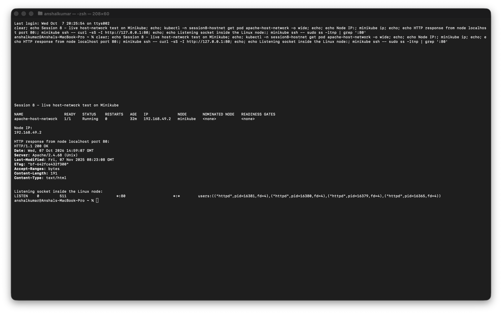

# Session 8 - Docker Networking and Volumes

I ran these exercises with Docker Desktop. Each task folder contains the commands and raw output from my test.

## Three containers and three networks

Files and output: [`task1-container-networking/`](task1-container-networking/).

I created `net-frontend`, `net-backend`, and `net-database`, then started a frontend, backend, and MySQL database container. The backend joined both `net-frontend` and `net-database`, while the frontend and database did not share a network.

| Test | Result |
|---|---|
| frontend to backend | Worked with 0% packet loss |
| frontend to database | Failed because there was no shared network or DNS entry |
| backend to frontend | Worked |
| backend to database | Worked |

This behaved like a simple three-tier setup: the frontend could reach the backend, and the backend could reach the database, but the frontend could not bypass the backend and contact the database directly.

## Host networking

Files and output: [`task2-host-network/`](task2-host-network/).

```bash
docker pull httpd
docker run -d --name apache-host-c --network host httpd
curl http://localhost:80
```

Apache started inside the container, but the request from macOS returned connection refused. Docker Desktop runs the Linux engine inside a VM, so the container joined the VM's host network rather than the Mac's network.

To verify the Linux behavior without pretending the macOS result succeeded, I ran Apache with `hostNetwork: true` on the Minikube Linux node. I temporarily disabled the ingress add-on because it already occupied port 80, then created the pod and tested the node directly:

```bash
kubectl -n session8-hostnet get pod apache-host-network -o wide
minikube ip
minikube ssh -- curl -I http://127.0.0.1:80
minikube ssh -- sudo ss -ltnp | grep :80
```

The pod IP matched the node IP, Apache listened on the node's port 80, and the request returned `HTTP/1.1 200 OK`.



## Bind mount

Files and output: [`task3-bind-mount/`](task3-bind-mount/).

```bash
echo "<h1>Hello students</h1>" > site/index.html
docker run -d --name bindmount-nginx-c -p 8090:80 \
  -v "$(pwd)/site:/usr/share/nginx/html" nginx:alpine
curl http://localhost:8090
```

After changing the host file to `Hello students - updated live!`, the next request returned the updated page. I did not restart the container. This showed that Nginx was reading the host file through the bind mount.

## Overlay network

Files and output: [`task4-overlay-network/`](task4-overlay-network/).

I created and inspected an overlay network on a single-node Swarm:

```bash
docker swarm init
docker network create -d overlay demo-overlay
docker network inspect demo-overlay --format "Driver={{.Driver}} Scope={{.Scope}}"
# Driver=overlay Scope=swarm
```

An overlay network is intended for containers running on different Docker hosts. Traffic is carried between the hosts through VXLAN while containers use one logical network. My local test confirmed the driver and Swarm scope, but a true cross-host connectivity test would require at least two Docker nodes.

Reference: [Docker network drivers](https://docs.docker.com/engine/network/drivers/).

The raw output for the Docker network, bind-mount, and overlay exercises remains in each task folder so the commands and results can be checked directly.
