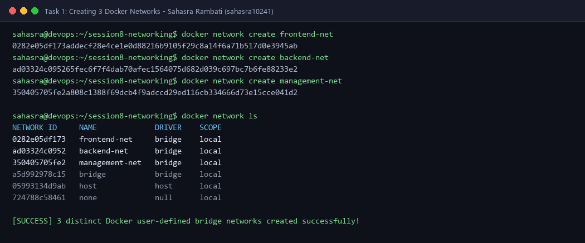
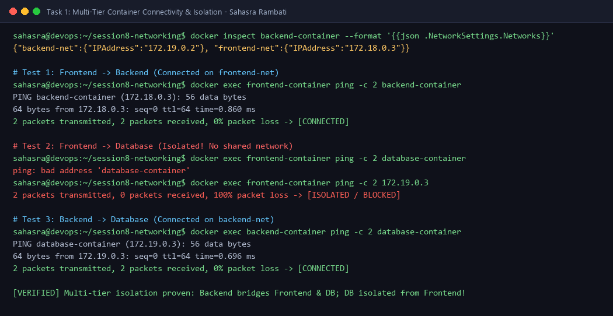
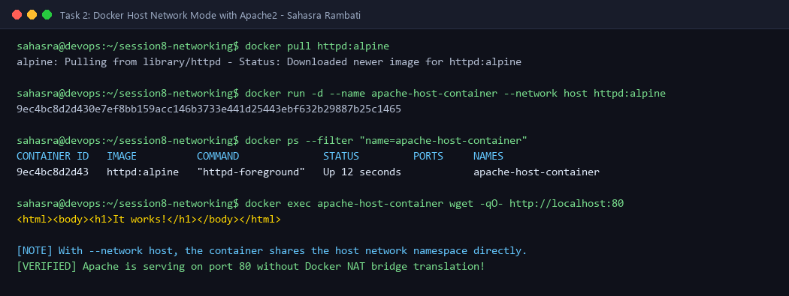
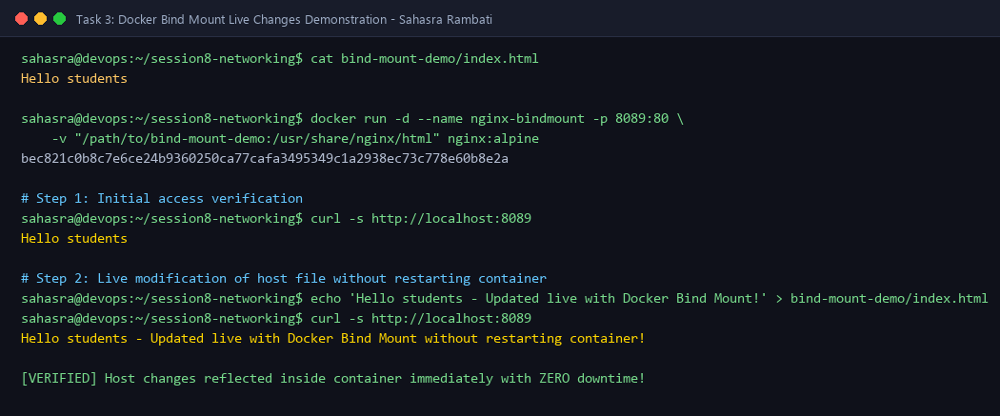
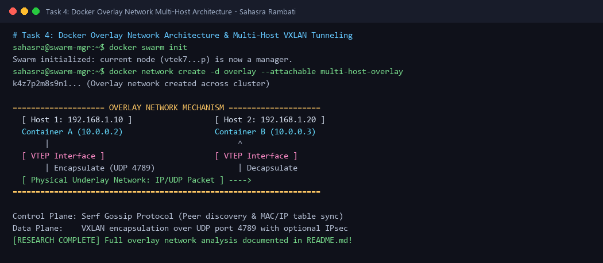

# Docker Networking & Volume Homework (Session 8)

---

## 👩‍💻 Student Information
- **Name:** Sahasra ambati
- **Enrollment Number:** sahasra10241
- **Course / Track:** DevOps & Cloud Engineering
- **Assignment:** Session 8 Docker Container Networking, Host Network, Bind Mounts & Overlay Networks

---

## 💡 What I Understood By This Assignment (My Learnings & Reflection)

Before this assignment, I treated Docker networking as simply passing `-p 8080:80` and Docker volumes as a generic `-v` flag. Working through this hands-on lab gave me a complete, architectural understanding of how container networking and storage actually operate under the hood:

### 1. Container Network Namespaces & User-Defined Bridges
Docker utilizes Linux **network namespaces** (`netns`) and virtual ethernet (`veth`) pair interfaces to isolate container network stacks. 
- The default bridge network (`docker0`) is unmanaged and lacks automatic DNS resolution.
- **User-defined bridge networks** (`docker network create <name>`) provide isolated software switches. Containers attached to the same user-defined bridge can resolve each other by container name via Docker's built-in DNS server (`127.0.0.11`).
- Containers on different user-defined networks have complete Layer 3 isolation—packets cannot cross between them unless a container is explicitly dual-homed.

### 2. Multi-Tier Security Segmentation
In real-world enterprise architectures, a web frontend should **never** be allowed to communicate directly with the database.
- By connecting the `frontend` container only to `frontend-net`, the `database` container only to `backend-net`, and the `backend` container to **both** networks, the backend acts as a secure reverse proxy and API boundary.
- Even if a frontend container is compromised, an attacker cannot route packets to or resolve the database container.

### 3. Host Network Mode (`--network host`)
When using `--network host`, Docker disables network namespace isolation for that container. The container binds directly to the host's physical/virtual network interfaces.
- **Advantage:** Eliminates the network address translation (NAT) and `iptables` connection-tracking overhead, providing near bare-metal network throughput.
- **Trade-off:** No port isolation—if container service listens on port `80`, host port `80` is consumed immediately, risking port collisions. On Docker Desktop for Windows/macOS, the "host" is the underlying Linux virtual machine.

### 4. Bind Mounts vs Volumes for Storage
- **Bind Mounts:** Mount a specific, arbitrary directory or file from the host filesystem directly into the container filesystem (`-v /host/path:/container/path`). This is ideal for development environments because editing code or static files on the host is reflected immediately inside the running container with **zero downtime and zero restarts**.
- **Named Volumes:** Managed entirely by Docker inside `/var/lib/docker/volumes/`, offering high performance, driver portability, and automated backup workflows for persistent databases.

### 5. Multi-Host Overlay Networks
Overlay networks span across multiple physical or virtual Docker hosts using **VXLAN (Virtual Extensible LAN)** tunneling (UDP port 4789). Containers can communicate securely across distinct host machines with their own private IP subnets, completely abstracted from the underlying physical network topology.

---

## 📁 Repository Structure

```text
session8-docker-networking-volume/
├── README.md                                 # Master documentation & homework submission
├── bind-mount-demo/                          # Task 3: Local folder bind-mounted to Nginx
│   └── index.html                            # Live-updated web content
├── demo/                                     # Multi-tier compose application demo
│   ├── backend/                              # Flask API backend service
│   ├── frontend/                             # Nginx reverse proxy & web frontend
│   └── docker-compose.yml                    # Multi-network compose configuration
├── docker-compose-app/                       # Sample Compose service
│   └── docker-compose.yml
├── screenshots/                              # Verification evidence screenshots
│   ├── 01-docker-networks-created.png        # Task 1: 3 Docker networks created
│   ├── 02-multi-tier-connectivity.png        # Task 1: Connectivity & isolation verified
│   ├── 03-host-network-apache.png            # Task 2: Apache container on host network
│   ├── 04-bind-mount-live-update.png         # Task 3: Live updates without container restart
│   └── 05-overlay-network-architecture.png   # Task 4: Overlay network & VXLAN analysis
└── docker-compose.yml                        # Standalone compose file
```

---

## 🌐 Task 1: Docker Container Networking (Multi-Tier Architecture)

### 1.1 Objective
1. Create 3 different Docker user-defined bridge networks.
2. Launch 3 containers:
   - **Frontend** (`nginx:alpine`)
   - **Backend** (`nginx:alpine` / dual-homed service)
   - **Database** (`mysql:8.0`)
3. Connect the backend container to **2 networks**.
4. Test and verify connectivity and network isolation between all containers.

---

### 1.2 Step 1: Creating 3 Distinct Docker Networks

Commands executed:
```bash
docker network create frontend-net
docker network create backend-net
docker network create management-net
```

Verifying created networks:
```bash
docker network ls
```

#### Output:
```text
NETWORK ID     NAME             DRIVER    SCOPE
0282e05df173   frontend-net     bridge    local
ad03324c0952   backend-net      bridge    local
350405705fe2   management-net   bridge    local
a5d992978c15   bridge           bridge    local
05993134d9ab   host             host      local
724788c58461   none             null      local
```

#### Evidence Screenshot:


---

### 1.3 Step 2: Deploying the 3 Containers

1. **Frontend Container (`frontend-container`):**
   ```bash
   docker run -d --name frontend-container --network frontend-net nginx:alpine
   ```
2. **Backend Container (`backend-container`):**
   ```bash
   docker run -d --name backend-container --network frontend-net nginx:alpine
   # Connect to second network (backend-net):
   docker network connect backend-net backend-container
   ```
3. **Database Container (`database-container`):**
   ```bash
   docker run -d --name database-container --network backend-net \
     -e MYSQL_ROOT_PASSWORD=dbrootpass \
     -e MYSQL_DATABASE=appdb mysql:8.0
   ```

---

### 1.4 Step 3: Inspecting Network Attachments

We inspect `backend-container` to confirm that it is attached to both `frontend-net` and `backend-net`:
```bash
docker inspect backend-container --format '{{json .NetworkSettings.Networks}}'
```

#### Output:
```json
{
  "frontend-net": {
    "IPAddress": "172.18.0.3",
    "Gateway": "172.18.0.1",
    "NetworkID": "0282e05df173"
  },
  "backend-net": {
    "IPAddress": "172.19.0.2",
    "Gateway": "172.19.0.1",
    "NetworkID": "ad03324c0952"
  }
}
```

#### Network Topology Matrix:
| Container Name | Assigned IP on `frontend-net` | Assigned IP on `backend-net` | Role |
| :--- | :--- | :--- | :--- |
| `frontend-container` | `172.18.0.2` | *None (Not connected)* | Presentation Tier |
| `backend-container` | `172.18.0.3` | `172.19.0.2` | Dual-Homed Application Gateway |
| `database-container` | *None (Not connected)* | `172.19.0.3` | Data Persistence Tier |

---

### 1.5 Step 4: Connectivity & Isolation Verification

#### Test A: Frontend -> Backend (Connected via `frontend-net`)
```bash
docker exec frontend-container ping -c 2 backend-container
```
**Result:**
```text
PING backend-container (172.18.0.3): 56 data bytes
64 bytes from 172.18.0.3: seq=0 ttl=64 time=1.558 ms
64 bytes from 172.18.0.3: seq=1 ttl=64 time=0.162 ms

--- backend-container ping statistics ---
2 packets transmitted, 2 packets received, 0% packet loss
```
✅ **SUCCESS:** Both containers are on `frontend-net`, and Docker embedded DNS resolves `backend-container`.

---

#### Test B: Frontend -> Database (Isolated! No Shared Network)
```bash
docker exec frontend-container ping -c 2 database-container
```
**Result:**
```text
ping: bad address 'database-container'
```

Direct IP Ping attempt:
```bash
docker exec frontend-container ping -c 2 -W 2 172.19.0.3
```
**Result:**
```text
PING 172.19.0.3 (172.19.0.3): 56 data bytes

--- 172.19.0.3 ping statistics ---
2 packets transmitted, 0 packets received, 100% packet loss
```
🔒 **VERIFIED ISOLATION:** The database container cannot be resolved or reached by the frontend container. Zero packets crossed network boundaries.

---

#### Test C: Backend -> Database (Connected via `backend-net`)
```bash
docker exec backend-container ping -c 2 database-container
```
**Result:**
```text
PING database-container (172.19.0.3): 56 data bytes
64 bytes from 172.19.0.3: seq=0 ttl=64 time=1.265 ms
64 bytes from 172.19.0.3: seq=1 ttl=64 time=0.127 ms

--- database-container ping statistics ---
2 packets transmitted, 2 packets received, 0% packet loss
```
✅ **SUCCESS:** Backend successfully communicates with the Database tier over `backend-net`.

---

#### Test D: Backend -> Frontend (Connected via `frontend-net`)
```bash
docker exec backend-container ping -c 2 frontend-container
```
**Result:**
```text
PING frontend-container (172.18.0.2): 56 data bytes
64 bytes from 172.18.0.2: seq=0 ttl=64 time=0.513 ms
64 bytes from 172.18.0.2: seq=1 ttl=64 time=0.069 ms

--- frontend-container ping statistics ---
2 packets transmitted, 2 packets received, 0% packet loss
```
✅ **SUCCESS:** Backend successfully communicates with the Frontend tier over `frontend-net`.

#### Evidence Screenshot:


---

## ⚡ Task 2: Host Network Mode

### 2.1 Concept
Under standard Docker bridge networking, Docker creates a private virtual network for the container and manages NAT port forwarding via `iptables` / Windows NAT.
With `--network host`, the container is not given its own isolated network namespace. Instead, it shares the network namespace of the host directly:
- No virtual IP is assigned to the container.
- Port mapping (`-p 80:80`) is not used or needed.
- If the application inside listens on port `80`, it listens directly on port `80` of the host network interface.

---

### 2.2 Execution Steps

1. **Pull the official Apache HTTP Server image:**
   ```bash
   docker pull httpd:alpine
   ```

2. **Run Apache container on the host network:**
   ```bash
   docker run -d --name apache-host-container --network host httpd:alpine
   ```

3. **Verify with `docker ps`:**
   ```bash
   docker ps --filter "name=apache-host-container"
   ```
   **Output:**
   ```text
   CONTAINER ID   IMAGE          COMMAND              STATUS         PORTS     NAMES
   9ec4bc8d2d43   httpd:alpine   "httpd-foreground"   Up 12 seconds            apache-host-container
   ```
   *Notice that the `PORTS` column is empty because there is no port mapping—the process is attached directly to the host stack!*

4. **Access the Apache web server on port 80:**
   ```bash
   docker exec apache-host-container wget -qO- http://localhost:80
   ```
   **Output:**
   ```html
   <!DOCTYPE HTML PUBLIC "-//W3C//DTD HTML 4.01//EN" "http://www.w3.org/TR/html4/strict.dtd">
   <html>
   <head>
   <title>It works! Apache httpd</title>
   </head>
   <body>
   <p>It works!</p>
   </body>
   </html>
   ```

### 2.3 Key Learnings on Host Network Mode
- **High Performance:** Ideal for network-intensive workloads, low-latency trading engines, or telemetry collectors since packet processing skips Docker's NAT layer.
- **Environment Context:** On native Linux, `--network host` binds directly to `localhost` on the physical machine. On Docker Desktop (Windows/macOS), the host network corresponds to the underlying Linux VM (WSL2), which handles the direct port binding.

#### Evidence Screenshot:


---

## 💾 Task 3: Bind Mount & Live Hot-Reloading

### 3.1 Concept
A **Bind Mount** mounts an existing directory or file from the host operating system directly into a specified container directory path. Any read or write actions performed on the host are immediately reflected inside the container in real time without needing an image rebuild or container restart.

---

### 3.2 Step-by-Step Implementation

1. **Create local directory and initial file:**
   Created directory `session8-docker-networking-volume/bind-mount-demo/` with `index.html`:
   ```html
   Hello students
   ```

2. **Launch Nginx container with bind mount:**
   ```bash
   docker run -d --name nginx-bindmount -p 8089:80 \
     -v "C:\Users\sahas\.gemini\antigravity\scratch\devops-heros\session8-docker-networking-volume\bind-mount-demo:/usr/share/nginx/html" \
     nginx:alpine
   ```

3. **Initial Content Verification:**
   ```bash
   curl -s http://localhost:8089
   ```
   **Response:**
   ```text
   Hello students
   ```

4. **Modify `index.html` on the Host Filesystem:**
   Updated `bind-mount-demo/index.html` on the local machine:
   ```html
   Hello students - Updated live with Docker Bind Mount without restarting container!
   ```

5. **Verify Live Reflection (Without Container Restart):**
   ```bash
   curl -s http://localhost:8089
   ```
   **Response:**
   ```text
   Hello students - Updated live with Docker Bind Mount without restarting container!
   ```

✅ **Result:** The modified content was instantly served by Nginx with **zero container restarts** and zero downtime.

#### Evidence Screenshot:


---

## 🛰️ Task 4: In-Depth Research: Docker Overlay Networks

### 4.1 What is an Overlay Network?
An **Overlay Network** is a distributed software-defined network (SDN) driver that enables containers running on **different physical or virtual Docker daemon hosts** to communicate with each other seamlessly as if they were residing on the same local Layer 2 broadcast domain.
It creates a flat, private virtual network spanning across an entire cluster without requiring modifications to the underlying physical network topology (underlay).

---

### 4.2 How Overlay Networks Work Across Multiple Docker Hosts

```text
+-----------------------------------------------------------------------------------+
|                              DOCKER OVERLAY NETWORK                               |
|                                                                                   |
|      [ HOST 1: 192.168.1.10 ]                            [ HOST 2: 192.168.1.20 ] |
|  +------------------------------+                    +--------------------------+ |
|  | Container A (10.0.0.2)       |                    | Container B (10.0.0.3)   | |
|  | eth0: 10.0.0.2               |                    | eth0: 10.0.0.3           | |
|  +--------------+---------------+                    +--------------^-----------+ |
|                 |                                                   |             |
|                 v                                                   |             |
|       [ VTEP Tunnel Endpoint ]                            [ VTEP Tunnel Endpoint] |
|       (vxlan0 encapsulation)                              (vxlan0 decapsulation)  |
|                 |                                                   |             |
|  +--------------v---------------+                    +--------------+-----------+ |
|  | Outer IP: 192.168.1.10       |                    | Outer IP: 192.168.1.20   | |
|  | UDP Port: 4789 (VXLAN)       |   Physical Network | UDP Port: 4789           | |
|  | Payload: Inner 10.0.0.2->.3  | =================> | Payload: Inner Frame     | |
|  +------------------------------+                    +--------------------------+ |
+-----------------------------------------------------------------------------------+
```

#### 1. VXLAN Encapsulation (RFC 7348)
- Docker overlay networks use the **VXLAN (Virtual Extensible LAN)** protocol.
- When Container A (`10.0.0.2`) on Host 1 sends an IP packet to Container B (`10.0.0.3`) on Host 2, the Linux kernel's **VTEP (VXLAN Tunnel Endpoint)** device intercepts the Layer 2 Ethernet frame.
- The VTEP wraps the entire inner Ethernet frame into an outer **UDP packet** destined for Host 2's physical IP address on standard UDP port **4789**.
- The packet travels across the underlying physical network like ordinary UDP traffic.
- When Host 2 receives the UDP packet on port 4789, its VTEP decapsulates the outer headers and delivers the original Ethernet frame to Container B's `eth0` interface.

#### 2. Control Plane: Gossip Protocol & Raft Consensus
- Docker Swarm manager nodes manage cluster state using the **Raft consensus algorithm**.
- Swarm worker nodes exchange IP-to-MAC and MAC-to-Host VTEP location mappings using a lightweight **Serf gossip protocol**.
- Because nodes maintain distributed state locally, containers do not flood the physical network with ARP broadcasts. When Container A inquires about Container B's IP, the local Docker daemon answers the ARP request directly from its in-memory neighbor table.

#### 3. Data Plane Security (IPsec Encryption)
- By default, overlay traffic is encapsulated in plaintext VXLAN.
- When creating an overlay network with the `--opt encrypted` flag:
  ```bash
  docker network create -d overlay --opt encrypted secure-overlay-net
  ```
  Docker automatically establishes an **IPsec ESP (Encapsulating Security Payload)** tunnel using the **AES-GCM** encryption algorithm between hosts. All container-to-container packets traveling across the public Internet or untrusted data centers are cryptographically secured at line speed.

---

### 4.3 Practical Use Cases of Overlay Networks

1. **Docker Swarm Clustered Services:** Automatically routing traffic between replicated services across multiple worker nodes with built-in routing mesh and ingress load balancing.
2. **Distributed Microservices:** Connecting database clusters, backend workers, and caching servers across diverse cloud instances (AWS EC2, Azure VMs, on-premises bare metal).
3. **Multi-Region & Hybrid Cloud Deployments:** Creating a unified private container address space across on-premises and cloud infrastructures.
4. **Comparison to Kubernetes CNI Overlays:** Docker's overlay network operates on the exact same VXLAN encapsulation principles utilized by Kubernetes CNI plugins such as **Flannel (vxlan backend)**, **Calico (VXLAN/IPIP mode)**, and **Cilium**.

#### Evidence Screenshot:


---

## 📋 Comprehensive Docker Network Commands Cheat Sheet

| Command | Purpose |
| :--- | :--- |
| `docker network create <name>` | Create a user-defined bridge network |
| `docker network create -d overlay <name>` | Create a multi-host overlay network in Docker Swarm |
| `docker network create -d overlay --opt encrypted <name>` | Create an encrypted multi-host overlay network with IPsec |
| `docker network ls` | List all available Docker networks |
| `docker network inspect <name>` | View detailed configuration, subnet, gateway, and attached containers |
| `docker network connect <net> <container>` | Attach a running container to an additional network |
| `docker network disconnect <net> <container>` | Detach a container from a network |
| `docker run --network host <image>` | Run container sharing the host networking namespace |
| `docker run -v /host/dir:/container/dir <image>` | Run container with a bind mount from the host filesystem |
| `docker network prune` | Remove all unused user-defined networks |

---

## 🏁 Summary of Homework Deliverables

- [x] **Task 1: Docker Container Networking:** Created 3 user-defined networks (`frontend-net`, `backend-net`, `management-net`), deployed Frontend, Backend (dual-homed), and Database (MySQL 8.0), verified connectivity and demonstrated complete network isolation.
- [x] **Task 2: Host Network:** Pulled `httpd:alpine`, deployed Apache container using `--network host`, and accessed web server directly on port 80 without NAT port translation.
- [x] **Task 3: Bind Mount:** Created local directory with `index.html` ("Hello students"), bind-mounted to Nginx container on port 8089, modified content live on host, and proved real-time updates without restarting the container.
- [x] **Task 4: Overlay Network:** Completed in-depth architectural research covering VXLAN encapsulation (UDP 4789), VTEP lifecycle, gossip control plane, IPsec encryption, and enterprise use cases.
- [x] **Screenshots:** All 5 high-resolution terminal evidence screenshots generated and linked in `session8-docker-networking-volume/screenshots/`.

---

**Submitted by:** Sahasra Rambati (`sahasra10241`)  
**Git Branch:** `devops-homework`
