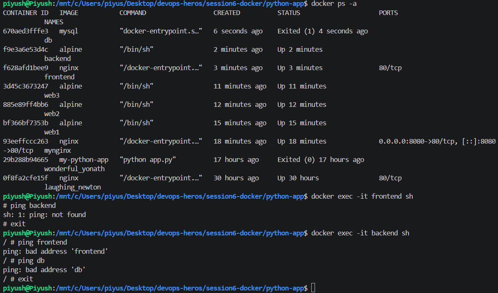
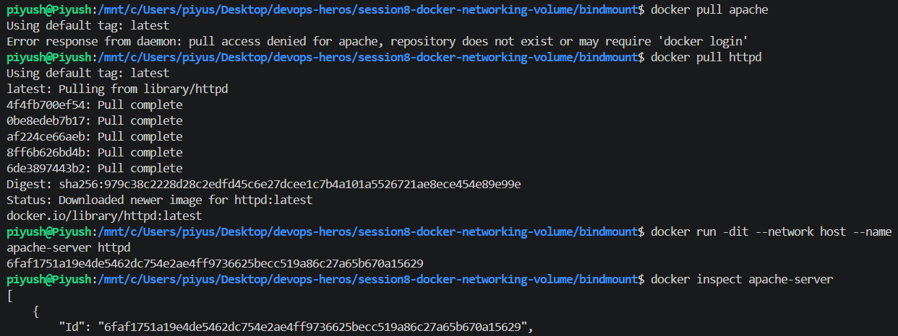
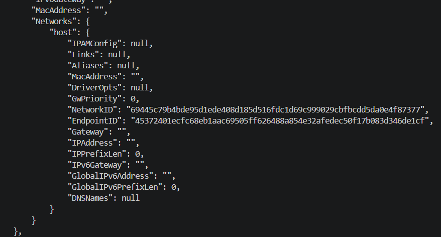
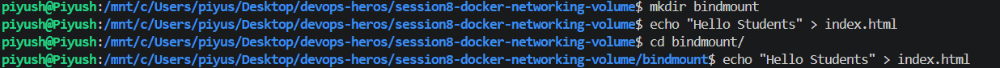
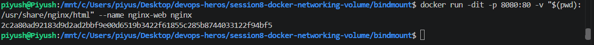
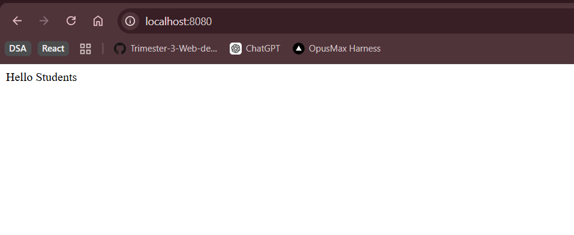

## Name - Piyush Kumar Mahato
## Roll no- 10233

## Task 1: Docker Container Networking
I created 3 networks: frontend-network, backend-network, db-network and 3 containers:
frontend- nginx image, backend- alpine image, and db-mysql image
then i tried to ping from backend to db and frontend and it didn't work

## Task 2: Host Network

since, the localhost wasn't working on windows so i checked it in inspect

## Task 3: Bind Mount

## Task 4: Overlay Network
Overlay is a type of network in docker which is used when containers running on different docker hosts need to communicate, like different devices. The docker hosts must be part of a swarm to use an overlay network. ex:
Host1 does docker swarm init, which gives something like docker swarm join --token <TOKEN> <MANAGER-IP>:2377 for host 2 to join.
Then the swarm manager i.e., Host 1 in our case creates the overlay network
docker network create --driver overlay --attachable my-network
Host 1:- docker run -dit --name container1 --network my-network alpine
Host 2:- docker run -dit --name container2 --network my-network alpine
after this if we try pinging container 1 from 2 or vice-versa, it should work.