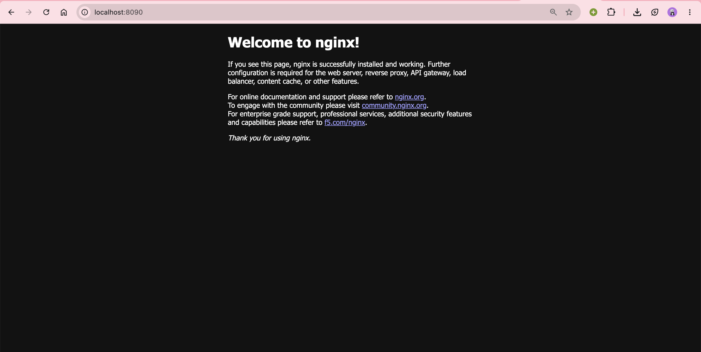
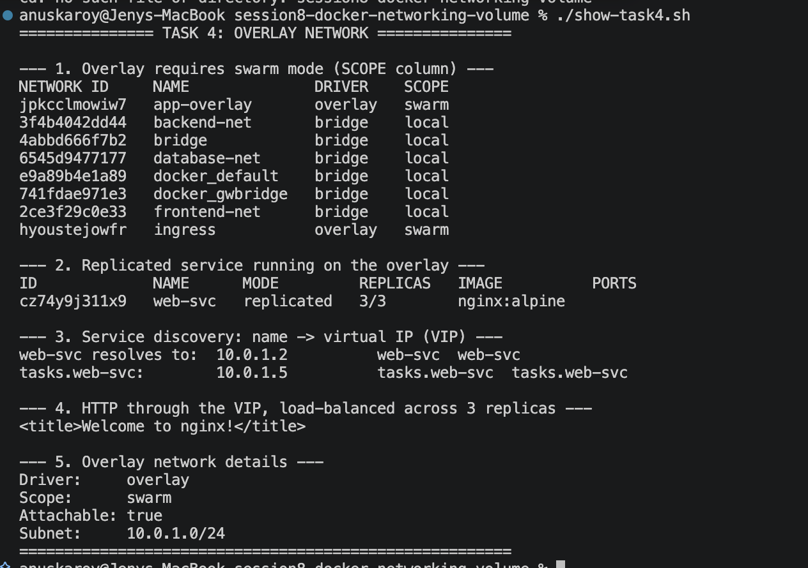

# Docker Networking & Volumes — Homework Submission

**Name:** Anuska Roy
**Enrollment Number:** 10021

Environment: Docker Engine 29.7.2, macOS (Apple Silicon, linux/arm64)

Command output for every task is saved under [`outputs/`](outputs) and screenshots
under [`screenshots/`](screenshots).

---

## Task 1 — Container Networking

Three containers on three user-defined bridge networks, with the **backend
attached to two of them** so it can reach both the frontend and the database
while those two stay isolated from each other.

```
   frontend-net (172.19.0.0/16)        database-net (172.21.0.0/16)
   ┌──────────────────────────┐        ┌──────────────────────────┐
   │  frontend  172.19.0.2    │        │   database  172.21.0.3   │
   │      ▲                   │        │       ▲                  │
   │      │                   │        │       │                  │
   │  backend   172.19.0.3 ───┼────────┼──►  backend  172.21.0.2   │
   └──────────────────────────┘        └──────────────────────────┘
              backend is the ONLY container on both networks
                 frontend  ✗───────────✗  database
```

A third network, `backend-net`, was also created as required.

### Commands

```bash
# 1. Create three networks
docker network create frontend-net
docker network create backend-net
docker network create database-net

# 2. Frontend (Nginx Alpine) — frontend-net only
docker run -d --name frontend --network frontend-net -p 8090:80 nginx:alpine

# 3. Backend (Nginx Alpine) — starts on frontend-net...
docker run -d --name backend --network frontend-net nginx:alpine
#    ...then attach it to a SECOND network
docker network connect database-net backend

# 4. Database (MySQL) — database-net only
docker run -d --name database --network database-net \
  -e MYSQL_ROOT_PASSWORD=root mysql:8.0
```

### Running containers

```
NAMES      IMAGE          STATUS         PORTS                     NETWORKS
database   mysql:8.0      Up 3 minutes   3306/tcp, 33060/tcp       database-net
backend    nginx:alpine   Up 4 minutes   80/tcp                    frontend-net,database-net
frontend   nginx:alpine   Up 4 minutes   0.0.0.0:8090->80/tcp      frontend-net
```

The `NETWORKS` column confirms **backend is on two networks**.

### Network attachments — `docker inspect`

```
### backend                          ### frontend
database-net -> 172.21.0.2           frontend-net -> 172.19.0.2
frontend-net -> 172.19.0.3
                                     ### database
                                     database-net -> 172.21.0.3
```

### Connectivity results

| # | From → To | Shared network | Result |
|---|-----------|----------------|--------|
| 1 | frontend → backend | frontend-net | ✅ 0% packet loss |
| 2 | backend → frontend | frontend-net | ✅ 0% packet loss |
| 3 | backend → database | database-net | ✅ 0% packet loss |
| 4 | frontend → database | none | ❌ `bad address 'database'` |
| 5 | database → frontend | none | ❌ DNS lookup fails (exit 2) |
| 6 | backend → frontend HTTP :80 | frontend-net | ✅ nginx welcome page |
| 7 | backend → database TCP :3306 | database-net | ✅ port open |

```bash
$ docker exec frontend ping -c 3 backend
PING backend (172.19.0.3): 56 data bytes
64 bytes from 172.19.0.3: seq=0 ttl=64 time=0.774 ms
3 packets transmitted, 3 packets received, 0% packet loss

$ docker exec backend ping -c 3 database
PING database (172.21.0.3): 56 data bytes
3 packets transmitted, 3 packets received, 0% packet loss

$ docker exec backend nc -zv database 3306
database (172.21.0.3:3306) open
```

**Isolation proof** — frontend and database share no network, so Docker's
embedded DNS refuses to resolve the name at all:

```bash
$ docker exec frontend ping -c 2 database
ping: bad address 'database'          # exit code 1

# From the database container (mysql:8.0 has no ping, so getent is used):
$ docker exec database getent hosts frontend
                                      # exit code 2 — no result
$ docker exec database getent hosts backend
172.21.0.2      backend               # exit code 0 — control, works
```

The control lookup succeeding while the other fails proves the failure is
network isolation, not a broken container.

MySQL was confirmed live and serving queries:

```bash
$ docker exec database mysql -uroot -proot -e "SELECT VERSION();"
mysql_version
8.0.46
```

**Takeaway:** containers on a user-defined bridge get automatic DNS resolution
by container name. Networks are isolated by default — a container reaches only
the networks it is attached to, which is what makes the backend a controlled
bridge between the web tier and the data tier.



---

## Task 2 — Host Network

```bash
docker pull httpd:2.4
docker run -d --name apache-host --network host httpd:2.4
```

```
NAMES         IMAGE       STATUS        PORTS     NETWORKS
apache-host   httpd:2.4   Up 3 seconds            host
```

The **empty `PORTS` column** is the signature of host networking — there is no
port mapping because no NAT is involved. `docker inspect` confirms the container
has no IP address of its own:

```
NetworkMode:  host
Networks:     host
Container IP: ""      # empty — it shares the host's network stack
```

Apache serves on port 80 in the host network namespace:

```bash
$ docker exec apache-host curl -s -i http://localhost:80
HTTP/1.1 200 OK
Server: Apache/2.4.68 (Unix)
Content-Length: 191
Content-Type: text/html

<!DOCTYPE HTML PUBLIC "-//W3C//DTD HTML 4.01//EN" ...
```

### Important: host networking and macOS

On **Linux**, `--network host` puts the container directly on the host's stack
and `http://localhost:80` works from the host immediately. On **macOS** it does
not, and this is worth understanding rather than glossing over:

Docker Desktop runs the Docker Engine inside a **Linux VM**. `--network host`
means *the VM's* network namespace, not the Mac's. So Apache binds port 80 on
the VM, and the Mac has nothing listening on port 80:

```bash
# From macOS:
$ curl -o /dev/null -w "%{http_code}" http://localhost:80
000        # nothing listening — connection failed
```

HTTP 200 from inside the VM but `000` from the Mac is the limitation exactly.

To actually reach Apache from the macOS browser, publish the port instead:

```bash
docker run -d --name apache-published -p 8095:80 httpd:2.4
```

```bash
$ curl -s -i http://localhost:8095
HTTP/1.1 200 OK
Server: Apache/2.4.68 (Unix)
Content-Type: text/html
```

```
NAMES              STATUS         PORTS
apache-published   Up 1 minute    0.0.0.0:8095->80/tcp, [::]:8095->80/tcp
```

Both containers were created — `apache-host` satisfies the host-network
requirement, and `apache-published` gives a browser-accessible result on macOS.

**When host networking is useful:** it removes the NAT layer, so it gives
slightly better network performance and lets a container see the host's real
interfaces — handy for network monitoring tools or services needing many ports.
The cost is no port isolation and possible port clashes with the host.


---

## Task 3 — Bind Mount

```bash
mkdir -p bind-mount/html
cat > bind-mount/html/index.html <<'EOF'
<h1>Hello students</h1>
EOF

docker run -d --name nginx-bind -p 8091:80 \
  -v "$(pwd)/bind-mount/html:/usr/share/nginx/html:ro" nginx:alpine
```

`:ro` mounts it read-only — the container serves the files but cannot modify
them, which is the sensible default for static content.

### Mount confirmed

```
Type:   bind
Source: /Users/anuskaroy/Desktop/devops-heros/session8-docker-networking-volume/bind-mount/html
Dest:   /usr/share/nginx/html
RW:     false
```

### Before — `curl http://localhost:8091`

```html
<h1>Hello students</h1>
```

### Modify the file on the host, without touching the container

```bash
cat > bind-mount/html/index.html <<'EOF'
<h1>Hello students - this file was MODIFIED on the host</h1>
<p>Bind mounts propagate host changes live, with no container restart.</p>
EOF
```

### After — same URL, re-fetched immediately

```html
<h1>Hello students - this file was MODIFIED on the host</h1>
<p>Bind mounts propagate host changes live, with no container restart.</p>
```

### Proof there was no restart

`StartedAt` and `RestartCount` were captured before and after the edit:

| | Before edit | After edit |
|---|---|---|
| `StartedAt` | `2026-09-02T18:49:58.868854544Z` | `2026-09-02T18:49:58.868854544Z` |
| `RestartCount` | `0` | `0` |

The start timestamp is **byte-for-byte identical** and the restart count stayed
at zero, so the updated content was served by the original process. The change
is also visible from inside the container:

```bash
$ docker exec nginx-bind cat /usr/share/nginx/html/index.html
<h1>Hello students - this file was MODIFIED on the host</h1>
```

**Takeaway:** a bind mount maps a host directory straight into the container, so
both sides see one set of files in real time. There is no copy and no sync step,
which is what makes it ideal for local development. The trade-off is that it
depends on the host's directory layout, so for portable production data a named
volume is the better choice.


---

## Task 4 — Overlay Networks (Research)

### What problem overlay networks solve

A bridge network is **local to a single Docker host**. Two containers on
different machines cannot reach each other by name over a bridge. An **overlay**
network spans multiple Docker hosts, letting containers on different physical
machines communicate as if they were on one LAN.

### How it works

Overlay networking builds a **VXLAN tunnel** (an encapsulation protocol) between
hosts:

1. Each container's Ethernet frame is wrapped inside a **UDP packet on port 4789**.
2. That packet travels over the ordinary physical network to the target host.
3. The receiving host unwraps it and delivers the original frame to the container.

The containers are unaware of any of this — they see a flat private subnet. A
distributed key-value store in the swarm control plane keeps every node's view of
network membership, IP allocation, and service endpoints in sync.

```
        Host A                                    Host B
  ┌────────────────────┐                  ┌────────────────────┐
  │ container 10.0.1.5 │                  │ container 10.0.1.6 │
  └─────────┬──────────┘                  └──────────┬─────────┘
            │  overlay (VXLAN, UDP 4789)             │
            └────────────────────────────────────────┘
                 encapsulated over the physical network
       ── control plane: 2377/tcp · data: 4789/udp · gossip: 7946/tcp+udp ──
```

### Required ports

| Port | Protocol | Purpose |
|------|----------|---------|
| 2377 | TCP | Swarm cluster management (managers only) |
| 7946 | TCP + UDP | Node-to-node gossip / service discovery |
| 4789 | UDP | VXLAN overlay data plane |

### Demonstrated locally

An overlay network needs swarm mode. Without it, creation is refused outright:

```bash
$ docker network create -d overlay demo-overlay
Error response from daemon: This node is not a swarm manager.
Use "docker swarm init" or "docker swarm join" ...
```

```bash
$ docker swarm init
Swarm initialized: current node (rsv5dzaq6w2h...) is now a manager.
To add a worker to this swarm, run:
    docker swarm join --token SWMTKN-1-3kxofh1kx9ocspwe5hwe8... 192.168.65.3:2377

$ docker network create -d overlay --attachable app-overlay
```

The `SCOPE` column is the key difference from every other network:

```
NETWORK ID     NAME              DRIVER    SCOPE
jpkcclmowiw7   app-overlay       overlay   swarm     <-- cluster-wide
hyoustejowfr   ingress           overlay   swarm     <-- built-in, for published ports
3f4b4042dd44   backend-net       bridge    local     <-- single host only
2ce3f29c0e33   frontend-net      bridge    local
0d6ab4e6fcff   host              host      local
```

`local` networks stop at this machine; `swarm` networks are shared across every
node in the cluster.

A replicated service was deployed onto it:

```bash
$ docker service create --name web-svc --network app-overlay --replicas 3 nginx:alpine
$ docker service ls
ID             NAME      MODE         REPLICAS   IMAGE
cz74y9j311x9   web-svc   replicated   3/3        nginx:alpine
```

**Service discovery and load balancing** — the service name resolves to a single
**virtual IP (VIP)** that Docker load-balances across all healthy replicas:

```bash
$ docker exec overlay-client getent hosts web-svc
10.0.1.2        web-svc            # the stable VIP

$ docker exec overlay-client getent hosts tasks.web-svc
10.0.1.5        tasks.web-svc      # a task endpoint — varies per run

$ docker exec overlay-client wget -qO- http://web-svc
<title>Welcome to nginx!</title>   # routed through the VIP
```

The VIP `10.0.1.2` stayed identical across every run, while the
`tasks.web-svc` endpoint returned `.3`, `.4`, then `.5` on successive runs as
replicas were rescheduled — so the screenshot above may show a different task
IP than the listing here. That difference *is* the feature: clients hold one
unchanging address while the replicas behind it move freely.

```
Driver:     overlay
Scope:      swarm
Attachable: true
Subnet:     10.0.1.0/24
```

Clients connect to the name `web-svc` and never track individual replica IPs —
replicas can be added, removed, or rescheduled onto other hosts and the VIP stays
valid. `--attachable` is what allows a plain `docker run` container to join a
swarm-scoped network alongside services.

### Use cases

- **Multi-host container communication** — the core purpose.
- **Docker Swarm services** — scaling replicas across a cluster.
- **Microservices** — services address each other by name regardless of host.
- **Isolating traffic** — separate overlays per environment or tier.
- **Encrypted traffic** — `--opt encrypted` enables IPSec encryption of the data
  plane, useful when nodes communicate over untrusted networks.

### Overlay vs bridge

| | Bridge | Overlay |
|---|---|---|
| Scope | Single host | Multiple hosts |
| Requires swarm | No | Yes |
| Transport | Linux bridge + NAT | VXLAN encapsulation |
| Service discovery | Container name, one host | Cluster-wide name → VIP |
| Load balancing | None built in | Built-in VIP across replicas |
| Encryption | N/A | Optional IPSec (`--opt encrypted`) |

**Note:** a full multi-host demonstration needs two or more Docker hosts. This
single-node swarm shows overlay creation, swarm scoping, service deployment, and
VIP-based discovery — the same mechanisms that carry traffic between hosts once
more nodes join.



---

## Cleanup

```bash
docker rm -f frontend backend database apache-host apache-published nginx-bind overlay-client
docker network rm frontend-net backend-net database-net
docker service rm web-svc
docker network rm app-overlay
docker swarm leave --force
```

---

## Summary

| Task | Requirement | Status |
|------|-------------|--------|
| 1 | 3 containers, 3 networks, backend on 2 networks, connectivity checked | ✅ Verified, incl. isolation proof |
| 2 | Apache pulled, run on host network, accessed on port 80 | ✅ HTTP 200 in host namespace (macOS caveat documented) |
| 3 | Bind mount, modify file, changes reflected without restart | ✅ Verified via unchanged `StartedAt` |
| 4 | Research overlay networks, use cases, multi-host operation | ✅ Researched + demonstrated on a swarm |
