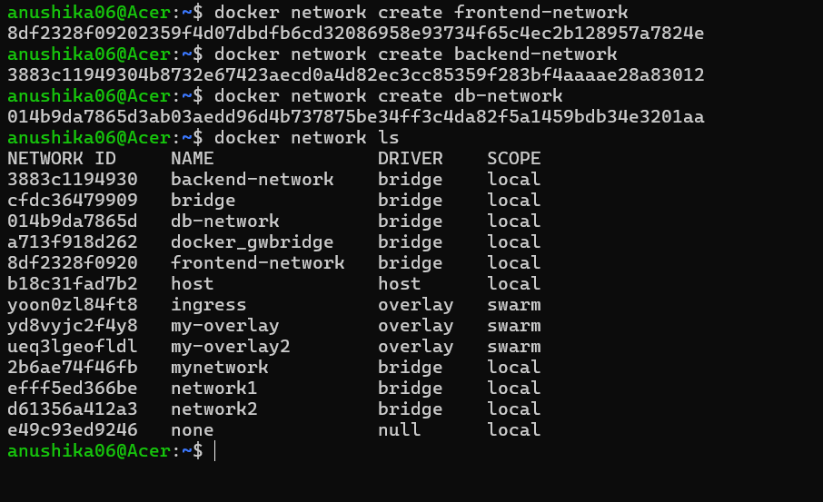
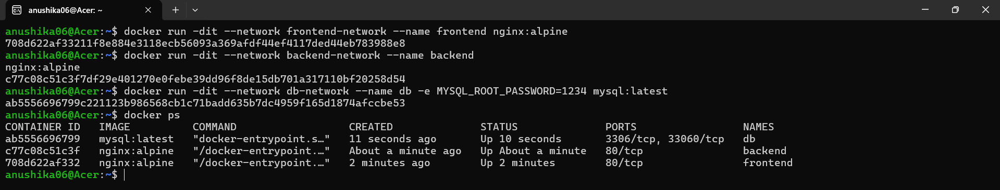
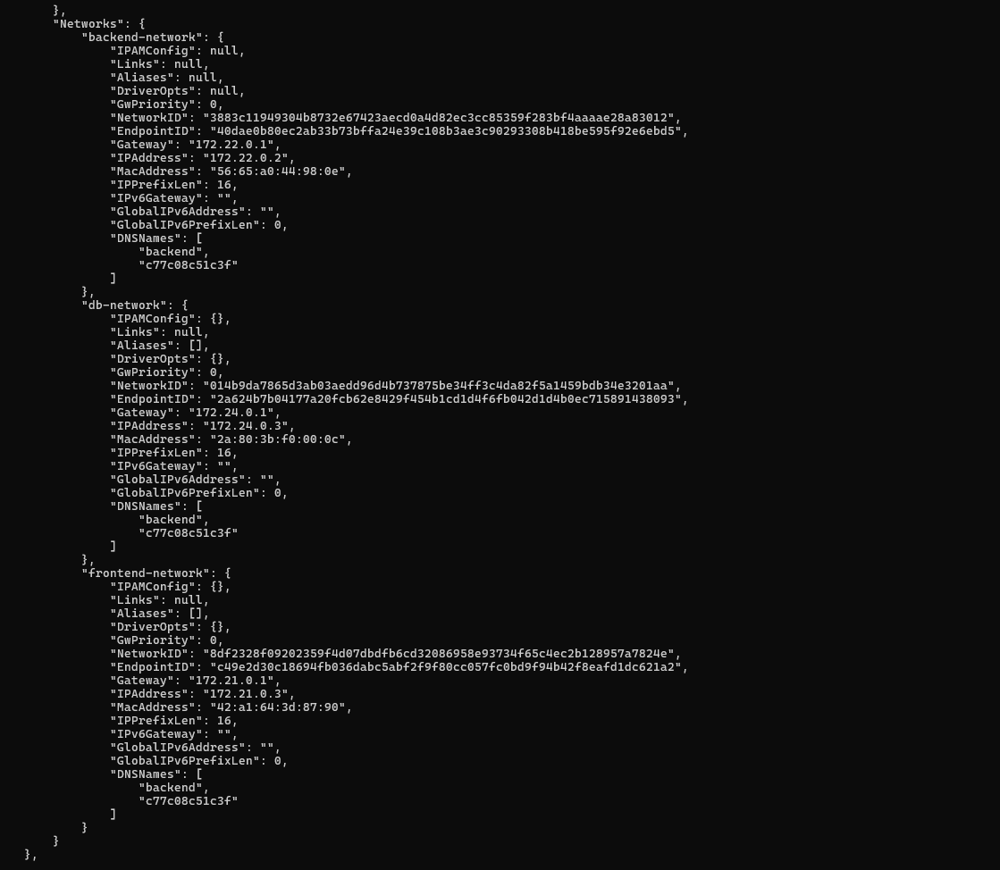
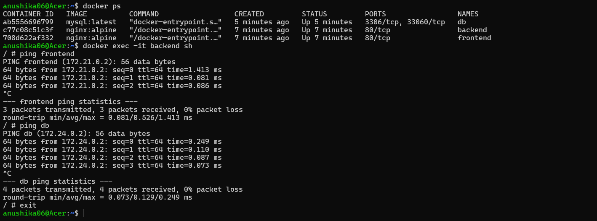
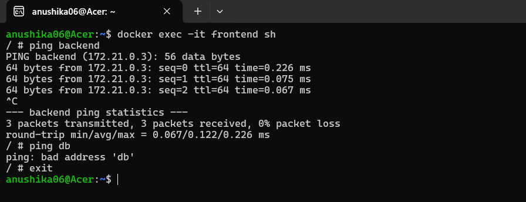
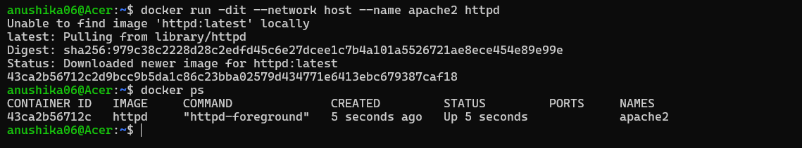
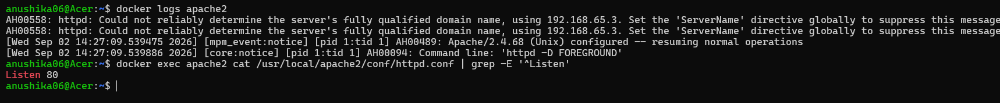
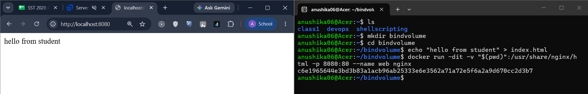
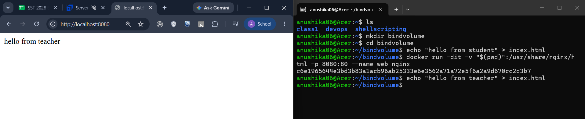
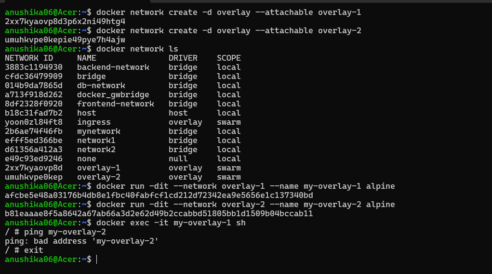

# Docker Networking & Volume Homework Tasks

## Task 1: Docker Container Networking

- Create 3 containers:
  - Frontend
  - Backend
  - Database
- Use Nginx or Alpine images for the frontend and backend.
- Use the MySQL image for the database.
- Create 3 different Docker networks.
- Add the backend container to 2 networks.
- Check connectivity between the containers.

## Task 2: Host Network

- Pull the Apache2 image from Docker Hub.
- Create an Apache2 container using the host network.
- Access the Apache website directly on port `80`.

## Task 3: Bind Mount

- Create a folder on your local machine.
- Create an `index.html` file with **Hello students** as the content.
- Bind mount the folder to an Nginx container.
- Access the Nginx website and verify the content.
- Modify the `index.html` file.
- Verify that the changes are reflected without restarting the container.

## Task 4: Overlay Network

- Research Docker overlay networks.
- Understand their use cases.
- Understand how overlay networks work across multiple Docker hosts.

# Solutions:

## Task-1

## Task-2

> **Note:** The Apache container was successfully started using Docker host networking. However, when using Docker Desktop with WSL2, `localhost:80` was not accessible from the host browser despite Apache listening on port 80 inside the container.

## Task-3

## Task-4

Created two containers and attached each container to a different overlay network. Communication was attempted between the containers, but it failed because they were connected to different networks.

