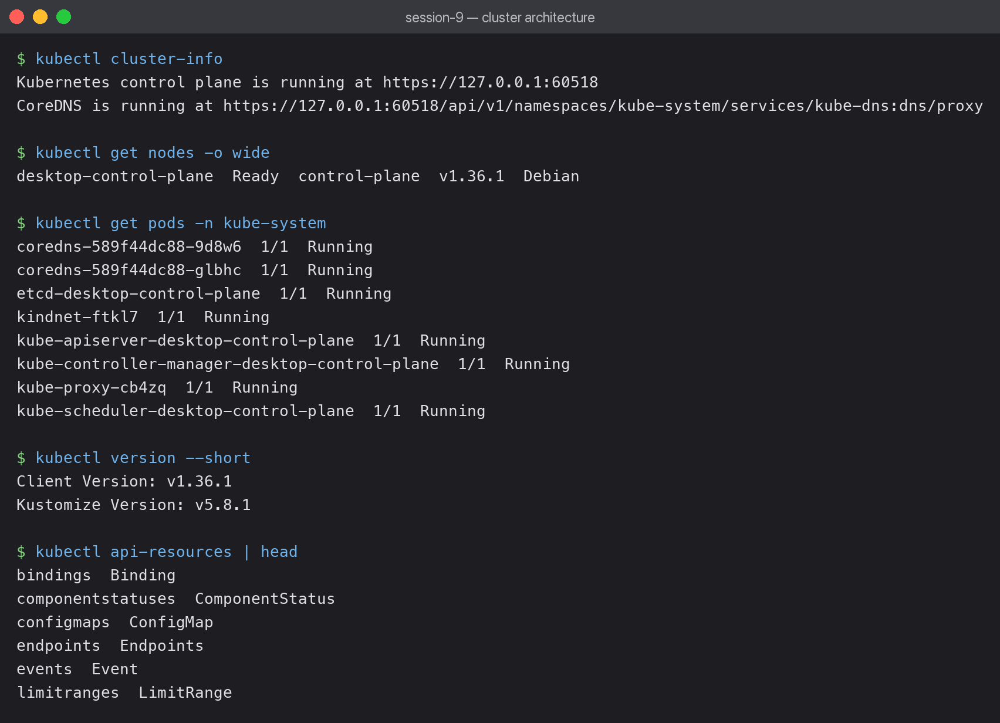

# Session 9 — Kubernetes Fundamentals

**Submitted by:** Piyush Bansal
**Cluster used:** Kubernetes v1.36.1, single node (`desktop-control-plane`)



## Why Kubernetes

Docker runs containers on one machine. That leaves real questions unanswered: what restarts
a crashed container, what happens when the host dies, how do containers on different hosts
find each other, how do you update without downtime?

Kubernetes answers these with one idea: **you declare desired state, and controllers work
continuously to make reality match.** You never tell it to start a container — you say "3
replicas should exist" and a controller makes that true, including after a pod is deleted.

## The cluster

```bash
kubectl cluster-info
```

```text
Kubernetes control plane is running at https://127.0.0.1:60518
CoreDNS is running at .../kube-dns:dns/proxy
```

```bash
kubectl get nodes -o wide
```

```text
desktop-control-plane   Ready   control-plane   v1.36.1   Debian GNU/Linux 13
```

Single node, acting as both control plane and worker (a production cluster separates these).

## Control plane components — all visible as pods

```bash
kubectl get pods -n kube-system
```

```text
coredns-589f44dc88-9d8w6                        1/1   Running
coredns-589f44dc88-glbhc                        1/1   Running
etcd-desktop-control-plane                      1/1   Running
kindnet-ftkl7                                   1/1   Running
kube-apiserver-desktop-control-plane            1/1   Running
kube-controller-manager-desktop-control-plane   1/1   Running
kube-proxy-cb4zq                                1/1   Running
kube-scheduler-desktop-control-plane            1/1   Running
```

Seeing these as ordinary pods made the architecture concrete:

| Component | Job |
|---|---|
| **kube-apiserver** | the front door — every `kubectl` command and every component talks to it, nothing talks directly to anything else |
| **etcd** | the database — all cluster state lives here; lose it and you lose the cluster |
| **kube-scheduler** | decides *which node* a new pod runs on (it does not start it) |
| **kube-controller-manager** | runs the reconciliation loops that keep actual state matching desired state |
| **kubelet** | on each node, actually starts and monitors containers (runs as a process, not a pod) |
| **kube-proxy** | programs the iptables rules that make Service IPs work |
| **CoreDNS** | in-cluster DNS — resolves `my-service.default.svc.cluster.local` |

## What happens when you run `kubectl apply`

1. kubectl sends the YAML to the **API server**
2. API server validates it and writes it to **etcd** — at this point the object "exists" but nothing is running
3. **Controller manager** notices a Deployment with no ReplicaSet and creates one; the ReplicaSet controller sees 0 of 3 pods and creates pod objects
4. **Scheduler** sees pods with no node assigned and picks one for each
5. **kubelet** on that node sees pods assigned to it and tells the container runtime to start them
6. **kube-proxy** updates iptables so Service traffic reaches the new pods

No component calls another directly. Each watches the API server and acts on what it sees —
which is why the system keeps working when one piece restarts.

## Everything is an object

```bash
kubectl api-resources
```

```text
bindings             Binding
componentstatuses    ComponentStatus
configmaps           ConfigMap
endpoints            Endpoints
events               Event
limitranges          LimitRange
```

Pods, Services, ConfigMaps, Secrets, Nodes — all the same kind of thing: an object with a
spec (what you want) and a status (what is true), stored in etcd and reconciled by a
controller.

## What I learned

- The scheduler only *assigns* pods to nodes; the kubelet is what actually starts containers.
  A pod stuck in `Pending` usually means scheduling failed, not that startup failed.
- `Ready` on a node means the kubelet is reporting in, not that the node is problem-free.
- The control plane being pods means you can debug it with the same commands as any app —
  `kubectl logs -n kube-system kube-scheduler-...` works.

## Applied in later sessions

- Session 10 — [pods, ReplicaSets, Deployments and rollout strategies](../../session10-k8s-core-objects/HW/)
- Session 11 — [Services and cluster networking](../../session-11-kubernetes-services/HW/)
- Session 12 — [Ingress, ConfigMaps and Secrets](../../session-12-ingress-configmaps-secrets/HW/)
