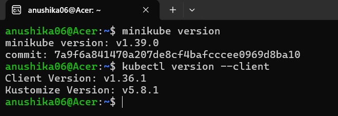
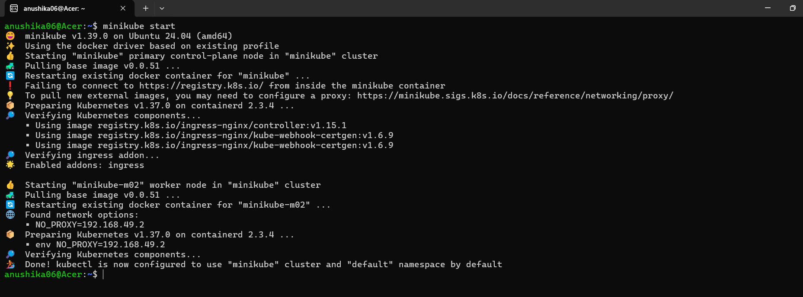
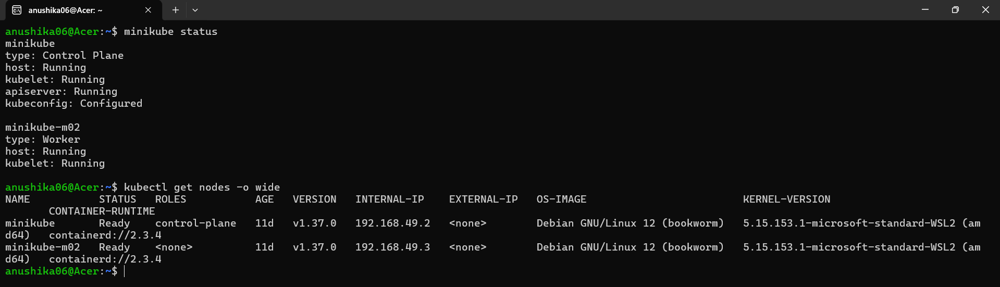
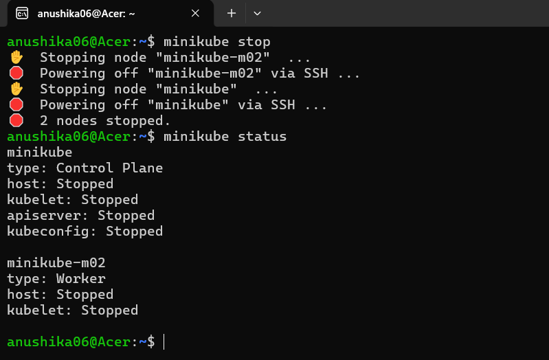

# Session 9: Kubernetes Fundamentals & Cluster Architecture

**Name:** Anushika Chauhan
**Session:** 09 - Kubernetes Fundamentals

---

## Task 1: Minikube & CLI Installation Verification

Verify that Minikube and the Kubernetes CLI (`kubectl`) are successfully installed on the local system.

**Commands:**
```bash
minikube version
kubectl version --client
```

**Output:**


---

## Task 2: Starting the Minikube Kubernetes Cluster

Initialize the local single-node Kubernetes cluster using the containerized runtime environment.

**Command:**

```bash
minikube start
```

**Output:**



---

## Task 3: Verifying Cluster Status & Node Health

Inspect the status of the local cluster control plane, kubelet, API server, and verify the node is in `Ready` state.

**Commands:**

```bash
minikube status
kubectl get nodes -o wide
```

**Output:**



---

## Task 4: Stopping the Minikube Cluster

Gracefully power down the Minikube cluster VM/container to release system resources.

**Command:**

```bash
minikube stop
minikube status
```

**Output:**


---

## Task 5: Kubernetes Cluster Architecture & Component Analysis

Comprehensive breakdown of the core components powering a Kubernetes cluster based on official documentation and classroom discussion.

```
+-------------------------------------------------------------------------------+
|                               CONTROL PLANE (MASTER)                          |
|                                                                               |
|   +-------------------+       +--------------------+       +--------------+   |
|   |       etcd        |<----->|  kube-apiserver    |<----->|kube-scheduler|   |
|   | (State Database)  |       |    (Front Door)    |       +--------------+   |
|   +-------------------+       +---------+----------+                          |
|                                         |                                     |
|                                         v                                     |
|                             +------------------------+                        |
|                             | kube-controller-manager|                        |
|                             +------------------------+                        |
+-----------------------------------------+-------------------------------------+
                                          |
                        +-----------------+-----------------+
                        |                                   |
                        v                                   v
+------------------------------------+ +------------------------------------+
|          WORKER NODE 1             | |          WORKER NODE 2             |
|                                    | |                                    |
|   +------------+  +------------+   | |   +------------+  +------------+   |
|   |  kubelet   |  | kube-proxy |   | |   |  kubelet   |  | kube-proxy |   |
|   +-----+------+  +-----+------+   | |   +-----+------+  +-----+------+   |
|         |               |          | |         |               |          |
|         v               v          | |         v               v          |
|   +----------------------------+   | |   +----------------------------+   |
|   | CRI (containerd runtime)   |   | |   | CRI (containerd runtime)   |   |
|   +----------------------------+   | |   +----------------------------+   |
|         |                          | |         |                          |
|         v                          | |         v                          |
|   +------------+  +------------+   | |   +------------+  +------------+   |
|   |   Pod 1    |  |   Pod 2    |   | |   |   Pod 3    |  |   Pod 4    |   |
|   | [Container]|  | [Container]|   | |   | [Container]|  | [Container]|   |
|   +------------+  +------------+   | |   +------------+  +------------+   |
+------------------------------------+ +------------------------------------+
```

### 1. Control Plane (Master Node) Components

- **`kube-apiserver`**: Single entry point exposing the Kubernetes API. All components communicate through it; it's the only one that accesses `etcd`.
- **`etcd`**: Highly available key-value store containing the entire cluster state, secrets, and metadata.
- **`kube-scheduler`**: Watches for new Pods and assigns them to optimal worker nodes based on resource needs and constraints.
- **`kube-controller-manager`**: Runs control loops ensuring Current State matches Desired State (e.g., node health, pod replicas).

---

### 2. Worker Node (Data Plane) Components

- **`kubelet`**: The node's primary agent. It receives Pod specifications, starts containers via the runtime, and reports health back to the API server.
- **`kube-proxy`**: Maintains network rules (like `iptables`) to enable internal cluster routing and load balancing for Services.
- **`Container Runtime (CRI)`**: Software (e.g., `containerd`, `CRI-O`) responsible for pulling images and running the containers.
- **`Pod`**: The smallest deployable unit. It encapsulates one or more containers that share network and storage namespaces.
