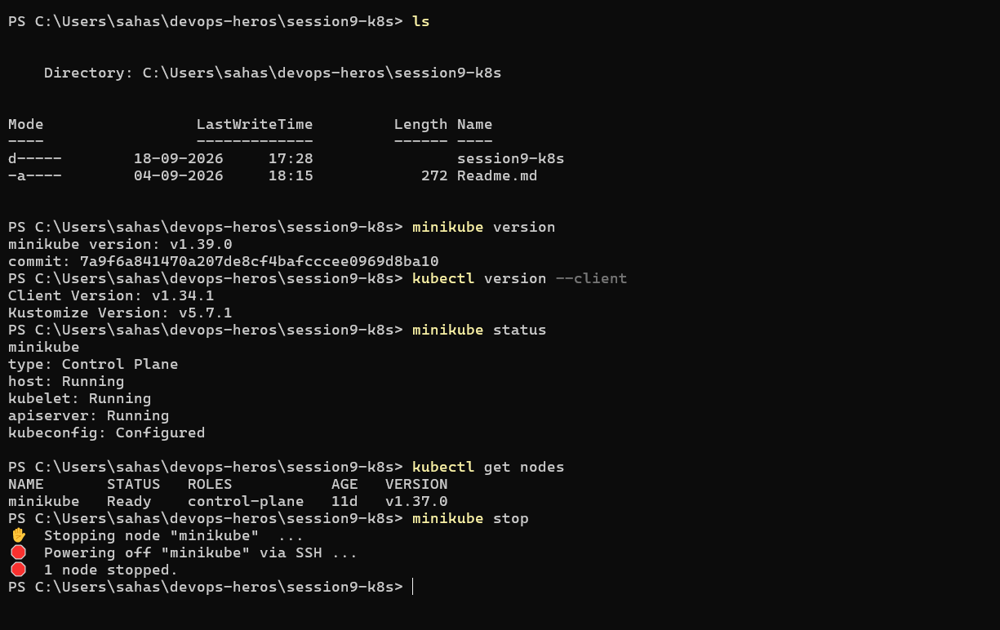

# Session 9 – Kubernetes Basics

**Name:** Sahasra Ambati
**Enrollment ID:** 10241

## Objective

To understand the basics of Kubernetes and set up and manage a local Kubernetes cluster using Minikube.

## Tasks Completed

### 1. Version Check

Checked the installed versions of Minikube and kubectl.

```powershell
minikube version
kubectl version --client
```

### 2. Start Minikube

Started the local Kubernetes cluster using Minikube.

```powershell
minikube start
```

### 3. Check Minikube Status

Verified that the Minikube cluster and its components were running.

```powershell
minikube status
```

### 4. Stop Minikube

Stopped the Minikube cluster after completing the tasks.

```powershell
minikube stop
```

## Screenshot

The following screenshot contains the terminal output for the completed Session 9 tasks:



## Resources

* [Kubernetes Basics](https://kubernetes.io/docs/tutorials/kubernetes-basics/)
* [Minikube Documentation](https://minikube.sigs.k8s.io/docs/)
* [Kubernetes Architecture](https://kubernetes.io/docs/concepts/architecture/)
