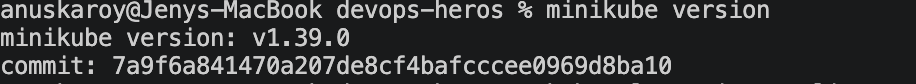
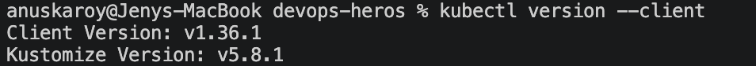
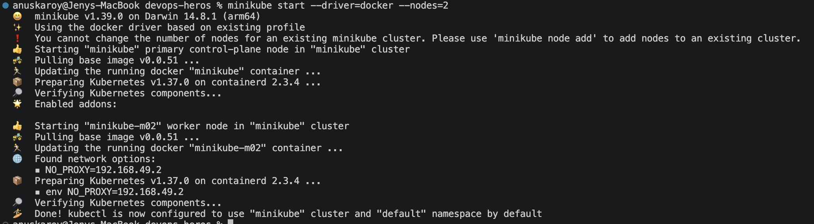
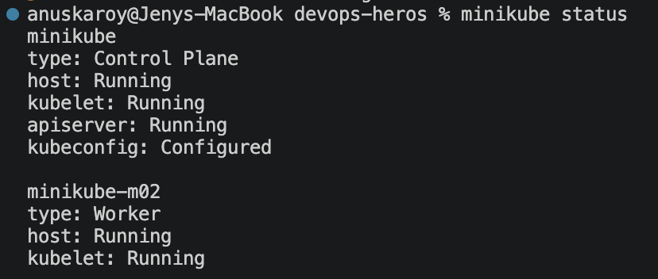
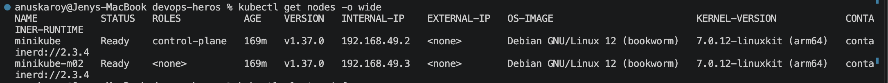
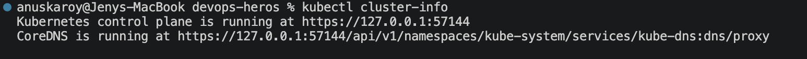
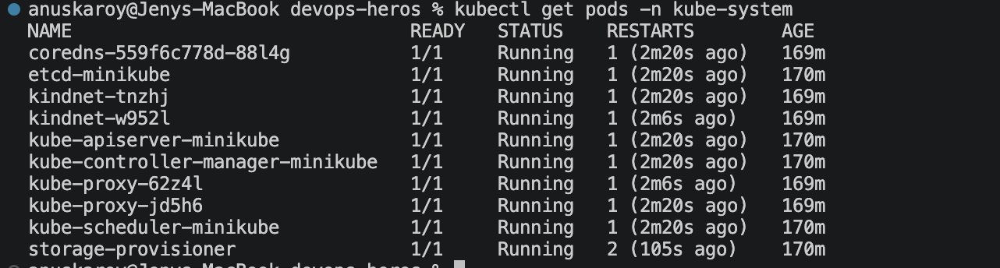
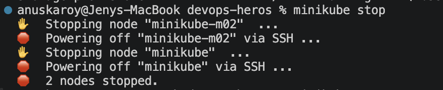
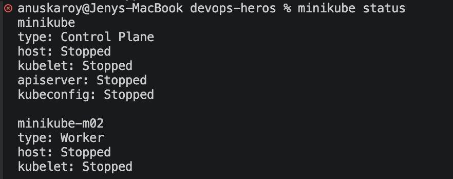

# Session 9: Kubernetes Fundamentals & Cluster Architecture

Local Kubernetes environment set up with **Minikube** (Docker driver) on macOS (Apple Silicon / arm64),
running a **2-node cluster**: one control-plane node and one worker node.

| Component | Version |
| --- | --- |
| minikube | v1.39.0 |
| kubectl (client) | v1.37.0 |
| Kubernetes (server) | v1.37.0 |
| Container runtime | containerd 2.3.4 |
| Driver | docker (Docker Desktop 29.7.2) |

---

## Task 1: Minikube & CLI Installation Verification

**Description:** Install `minikube` and `kubectl` on the local machine and confirm both binaries are on the `PATH` by running version checks.

**Commands:**

```bash
brew install minikube        # installs minikube + kubernetes-cli
minikube version
kubectl version --client
```

**Terminal Output:**

```
minikube version: v1.39.0
commit: 7a9f6a841470a207de8cf4bafcccee0969d8ba10

Client Version: v1.37.0
Kustomize Version: v5.8.1
```

**Screenshots:**




---

## Task 2: Starting the Minikube Kubernetes Cluster

**Description:** Boot a local 2-node Kubernetes cluster using the Docker driver, which provisions each node as a Docker container running kubelet and containerd.

**Command:**

```bash
minikube start --driver=docker --nodes=2
```

**Terminal Output:**

```
* minikube v1.39.0 on Darwin 14.8.1 (arm64)
* Using the docker driver based on user configuration
* Using Docker Desktop driver with root privileges
* Starting "minikube" primary control-plane node in "minikube" cluster
* Pulling base image v0.0.51 ...
* Preparing Kubernetes v1.37.0 on containerd 2.3.4 ...
* Configuring CNI (Container Networking Interface) ...
* Verifying Kubernetes components...
  - Using image gcr.io/k8s-minikube/storage-provisioner:v5
* Enabled addons: storage-provisioner, default-storageclass

* Starting "minikube-m02" worker node in "minikube" cluster
* Pulling base image v0.0.51 ...
* Found network options:
  - NO_PROXY=192.168.49.2
* Preparing Kubernetes v1.37.0 on containerd 2.3.4 ...
  - env NO_PROXY=192.168.49.2
* Verifying Kubernetes components...
* Done! kubectl is now configured to use "minikube" cluster and "default" namespace by default
```

**Screenshots:**



---

## Task 3: Verifying Cluster Status & Node Health

**Description:** Confirm that the control plane, kubelet, and apiserver are running, that both nodes report `Ready`, and that all control-plane system pods are healthy.

**Commands:**

```bash
minikube status
kubectl get nodes -o wide
kubectl cluster-info
kubectl get pods -n kube-system
```

**Terminal Output:**

```
minikube
type: Control Plane
host: Running
kubelet: Running
apiserver: Running
kubeconfig: Configured

minikube-m02
type: Worker
host: Running
kubelet: Running
```

```
NAME           STATUS   ROLES           AGE   VERSION   INTERNAL-IP    EXTERNAL-IP   OS-IMAGE                         KERNEL-VERSION            CONTAINER-RUNTIME
minikube       Ready    control-plane   94s   v1.37.0   192.168.49.2   <none>        Debian GNU/Linux 12 (bookworm)   7.0.12-linuxkit (arm64)   containerd://2.3.4
minikube-m02   Ready    <none>          74s   v1.37.0   192.168.49.3   <none>        Debian GNU/Linux 12 (bookworm)   7.0.12-linuxkit (arm64)   containerd://2.3.4
```

```
Kubernetes control plane is running at https://127.0.0.1:53105
CoreDNS is running at https://127.0.0.1:53105/api/v1/namespaces/kube-system/services/kube-dns:dns/proxy

To further debug and diagnose cluster problems, use 'kubectl cluster-info dump'.
```

```
NAME                               READY   STATUS    RESTARTS   AGE
coredns-559f6c778d-88l4g           1/1     Running   0          86s
etcd-minikube                      1/1     Running   0          92s
kindnet-tnzhj                      1/1     Running   0          86s
kindnet-w952l                      1/1     Running   0          74s
kube-apiserver-minikube            1/1     Running   0          92s
kube-controller-manager-minikube   1/1     Running   0          93s
kube-proxy-62z4l                   1/1     Running   0          74s
kube-proxy-jd5h6                   1/1     Running   0          86s
kube-scheduler-minikube            1/1     Running   0          93s
storage-provisioner                1/1     Running   0          91s
```

Every control-plane component (`etcd`, `kube-apiserver`, `kube-controller-manager`, `kube-scheduler`) runs as a
**static pod** on the control-plane node, while `kube-proxy` and `kindnet` (CNI) run as **DaemonSets** with one
pod on each of the two nodes.

**Screenshots:**






---

## Task 4: Stopping the Minikube Cluster

**Description:** Cleanly shut down the cluster, which stops the node containers while preserving cluster state on disk for the next `minikube start`.

**Commands:**

```bash
minikube stop
minikube status
```

**Terminal Output:**

```
* Stopping node "minikube-m02"  ...
* Powering off "minikube-m02" via SSH ...
* Stopping node "minikube"  ...
* Powering off "minikube" via SSH ...
* 2 nodes stopped.
```

```
minikube
type: Control Plane
host: Stopped
kubelet: Stopped
apiserver: Stopped
kubeconfig: Stopped

minikube-m02
type: Worker
host: Stopped
kubelet: Stopped
```

**Screenshots:**




---

## Task 5: Kubernetes Cluster Architecture & Component Analysis

**Description:** Study of the [official Kubernetes architecture documentation](https://kubernetes.io/docs/concepts/architecture/),
documenting each Control Plane and Worker Node component and how they interact.

A Kubernetes cluster splits into two planes: the **Control Plane**, which decides *what should happen*, and the
**Worker Nodes** (data plane), which actually *run the containers*. The control plane never runs application
workloads directly — it records desired state and drives the cluster toward it.

### 1. Control Plane (Master Node) Components

| Component | Responsibility |
| --- | --- |
| **kube-apiserver** | The single front door to the cluster. Exposes the REST API, authenticates and authorises every request, validates objects, and is the **only** component that talks to etcd. Every other component communicates through it, never with each other directly. |
| **etcd** | Consistent, highly-available key-value store holding the entire cluster state — every object, its spec and its status. The single source of truth; losing etcd means losing the cluster, which is why it is backed up and run with an odd number of replicas for quorum. |
| **kube-scheduler** | Watches for newly created Pods with no assigned node and picks the best node for each one. Filters nodes by feasibility (resource requests, taints/tolerations, node selectors, affinity rules) then scores the survivors, binding the Pod to the winner. It only *decides* placement — it does not start containers. |
| **kube-controller-manager** | Runs the reconciliation control loops as a single binary: Node controller (notices node failures), ReplicaSet controller (maintains replica counts), Job controller, EndpointSlice controller, ServiceAccount controller, and more. Each loop compares **desired state vs. actual state** and acts to close the gap. |
| **cloud-controller-manager** | Optional; present only on cloud-hosted clusters. Isolates cloud-provider-specific logic — provisioning load balancers for `type: LoadBalancer` Services, managing routes, and labelling/removing nodes as cloud VMs come and go. Absent on Minikube. |

### 2. Worker Node (Data Plane) Components

| Component | Responsibility |
| --- | --- |
| **kubelet** | The node agent. Registers the node with the apiserver, watches for Pods bound to its node, and instructs the container runtime to start/stop containers to match the PodSpec. Runs liveness/readiness/startup probes and continuously reports Pod and node status back to the apiserver. It manages only containers created by Kubernetes. |
| **kube-proxy** | Maintains the network rules that implement the Service abstraction. Watches Services and EndpointSlices, then programs `iptables` (or IPVS) so that traffic to a Service's virtual IP is load-balanced across healthy backend Pod IPs. This is what makes a ClusterIP reachable from anywhere in the cluster. |
| **Container Runtime** | The software that actually pulls images and runs containers, talking to the kubelet over the **CRI** (Container Runtime Interface). This cluster uses **containerd 2.3.4**; other CRI implementations include CRI-O. |
| **CNI Plugin** | Provides the Pod network so every Pod gets its own routable IP and can reach every other Pod without NAT. This cluster uses **kindnet**, visible as the `kindnet-*` DaemonSet pods. |

### 3. How the Components Interact — Creating a Pod

The flow below traces `kubectl apply -f pod.yml` end to end, and shows why the apiserver sits at the centre of everything:

```
  kubectl apply -f pod.yml
          │
          ▼
  ┌───────────────────┐   1. authenticate → authorise → validate
  │  kube-apiserver   │   2. persist object
  └─────────┬─────────┘
            │  writes desired state
            ▼
      ┌───────────┐
      │   etcd    │   Pod recorded with nodeName: ""  (Pending)
      └───────────┘
            │  apiserver watch event
            ▼
  ┌───────────────────┐   3. filter feasible nodes → score → pick best
  │  kube-scheduler   │   4. write binding back through the apiserver
  └─────────┬─────────┘
            │  Pod now has nodeName: minikube-m02
            ▼
  ┌───────────────────┐   5. kubelet on that node sees the Pod assigned to it
  │      kubelet      │   6. calls the container runtime over CRI
  └─────────┬─────────┘
            │
            ▼
  ┌───────────────────┐   7. pull image, create container, attach CNI network
  │   containerd      │
  └─────────┬─────────┘
            │  status reported back up through the apiserver
            ▼
      Pod status: Running   ──►  kube-proxy programs iptables rules so
                                 Services can route traffic to this Pod
```

**Key architectural properties:**

- **Hub-and-spoke, never peer-to-peer.** The scheduler never talks to the kubelet; it writes a binding to the apiserver and the kubelet observes it. This keeps components decoupled and independently restartable.
- **Watch-based, not polling.** Components open long-lived watches on the apiserver and react to events, which is what makes reconciliation feel instantaneous.
- **Declarative reconciliation.** You declare desired state; controllers continuously work to make actual state match. Delete a Pod managed by a ReplicaSet and the controller recreates it — the same loop that provides self-healing.
- **etcd is the only stateful component.** Every other control-plane process is effectively stateless and rebuilds its view by reading from the apiserver.

---

## Summary

| # | Task | Status |
| --- | --- | --- |
| 1 | Minikube & kubectl installation verification | Completed |
| 2 | Cluster start (`minikube start --nodes=2`) | Completed |
| 3 | Cluster status & node health verification | Completed |
| 4 | Clean cluster shutdown (`minikube stop`) | Completed |
| 5 | Architecture study & component documentation | Completed |

---

## Resources

- [Kubernetes Basics Tutorial](https://kubernetes.io/docs/tutorials/kubernetes-basics/)
- [Minikube installation (macOS / arm64)](https://minikube.sigs.k8s.io/docs/start/?arch=%2Fmacos%2Farm64%2Fstable%2Fbinary+download)
- [Kubernetes Architecture Concepts](https://kubernetes.io/docs/concepts/architecture/)
- [Course reference repository](https://github.com/Nency-Ravaliya/Kubernetes)
