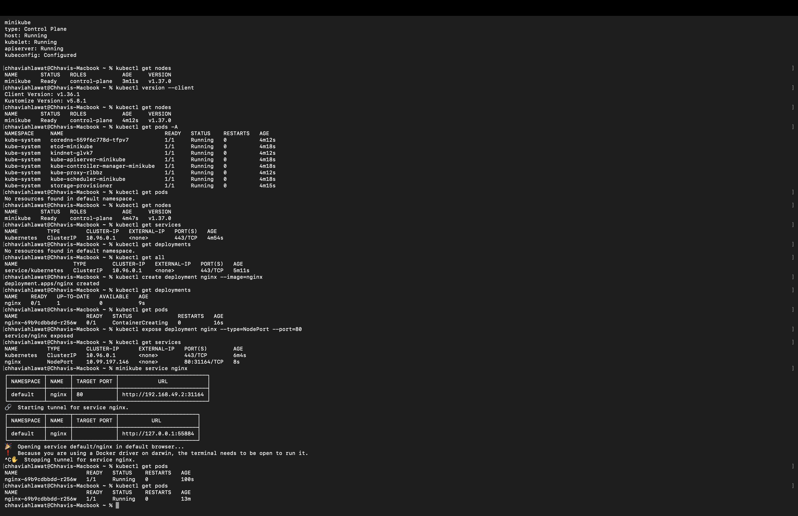

# Session 9 — Kubernetes Basics with Minikube (Homework)

**Name:** Chhavi Ahlawat
**Enrollment Number:** 24BCS10201
**Email:** chhavi.24bcs10201@sst.scaler.com

---

## Homework Tasks

| Task | Description | Status |
|---|---|---|
| **1** | Install Minikube + kubectl and bring up a single-node cluster | ✅ |
| **2** | Inspect the cluster — nodes, control-plane components, namespaces | ✅ |
| **3** | Run an Nginx deployment imperatively and confirm the Pod is Running | ✅ |
| **4** | Expose the deployment as a NodePort Service and reach it in the browser | ✅ |

All output below is **real terminal output**.

---

## 1. Cluster status

```bash
minikube status
```

```
minikube
type: Control Plane
host: Running
kubelet: Running
apiserver: Running
kubeconfig: Configured
```

Everything is `Running` and `kubeconfig: Configured` — meaning `kubectl` is already pointed at
this cluster, so no manual context switching is needed.

---

## 2. Inspecting the cluster

```bash
kubectl get nodes
```

```
NAME       STATUS   ROLES           AGE     VERSION
minikube   Ready    control-plane   3m11s   v1.37.0
```

A single node that is **both** the control plane and the worker — that is what makes Minikube a
one-node cluster. On a real cluster the control plane would be tainted so no workloads land on it.

```bash
kubectl version --client
```

```
Client Version: v1.36.1
Kustomize Version: v5.8.1
```

> Note the client (`v1.36.1`) is one minor version behind the server (`v1.37.0`). Kubernetes
> supports a ±1 minor version skew, so this combination is fine.

### The control-plane components

```bash
kubectl get pods -A
```

```
NAMESPACE     NAME                               READY   STATUS    RESTARTS   AGE
kube-system   coredns-559f6c778d-tfpv7           1/1     Running   0          4m12s
kube-system   etcd-minikube                      1/1     Running   0          4m18s
kube-system   kindnet-glvk7                      1/1     Running   0          4m12s
kube-system   kube-apiserver-minikube            1/1     Running   0          4m18s
kube-system   kube-controller-manager-minikube   1/1     Running   0          4m18s
kube-system   kube-proxy-rlbbz                   1/1     Running   0          4m12s
kube-system   kube-scheduler-minikube            1/1     Running   0          4m18s
kube-system   storage-provisioner                1/1     Running   0          4m15s
```

This is the whole control plane running *as Pods on the cluster it manages*:

| Pod | Job |
|---|---|
| `kube-apiserver` | The front door — every `kubectl` command talks to this |
| `etcd` | Key-value store holding all cluster state |
| `kube-scheduler` | Decides which node an unassigned Pod goes to |
| `kube-controller-manager` | Reconciliation loops (keeps actual state == desired state) |
| `kube-proxy` | Programs the node's network rules so Services work |
| `coredns` | In-cluster DNS (`nginx.default.svc.cluster.local`) |
| `kindnet` | CNI plugin — gives every Pod its own IP |
| `storage-provisioner` | Minikube addon that fulfils PersistentVolumeClaims |

### The default namespace is empty

```bash
kubectl get pods
```

```
No resources found in default namespace.
```

`kubectl get pods` without `-A` only looks at the **default** namespace, which is why the
control-plane Pods above disappear — they live in `kube-system`.

```bash
kubectl get services
```

```
NAME         TYPE        CLUSTER-IP   EXTERNAL-IP   PORT(S)   AGE
kubernetes   ClusterIP   10.96.0.1    <none>        443/TCP   4m54s
```

```bash
kubectl get deployments
```

```
No resources found in default namespace.
```

```bash
kubectl get all
```

```
NAME                 TYPE        CLUSTER-IP   EXTERNAL-IP   PORT(S)   AGE
service/kubernetes   ClusterIP   10.96.0.1    <none>        443/TCP   5m11s
```

The only thing in `default` is the `kubernetes` Service — the in-cluster ClusterIP that Pods use
to reach the API server. A clean slate.

---

## 3. Running Nginx

```bash
kubectl create deployment nginx --image=nginx
```

```
deployment.apps/nginx created
```

```bash
kubectl get deployments
```

```
NAME    READY   UP-TO-DATE   AVAILABLE   AGE
nginx   0/1     1            0           9s
```

```bash
kubectl get pods
```

```
NAME                     READY   STATUS              RESTARTS   AGE
nginx-69b9cdbbdd-r256w   0/1     ContainerCreating   0          16s
```

`READY 0/1` and `ContainerCreating` — the image is still being pulled. Note the Pod name pattern
`nginx-69b9cdbbdd-r256w`: **Deployment name → ReplicaSet hash → Pod suffix**. The Deployment
never manages Pods directly; it creates a ReplicaSet, and the ReplicaSet creates the Pod.

---

## 4. Exposing it with a NodePort Service

```bash
kubectl expose deployment nginx --type=NodePort --port=80
```

```
service/nginx exposed
```

```bash
kubectl get services
```

```
NAME         TYPE        CLUSTER-IP      EXTERNAL-IP   PORT(S)        AGE
kubernetes   ClusterIP   10.96.0.1       <none>        443/TCP        6m4s
nginx        NodePort    10.99.197.146   <none>        80:31164/TCP   8s
```

`80:31164/TCP` is the mapping — port **80** inside the cluster, reachable on port **31164** on
the node itself. NodePort always allocates from the `30000–32767` range.

```bash
minikube service nginx
```

```
|-----------|-------|-------------|---------------------------|
| NAMESPACE | NAME  | TARGET PORT |            URL            |
|-----------|-------|-------------|---------------------------|
| default   | nginx |          80 | http://192.168.49.2:31164 |
|-----------|-------|-------------|---------------------------|
🏃  Starting tunnel for service nginx.
|-----------|-------|-------------|------------------------|
| NAMESPACE | NAME  | TARGET PORT |          URL           |
|-----------|-------|-------------|------------------------|
| default   | nginx |             | http://127.0.0.1:55884 |
|-----------|-------|-------------|------------------------|
🎉  Opening service default/nginx in default browser...
❗  Because you are using a Docker driver on darwin, the terminal needs to be open to run it.
```

Two URLs, and the reason is the driver:

- `http://192.168.49.2:31164` — the real NodePort on the Minikube node's IP. **Not reachable from
  macOS**, because with the Docker driver the node is a container on an isolated Docker network.
- `http://127.0.0.1:55884` — the tunnel Minikube opens to bridge that gap. This is the one that
  works in the browser, and it only stays up while the terminal running it is open.

```bash
kubectl get pods
```

```
NAME                     READY   STATUS    RESTARTS   AGE
nginx-69b9cdbbdd-r256w   1/1     Running   0          100s
```

```bash
kubectl get pods
```

```
NAME                     READY   STATUS    RESTARTS   AGE
nginx-69b9cdbbdd-r256w   1/1     Running   0          13m
```

`1/1 Running` with `0 RESTARTS` — the container came up cleanly and stayed up.

---

## Screenshot



---

## What I took away

- The control plane is **just Pods** in `kube-system` — the cluster manages itself with the same
  primitives it gives you.
- `kubectl create deployment` is imperative and fine for a scratch test, but it produces no file
  to commit. Declarative YAML (`kubectl apply -f`) is what belongs in a repo — that's Session 10.
- Nothing manages Pods directly: **Deployment → ReplicaSet → Pod**, visible right in the Pod name.
- A `NodePort` Service is not automatically reachable from the host. With Minikube's Docker driver
  you need `minikube service` to tunnel to it.
- `kubectl get` is namespace-scoped by default; `-A` is what shows you the whole cluster.

---

# Resources

- https://kubernetes.io/docs/tutorials/kubernetes-basics/
- https://minikube.sigs.k8s.io/docs/start/?arch=%2Fmacos%2Farm64%2Fstable%2Fbinary+download
- https://kubernetes.io/docs/concepts/architecture/
- https://github.com/Nency-Ravaliya/Kubernetes
