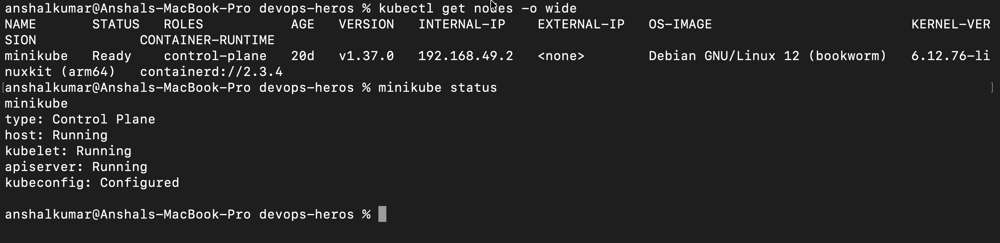

# Session 9 - Kubernetes Fundamentals

I installed Minikube, started a local cluster with the Docker driver, and checked that the control plane was available before moving on to the workload exercises.

The screenshot below records the environment I used:



The commands I used for the initial checks were:

```bash
minikube status
kubectl cluster-info
kubectl get nodes -o wide
kubectl get pods -A
kubectl api-resources
```

The cluster had one Minikube node. It acted as the control-plane and worker node for these local exercises. I also reviewed how the API server, scheduler, controller manager, etcd, kubelet, container runtime, and kube-proxy fit together.

My basic workflow became:

```bash
kubectl apply -f resource.yaml
kubectl get pods
kubectl describe pod <pod-name>
kubectl logs <pod-name>
kubectl delete -f resource.yaml
```

References I used:

- [Kubernetes Basics](https://kubernetes.io/docs/tutorials/kubernetes-basics/)
- [Minikube installation](https://minikube.sigs.k8s.io/docs/start/)
- [Kubernetes architecture](https://kubernetes.io/docs/concepts/architecture/)
- [Instructor Kubernetes repository](https://github.com/Nency-Ravaliya/Kubernetes)
