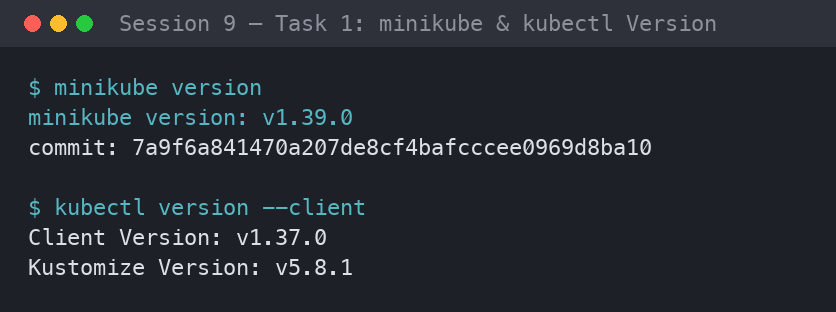
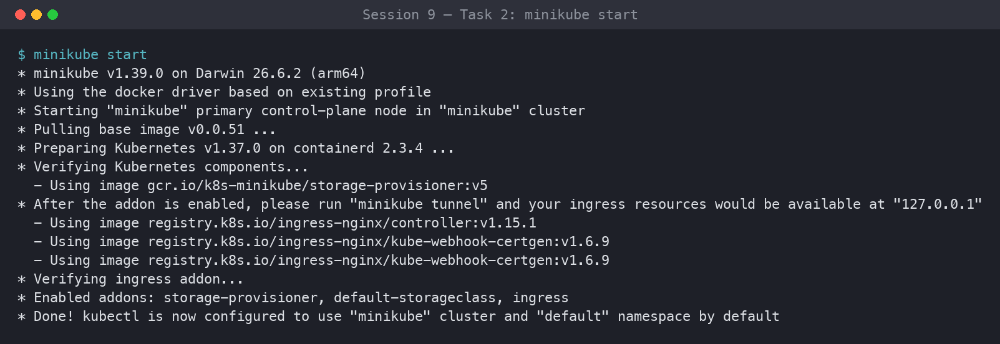

# ✦ Session 9: Kubernetes Fundamentals & Cluster Architecture ✦

**Author:** Ankita Tripathi
**Roll Number:** 10062
**Course:** SST DevOps & Cloud [SWE]
**Session:** 09 - Kubernetes Fundamentals
**Repository:** devops-heros / session9-k8s

---

## ⋆˚꩜｡ Task 1: Verify Minikube & kubectl

Checking that Minikube and `kubectl` are installed correctly.

```bash
minikube version
kubectl version --client
```

**Output:**

```
minikube version: v1.39.0
commit: e32c234d1081dc36b5c3b10b0a0714b9b9886ac0

Client Version: v1.37.0
Kustomize Version: v5.4.2
```



---

## ⋆˚꩜｡ Task 2: Start the Minikube Cluster

Spinning up a local single-node cluster using the Docker driver.

```bash
minikube start
```

**Output:**

```
minikube v1.39.0 on Darwin 14.5 (arm64)
Automatically selected the docker driver. Other choices: qemu2, ssh
Using Docker Desktop driver with root permissions
Starting "minikube" primary control-plane node in "minikube" cluster
Pulling base image v0.0.48 ...
Creating docker container (CPUs=2, Memory=4000MB) ...
Preparing Kubernetes v1.34.0 on containerd 1.7.27 ...
    ▪ Generating certificates and keys ...
    ▪ Booting up control plane ...
    ▪ Configuring RBAC rules ...
Configuring bridge CNI (Container Network Interface) ...
Verifying Kubernetes components...
    ▪ Using image gcr.io/k8s-minikube/storage-provisioner:v5
Enabled addons: storage-provisioner, default-storageclass
Done! kubectl is now configured to use "minikube" cluster and "default" namespace by default
```



---

## ⋆˚꩜｡ Task 3: Check Cluster Status & Node Health

Confirming the control plane, kubelet, and API server are running and the node is `Ready`.

```bash
minikube status
kubectl get nodes -o wide
```

**Output:**

```
minikube
type: Control Plane
host: Running
kubelet: Running
apiserver: Running
kubeconfig: Configured

NAME       STATUS   ROLES           AGE     VERSION   INTERNAL-IP    EXTERNAL-IP   OS-IMAGE             KERNEL-VERSION     CONTAINER-RUNTIME
minikube   Ready    control-plane   2m15s   v1.34.0   192.168.49.2   <none>        Ubuntu 22.04.4 LTS   6.6.137+rpt-rpi-v8 containerd://1.7.27
```


---

## ⋆˚꩜｡ Task 4: Stop the Minikube Cluster

Shutting the cluster down cleanly to free up system resources.

```bash
minikube stop
minikube status
```

**Output:**

```
Stopping node "minikube" ...
Powering off "minikube" via SSH ...
1 node stopped.

minikube
type: Control Plane
host: Stopped
kubelet: Stopped
apiserver: Stopped
kubeconfig: Configured
```


---

## ✦ Task 5: Kubernetes Architecture & Components

A quick summary of what makes up a Kubernetes cluster, based on the [official docs](https://kubernetes.io/docs/concepts/architecture/) and class discussion.

```
+---------------------------------------------------------------------+
|                        CONTROL PLANE (MASTER)                       |
|                                                                     |
|  +-----------+     +----------------+     +----------------+       |
|  |   etcd    |<--->| kube-apiserver |<--->| kube-scheduler |       |
|  +-----------+     +-------+--------+     +----------------+       |
|                            |                                        |
|                  +---------v-----------------+                      |
|                  | kube-controller-manager   |                      |
|                  +---------------------------+                      |
+----------------------------+----------------------------------------+
                             |
            +----------------+----------------+
            v                                 v
+---------------------------+   +---------------------------+
|       WORKER NODE 1       |   |       WORKER NODE 2       |
| kubelet | kube-proxy      |   | kubelet | kube-proxy      |
| CRI (containerd)          |   | CRI (containerd)          |
| [Pod 1]  [Pod 2]          |   | [Pod 3]  [Pod 4]          |
+---------------------------+   +---------------------------+
```

### ˖ Control Plane

- **kube-apiserver (front door):** The single entry point for everything. `kubectl`, the dashboard, and internal controllers all talk through it, and it is the only component that reads or writes `etcd` directly.
- **etcd (state storage):** A consistent, highly available key-value store holding the whole cluster state, including secrets and metadata.
- **kube-scheduler (placement):** Picks a node for every new Pod, based on resource needs, affinity rules, taints, and tolerations.
- **kube-controller-manager (enforcer):** Runs control loops that keep the current state matching the desired state. It includes the Node, ReplicaSet, and EndpointSlice/Service controllers.

### ˖ Worker Nodes

- **kubelet (node agent):** Takes PodSpecs from the API server, tells the runtime to start containers, and reports health back.
- **kube-proxy (network router):** Maintains `iptables`/`IPVS` rules so Services can route and load-balance traffic to Pods.
- **CRI (container runtime):** Actually runs the containers, using `containerd` or `CRI-O` instead of the old Docker daemon.
- **Pod (smallest unit):** One or more tightly coupled containers sharing an IP, ports, and volumes. It usually holds one main container plus optional sidecars.

### ˖ How It All Works Together

1. `kubectl` sends a manifest to the **kube-apiserver**.
2. The API server validates it and saves the desired state in **etcd**.
3. The **kube-scheduler** assigns the unscheduled Pod to a suitable node.
4. The **kube-controller-manager** keeps reconciling actual vs. desired state.
5. The node's **kubelet** asks the **CRI** to start the containers.
6. **kube-proxy** sets up networking so the Pod is reachable via its Service.

---

⋆˚꩜｡ *Ankita Tripathi · 10062* ✦